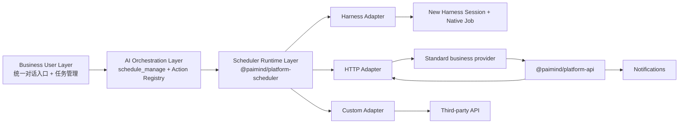

# Platform Scheduler Architecture

> Active local-main architecture. `@paimind/platform-scheduler` is the only Scheduler product and runtime selected by the PAIMind Bundle. The old native Session-reminder packages are not loaded in `3080`.

## Boundary

Scheduler Core owns calendar calculation, definitions, runs, idempotency, retries, timeout, audit and durable single-node recovery. It imports no Harness, Feishu or business-system API. A definition persists `actionId`; target configuration stays with an Adapter.

Dependencies point inward to the public contracts. Version-sensitive Harness constructors, messages and Session-result parsing remain in `@paimind/harness-compat`.

## Packages

| Package | Responsibility |
|---|---|
| `@paimind/contracts` | Stable task, action, Run, trigger, callback and notification types |
| `@paimind/platform-scheduler` | Active Core, Storage Domain Schema v2, Remote and business task UI |
| `@paimind/scheduler-adapter-harness` | New Session, Native Job, Agent execution and Session result action; `./agent-action` registers actions and `./agent-tool` provides `schedule_manage` |
| `@paimind/scheduler-adapter-http` | Signed HTTPS dispatch, `202` boundary and result-origin policy |
| `@paimind/scheduler-adapter-feishu-bot` | Feishu/Lark custom-bot translation, secret resolution and keyword enforcement |
| `@paimind/platform-api` | Authenticated ingress for action registration, callback and notification |
| `@paimind/platform-sdk` | Validation, signing, verification and server-side client |
| `examples/platform-integration/` | Non-published executable Harness, HTTP, custom and notification examples |

## Durable data

Storage Domain `paimind_scheduler`, Schema Version 2, contains `actions`, `definitions`, `runs` and `audits`. The local Harness profile currently persists this Domain in a JSON-backed storage file; production may select SQLite through Harness configuration. Executors and secrets are process-local registrations; restart reconstructs timers from durable definitions and running timeouts from `startedAt`.

Schema v2 adds `sourceSessionId`, validated versioned `actionInput` and the `weekdays` calendar rule. They are orchestration/runtime data, not business-user form fields. The explicit migration command is documented in the deployment runbook; opening a v1 Domain with v2 code fails loudly until migration completes.

The selected architecture is a formal single-node scheduler. The per-key Storage Domain API is not a distributed lease, so multi-node scheduling is explicitly unsupported.

## Dispatch invariants

- `runId = sha256(scheduleId + scheduledFor)` and `idempotencyKey` use the same occurrence digest.
- The stored next occurrence advances before Adapter dispatch.
- Existing `queued` or `running` Run blocks a new Run for the same task.
- A downtime window is folded to its latest due occurrence.
- Dispatch transport failure retries; accepted business work is never automatically repeated.
- Harness and HTTP Adapters cross the same acceptance boundary: creation/handoff returns `accepted`; final execution state arrives asynchronously through `reportRun`.
- Final callback is first-wins; an identical final report is idempotent and a conflicting final report is rejected.
- A user-requested **Run now** uses the same registered Adapter but does not change definition status, calendar rule or `nextRunAt`; Run records identify `schedule` versus `manual` triggers.

Provider-specific Adapters may have weaker guarantees than the standard
contract. The Feishu custom-bot endpoint has no callback or idempotency key, so
an ambiguous network retry can duplicate a notification message. This Adapter
is appropriate for repeatable notifications, not non-repeatable business side
effects.

For the generic `paimind:agent-prompt` action, a Schedule captures the current `cwd` and Agent Preset inside validated `actionInput`. An Action may pin a trusted provider/model pair; otherwise the Adapter reads Harness `agentDefaultModel.currentSelection()` at Run creation so an autonomous Session always has an explicit model route. These fields are never requested by or exposed to the business user.

The Action Registry defaults to conversation-disabled. Only descriptors with `conversationEnabled=true` enter `schedule_manage capabilities`; `usageHint` guides business-language matching. Categories and ids remain internal routing/audit metadata. When no specific capability fits, orchestration uses the validated `paimind:agent-prompt` fallback. Ambiguous matches require a business-name choice; unavailable actions never produce an inert definition.

Every Harness Run creates one independent Session, renames it to the Schedule name, reports a Session action, and publishes one idempotent final notification keyed by `runId`. `@paimind/harness-compat` owns the version-scoped native tree marker: it replaces relative time with a clock only when the visible row maps unambiguously to scheduled canonical Session ids and restores the native DOM on unload.

## Single active scheduler

`@deepseek-ai/dsh-schedule`, `@deepseek-ai/dsh-time-context` and the retired Session-local facade are not selected by the active PAIMind Bundle. Platform definitions and Runs are the only scheduled-task records shown in `3080`. Harness Session and Job objects created by the Harness Adapter remain canonical inside their own domains.
