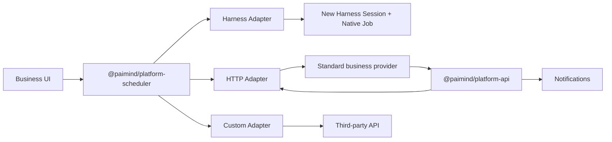

# Platform Scheduler Architecture

> Active local-main architecture. `@paimind/platform-scheduler` is the only Scheduler product and runtime selected by the PAIMind Bundle. The old native Session-reminder packages are not loaded in `3080`.

## Boundary

Scheduler Core owns calendar calculation, definitions, runs, idempotency, retries, timeout, audit and durable single-node recovery. It imports no Harness, Feishu or business-system API. A definition persists `actionId`; target configuration stays with an Adapter.

Dependencies point inward to the public contracts. Version-sensitive Harness constructors, messages and Session-result parsing remain in `@paimind/harness-compat`.

## Packages

| Package | Responsibility |
|---|---|
| `@paimind/contracts` | Stable task, action, Run, trigger, callback and notification types |
| `@paimind/platform-scheduler` | Active Core, Storage Domain schema v1, Remote and business UI |
| `@paimind/scheduler-adapter-harness` | New Session, Native Job, Agent execution and Session result action; `./agent-action` registers the built-in workspace-brief item |
| `@paimind/scheduler-adapter-http` | Signed HTTPS dispatch, `202` boundary and result-origin policy |
| `@paimind/scheduler-adapter-feishu-bot` | Feishu/Lark custom-bot translation, secret resolution and keyword enforcement |
| `@paimind/platform-api` | Authenticated ingress for action registration, callback and notification |
| `@paimind/platform-sdk` | Validation, signing, verification and server-side client |
| `@paimind/platform-integration-examples` | Executable Harness, HTTP, custom and notification examples |

## Durable data

Storage Domain `paimind_scheduler`, Schema Version 1, contains `actions`, `definitions`, `runs` and `audits`. SQLite is selected by the Harness profile. Executors and secrets are process-local registrations; restart reconstructs timers from durable definitions and running timeouts from `startedAt`.

The selected architecture is a formal single-node scheduler. The per-key Storage Domain API is not a distributed lease, so multi-node scheduling is explicitly unsupported.

## Dispatch invariants

- `runId = sha256(scheduleId + scheduledFor)` and `idempotencyKey` use the same occurrence digest.
- The stored next occurrence advances before Adapter dispatch.
- Existing `queued` or `running` Run blocks a new Run for the same task.
- A downtime window is folded to its latest due occurrence.
- Dispatch transport failure retries; accepted business work is never automatically repeated.
- Harness and HTTP Adapters cross the same acceptance boundary: creation/handoff returns `accepted`; final execution state arrives asynchronously through `reportRun`.
- Final callback is first-wins; an identical final report is idempotent and a conflicting final report is rejected.
- A user-requested **Run now** uses the same registered Adapter but does not change definition status, calendar rule or `nextRunAt`; Run records identify `schedule` versus `manual` triggers.

Provider-specific Adapters may have weaker guarantees than the standard
contract. The Feishu custom-bot endpoint has no callback or idempotency key, so
an ambiguous network retry can duplicate a notification message. This Adapter
is appropriate for repeatable notifications, not non-repeatable business side
effects.

Harness execution metadata (`cwd`, Agent Preset and provider/model) belongs to the code-registered action. It is neither stored in the Schedule definition nor exposed to the business UI.

The business Action Catalog groups descriptors as `ai`, `integration`, `message` or `health-check`. Categories are discovery metadata only; Core dispatch remains entirely `actionId`-driven. The built-in Agent item is loaded as a separate `@paimind/scheduler-adapter-harness/agent-action` plugin after the Harness Adapter service and therefore follows the same registration/unload lifecycle as any business-owned item.

## Single active scheduler

`@deepseek-ai/dsh-schedule`, `@deepseek-ai/dsh-time-context` and the former `@paimind/scheduler` facade remain available only as upstream or compatibility code; none is selected by the active PAIMind Bundle. Platform definitions and Runs are the only scheduled-task records shown in `3080`. Harness Session and Job objects created by the Harness Adapter remain canonical inside their own domains.
