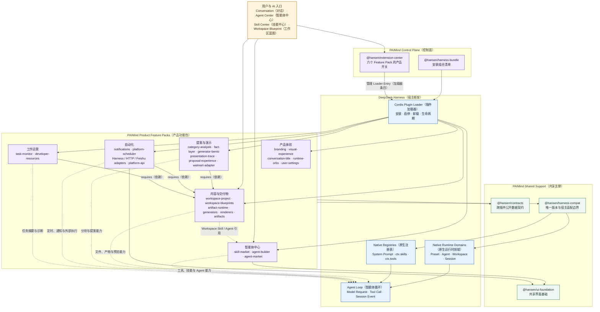
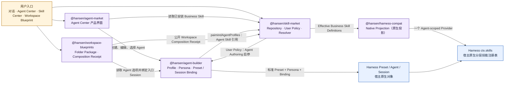
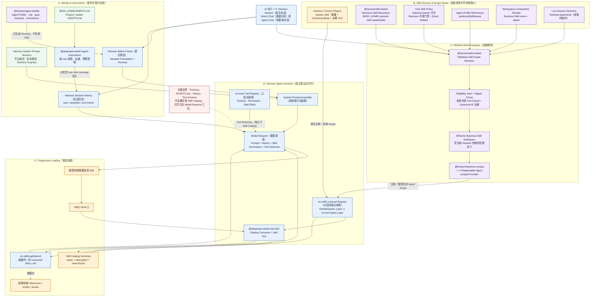
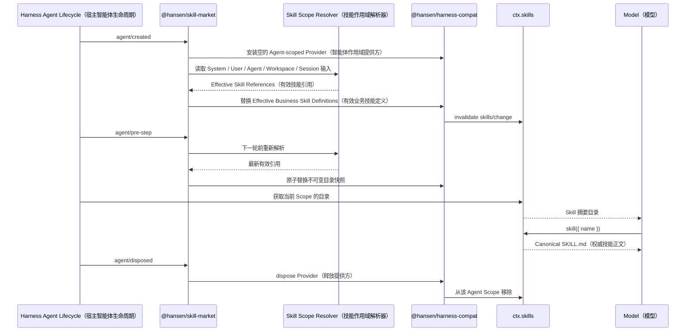

# PAIMind Plugin（插件）、Harness（宿主）与 AI Skill Catalog（技能目录）运行流程

> Status（状态）：Current-state Architecture（当前状态架构）<br>
> Evidence date（证据日期）：2026-09-03<br>
> Scope（范围）：Product Line（产品线）的插件组合、DeepSeek Harness（宿主框架）边界、AI Session（智能体会话）上下文装配与 Skill Catalog（技能目录）生成

## 1. 核心结论

DeepSeek Harness（宿主框架）是唯一 Runtime Spine（运行时主干），拥有 Plugin Loader（插件加载器）、Preset（预设）、Agent（智能体）、Workspace（工作区）、Session（会话）、System Prompt Assembly（系统提示词装配）、`ctx.skills`、`ctx.tools` 与 Model Loop（模型循环）。PAIMind 不复制这些对象，只通过 Plugin（插件）、Contract（契约）和 Projection（投影）扩展宿主。

PAIMind 的六个 Feature Pack（功能包）并不都会向 Skill Catalog（技能目录）写内容。当前直接参与技能目录计算的主链只有：

1. `@hansen/skill-market` 提供 User Skill Policy（用户技能策略）、Business Skill Repository（业务技能仓库）、Session Selection（会话选择）和唯一 Skill Scope Resolver（技能作用域解析器）。
2. `@hansen/agent-builder` 提供 Agent Profile（智能体配置）中的 Business Skill Reference（业务技能引用）与 Persona（人设），但 Persona 不保存技能名称或正文。
3. `@hansen/workspace-blueprints` 提供 Workspace Composition Receipt（工作区组合回执）中的 Business Skill Reference，并可为入口 Session（会话）绑定一个 Agent Reference（智能体引用）。
4. `@hansen/harness-compat` 把已解析的 Business Skill Definition（业务技能定义）投影到当前 Agent Scope（智能体作用域）的 Harness Native Skill Provider（宿主原生技能提供方）。
5. Harness 原生 `ctx.skills` 合并 Global/System Layer（全局／系统层）与当前 Agent Layer（智能体层），`@deepseek-ai/dsh-tool-skill` 只把摘要交给模型，并在模型调用 `skill({ name })` 时加载同一份 Canonical `SKILL.md`（权威技能正文）。

## 2. Plugin Suite 与 Harness 总体关系



这张图按 Product Ownership（产品所有权）组织，而不是把 40 个 Package（包）的每条 `package.json` 依赖都展开。六个 Feature Pack（功能包）是用户可理解的组合层；Package（包）仍然各自构建、测试和卸载。`@hansen/harness-compat` 是所有 Harness Version-sensitive Logic（宿主版本敏感逻辑）的唯一边界。

### 2.1 Agent、Skill 与 Workspace 核心插件关系



这里没有把 UI Read（界面读取）误画成 Runtime Ownership（运行时所有权）：`@hansen/agent-market` 是产品界面，`@hansen/agent-builder` 与 `@hansen/skill-market` 提供各自领域服务，最终 Preset、Session 与 Skill Registry 仍由 Harness 持有。

## 3. AI 进入 Session 后的内容装配与 Skill Catalog 生成



### 3.1 Session 生命周期中的刷新点



## 4. Skill Catalog 合并公式

```text
EligibleSystem
  = MandatorySystem
  ∪ UserEnabledOptionalSystem

EligibleBusiness
  = InstalledBusiness
  ∩ UserEnabledBusiness

DirectSessionCatalog
  = EligibleSystem
  ∪ (EligibleBusiness ∩ UserDefaultBusiness)
  ∪ (EligibleBusiness ∩ WorkspaceBusiness)
  ∪ (EligibleBusiness ∩ SessionBusiness)

AgentSessionCatalog
  = EligibleSystem
  ∪ (EligibleBusiness ∩ AgentBusiness)
  ∪ (EligibleBusiness ∩ WorkspaceBusiness)
  ∪ (EligibleBusiness ∩ SessionBusiness)

SelectedSessionCatalog
  = sessionKind == direct
    ? DirectSessionCatalog
    : AgentSessionCatalog

FinalCatalog
  = FailClosedOnNameCollision(
      DeduplicateByCanonicalSkillIdentity(SelectedSessionCatalog)
    )
```

Direct Session（普通会话）使用用户的 Direct Default（普通对话默认技能）；Agent Session（智能体会话）用 Agent Attachment（智能体挂载）替换 Direct Default，再叠加 Workspace（工作区）和当前 Session（会话）的选择。所有 Business Skill（业务技能）都必须先通过 User-enabled Eligibility Gate（用户可用门禁）。

实现上，Resolver（解析器）会计算 System Skill（系统技能）与 Business Skill（业务技能）的完整有效引用集合，但 PAIMind Scoped Provider（作用域提供方）只重新投影 Business Skill Definition（业务技能定义）；System Skill 已由各 Source Plugin（来源插件）注册在 Harness 原生 Registry（宿主原生注册表）中，不能再复制一次。

## 5. 内容应该放在哪里

| 内容 | Canonical Location（权威位置） | Runtime Entry（运行时入口） | 是否进入 Skill Catalog | 关键规则 |
| --- | --- | --- | --- | --- |
| 平台身份、安全规则、不可关闭的运行时不变量 | Harness System Prompt Section（宿主系统提示词段） | System Prompt Assembly（系统提示词装配） | 否 | 不能伪装成可关闭 Skill |
| Agent 的角色、目标、行为和补充要求 | `@hansen/agent-builder` 的 Agent Profile，并投影到 Harness Native Preset Persona（宿主原生预设人设） | 当前 Agent Scope 的 Persona | 否 | Persona 不保存 Skill 名称、摘要或正文 |
| 用户级与项目级工作规则 | `$DSH_HOME/AGENTS.md`、项目与子目录 `AGENTS.md` | `@deepseek-ai/dsh-agent-instructions` 按 Session `cwd` 注入历史 | 否 | 以有来源、受预算控制的 user-role message 进入；不复制为 Workspace 或 Agent 状态 |
| System Skill 的场景、方法和工具使用说明 | Harness 或 Source Plugin 拥有的 Canonical `SKILL.md` / `ctx.skills.register()` | Harness Global/System Skill Layer（全局／系统技能层） | 是，先摘要 | Optional System Skill 必须由同一来源原子启停摘要、正文、必需 Tool 与客户端能力 |
| 用户或业务团队维护的 Business Skill Package | `$DSH_HOME/.paimind-skill-market/skills/<name>/` | Resolver 选中后，经 Agent-scoped Provider 进入 `ctx.skills` | 有条件进入 | 安装不等于进入会话；必须同时满足已安装、用户启用和至少一个有效 Scope 引用 |
| 普通对话默认技能选择 | User Skill Policy（用户技能策略）的 `directBusinessSkillNames` | Direct Session Scope（普通会话作用域） | 有条件进入 | 不继承到 Agent Session |
| Agent 持久技能选择 | Agent Profile 的 `preferredSkillNames` 引用 | Agent Session Scope（智能体会话作用域） | 有条件进入 | 新 Session 直接使用；不写入 Persona |
| Workspace 持久组合技能 | Workspace Composition Receipt 的 `name + digest` | 该 Workspace 的全部 Session Scope（会话作用域） | 有条件进入 | 采用模板时写回执；Resolver 再校验安装、用户门禁与 Digest（摘要值） |
| 当前 Session 临时技能选择 | Live Session Object（实时会话对象）的进程内选择 | 当前 Session 的 Agent-scoped Provider | 有条件进入 | Runtime-ephemeral（运行时临时）；不写未知 Session Event，不修改 Agent Profile |
| Tool Schema、权限与副作用 | `ctx.tools` Tool Registry（工具注册表） | Model Request 的 Tool Catalog（工具目录） | 否 | Skill 只说明何时和如何使用 Tool，不能代替执行边界 |
| Connector / MCP 的连接、授权和 Tool | 独立 Connector / MCP Runtime（连接器／模型上下文协议运行时） | `ctx.tools` 或独立资源接口 | 否 | 可以被 Skill 引用，但不是 Skill 的别名 |
| 用户消息、模型回复与 Tool Result | Harness Session Event Log（宿主会话事件日志） | Conversation History（对话历史） | 否 | Session 是交互历史的唯一事实源 |
| Workspace 文件与生成 Artifact | Harness Workspace（宿主工作区）与 PAIMind Artifact 服务 | 文件工具、预览和交付物界面 | 否 | 文件内容不因存在于工作区就自动成为 Skill |

## 6. 三条不能被实现破坏的边界

1. One Runtime Owner（唯一运行时所有者）：Harness 始终唯一拥有 Preset、Session、Skill Registry 和 Tool Execution；PAIMind 不能增加 Shadow Registry（影子注册表）或额外 Invocation RPC（调用接口）。
2. One Canonical Skill（唯一权威技能）：目录只注入摘要，模型调用时才加载同一份完整 `SKILL.md`；不得把正文同时复制进 System Prompt、Persona 和 Session Message（会话消息）。
3. Scope Isolation（作用域隔离）：未选择的 Business Skill 不进入当前 Session；Session 临时选择不改写 Agent Profile；Agent 选择不泄漏到普通会话或其他 Agent；Workspace 选择只覆盖对应 Workspace。

## 7. 图中关系的代码依据

- Feature Pack（功能包）清单与依赖：[`../../packages/extension-center/src/feature-packs.ts`](../../packages/extension-center/src/feature-packs.ts)
- Bundle（组合包）与 Cordis Group（插件组）：[`../../packages/harness-bundle/cordis.patch.yml`](../../packages/harness-bundle/cordis.patch.yml)
- Skill Scope Resolver（技能作用域解析器）：[`../../packages/skill-market/src/scope.ts`](../../packages/skill-market/src/scope.ts)
- Session 生命周期、Policy（策略）与 Scoped Projection（作用域投影）：[`../../packages/skill-market/src/installer.ts`](../../packages/skill-market/src/installer.ts)
- Harness Native Scoped Provider（宿主原生作用域提供方）：[`../../packages/harness-compat/src/host.ts`](../../packages/harness-compat/src/host.ts)
- Agent Persona 与 Business Skill Reference：[`../../packages/agent-builder/src/index.ts`](../../packages/agent-builder/src/index.ts)
- Workspace Composition Receipt：[`../../packages/workspace-blueprints/src/catalog.ts`](../../packages/workspace-blueprints/src/catalog.ts)
- Current Skill Center Reference Design（当前技能中心参考设计）：[`../plans/skill-center-reference-design.md`](../plans/skill-center-reference-design.md)
- Harness 原生 Skill Runtime（宿主技能运行时）：本地上游检出 `../../Deepseek harness/docs/subsystems/skills.zh.md`
