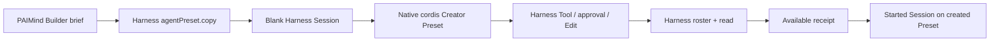

# FP10 Personal Agent Builder Checkpoint

> Historical Evidence（历史证据）: 独立 Builder 页面已退役；当前后台服务边界见 [`../acceptance/FP-10-agent-builder.md`](../acceptance/FP-10-agent-builder.md)。

## Result

FP10 is Technically Verified and Product E2E Verified on 2026-08-15. It is a product authoring layer over Harness Agent Preset and Creator Session, not a second Agent runtime or configuration store.

## Canonical chain

- Runtime/configuration owner: Harness Agent Preset.
- Authoring/execution owner: Harness Session, `cordis`, Tool and native approval.
- PAIMind-owned state: one browser-local receipt containing ids, hashes, lifecycle and Creator Session id. It contains no Cordis YAML, Tool list or Agent runtime.

## Real Product E2E

1. From a clean id, Builder copied a real native Preset to `paimind-fp10-e2e` and opened a blank Session.
2. The initial default-seat race was reproduced and fixed: Builder now waits for the native default load, selects `cordis`, waits again and confirms `cordis` before setting the draft. The final handoff visibly reported native `创造模式`.
3. The draft was reviewable and manually sent. Creator inspected the target, verified its `agent.cordis.yml` was byte-identical to shipped `standard`, resolved the live Tool/Skill packages and requested the normal one-time Harness approval for the user Preset root.
4. The exact approved write changed only `.dsh-home/.agent-presets/paimind-fp10-e2e/preset.yml` description to `Validates PAIMind native Agent Builder end to end v2.`. The Cordis composition stayed unchanged.
5. An initial content-only check exposed a real false negative because the change was metadata-only. Receipt schema v2 now fingerprints `content`, `name` and `description`; the baseline `fnv1a32:5905558d:12151` changed to `fnv1a32:1fa8a6dc:12148`, and Builder marked the healthy native row Available.
6. Native Agent Center and the native menu listed the same id, user trust, name and description. A real Session using that Preset returned `FP10 preset execution verified.`. A second blank Session selected it through Agent Center and, after starting, its authoritative native header reported the same Preset and returned `Agent Center native runtime verified.`.
7. Browser refresh and a full Harness restart recovered the Session and receipt while re-reading native roster and health facts.

## Product boundary findings

- Harness `rc.6`'s new-session Hero Preset chip may briefly retain the configured default after an external `agentPreset.select` call. The started Session header and actual composition are authoritative; both confirmed the selected Preset. PAIMind neither duplicates nor patches the native seat.
- Creator cannot write the user Preset root in Workspace Write mode without native approval. The flow used an exact one-time approval. Builder does not introduce a privileged browser write path.
- Modify mode lists only user Presets. `rc.6` exposes no arbitrary document restore RPC, so modify mode intentionally has no fake one-click Undo.
- Native create Undo was exercised on two disposable test copies after their Sessions settled. The final E2E Preset remains temporarily as inspectable acceptance evidence.

## Verification matrix

| Gate | Result |
|---|---|
| Focused Builder/Agent Center tests | Passed; controlled-field crash regression, metadata fingerprint and Creator seat confirmation included |
| Full check | 47 test files / 139 tests, Type Check, Production Build passed |
| Framework | 14 clients; exact seven-category Extension Center; no second Agent service/config store; compatibility-only Harness imports passed |
| Exact composition | Harness `0.1.0-rc.6` + Better Sidebar `0.11.0`; full install/boot/remove/restore, Extension Center absence, Task Monitor absence, Agent Market absence, Agent Builder absence, cleanup and zero upstream delta passed |
| Browser | Chinese/Dark, English/Light, real 560×800 one-column layout with no horizontal overflow, refresh and Harness restart passed |
| Error isolation | Removing Agent Builder leaves Agent Center, native Agent Presets and conversation composition bootable |

## Evidence

- `/Users/hansen/Documents/PAIMind-workspace/codex-output/qa/FP10-agent-builder-draft.png`
- `/Users/hansen/Documents/PAIMind-workspace/codex-output/qa/FP10-creator-handoff.png`
- `/Users/hansen/Documents/PAIMind-workspace/codex-output/qa/FP10-agent-builder-available.png`
- `/Users/hansen/Documents/PAIMind-workspace/codex-output/qa/FP10-agent-builder-execution.png`
- `/Users/hansen/Documents/PAIMind-workspace/codex-output/qa/FP10-agent-builder-light-en.png`
- `/Users/hansen/Documents/PAIMind-workspace/codex-output/qa/FP10-agent-builder-narrow.png`

R4 advances automatically to FP11 Skill Market. FP11 must keep Harness Skill id as the only runtime reference and may add only catalog, version, file-view and governance product metadata.
