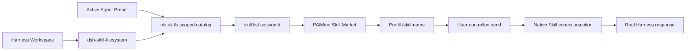

# FP11 Skill Market Checkpoint

> Historical Evidence（历史证据）: 只读目录版本的验收记录。当前安装流程需要按 [`../acceptance/FP-11-skill-market.md`](../acceptance/FP-11-skill-market.md) 重新执行产品验收。

## Result

FP11 is Technically Verified and Product E2E Verified on 2026-08-15. PAIMind provides a catalog, filter, favorite and governance product layer over the current Harness Session's canonical `ctx.skills` view. It does not own a second Skill registry, body store, attachment state or invocation protocol.

## Canonical chain

- Runtime identity and catalog owner: Harness Skill name and `ctx.skills`.
- Discovery owner: Harness provider selected by Workspace cwd and Agent Preset.
- Invocation owner: ordinary Harness Session prompt plus `dsh-tool-skill` pre-step injection.
- PAIMind-owned state: validated favorite names only; no body, provider path, source, version or runtime attachment.

## Real Product E2E

1. A real project-scoped `SKILL.md` named `paimind-catalog-e2e` was added under the attached Workspace's `.dsh/skills`; Harness filesystem discovery—not a PAIMind fixture API—published it through `skill.list`.
2. A second real `paimind-user-only-e2e` Skill proved `disable-model-invocation: true` remains a native user-only policy. The native `/pai` menu and Skill Market showed the same two names, descriptions and policy marker.
3. Search, Model invocable, User-only and Favorites projections operated over exact native objects. Browser localStorage retained only validated names.
4. `Use in current Session` prefixed `/paimind-catalog-e2e` and closed Settings without sending or creating selected-Skill state.
5. Manual send produced native `skill-catalog` and `paimind-catalog-e2e` Context Injection rows, then the real response `FP11 native skill invocation verified.`.
6. Browser testing found a filtered-list/detail mismatch. The detail selection now resolves only inside the active projection and the regression is automated.
7. Refresh and Harness restart recovered the native Session, injection history, catalog and favorite while re-reading runtime truth.
8. A live without-Skill-Market composition kept Extension Center, Task Monitor, native `/` suggestions and conversation usable; the formal Bundle was restored afterward.

## Capability boundary

Harness `0.1.0-rc.6` publishes only name, description, optional `whenToUse`, and model/user invocation facts to the browser. Version, provider/source, body and file tree have no stable permission-aware public contract. FP11 therefore renders `Not exposed by Harness rc.6` and never crawls Host paths. This is an upstream capability boundary, not a second PAIMind detail store.

## Verification matrix

| Gate | Result |
|---|---|
| Focused Skill Market tests | Passed; exact native projection, metadata-only favorites, error/missing-binding, prefill-without-send, registration and filtered-detail regression included |
| Full check | 50 test files / 146 tests, Type Check, Production Build and framework scan passed |
| Framework | 15 clients; exact seven-category Extension Center; Skill Market is `Skills & Tools`; no duplicate Skill runtime, Host-path crawl or direct Harness imports |
| Exact composition | Harness `0.1.0-rc.6` + Better Sidebar `0.11.0`; full install/boot/remove/restore plus Extension Center, Task Monitor, Agent Market, Agent Builder and Skill Market isolated-absence profiles passed with zero upstream delta |
| Browser | Real native catalog comparison/invocation; Chinese/Dark, English/Light, 560×800, refresh and restart passed |
| Error isolation | Removing Skill Market left native `/` suggestions, Skill injection/runtime ownership, Extension Center, Task Monitor and conversation usable |

## Evidence

- `/Users/hansen/Documents/PAIMind-workspace/codex-output/qa/FP11-native-skill-menu.png`
- `/Users/hansen/Documents/PAIMind-workspace/codex-output/qa/FP11-skill-market-dark.png`
- `/Users/hansen/Documents/PAIMind-workspace/codex-output/qa/FP11-native-skill-invocation.png`
- `/Users/hansen/Documents/PAIMind-workspace/codex-output/qa/FP11-user-only-filter.png`
- `/Users/hansen/Documents/PAIMind-workspace/codex-output/qa/FP11-skill-market-light-en.png`
- `/Users/hansen/Documents/PAIMind-workspace/codex-output/qa/FP11-skill-market-narrow.png`
- `/Users/hansen/Documents/PAIMind-workspace/codex-output/qa/FP11-native-menu-after-market-removal.png`

R4 is complete. Goal A advances automatically to R5 and FP12 Notification Center. FP12 must consume canonical Harness Job/Artifact/Session references and must not duplicate task state.
