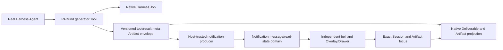

# FP12 Notification Center Checkpoint

## Result

FP12 is Technically Verified and Product E2E Verified on 2026-08-15. PAIMind owns only durable notification messages and read state. Harness remains the canonical owner of Workspace, Session, Job, Artifact and Deliverable lifecycle, and Notification Center stores safe references instead of copying that lifecycle.

## Canonical chain

- Runtime truth owner: Harness Workspace, Session, Tool, Job and Deliverable.
- Artifact truth owner: versioned Tool Result metadata plus Session Projection.
- PAIMind-owned state: trusted source snapshot, message text, level, safe canonical target and read timestamp.
- Explicit exclusion: no copied Job state, approval, retry, completion, archive or second workflow model.

## Real Product E2E

1. With no target file or notification fixture, a real Agent invoked `generate_html_artifact` and created `fp12-notification-e2e.html` in the attached Workspace.
2. The same execution produced a completed native Job, native Tool call/result, Deliverable, Artifact projection and one unread notification. The producer consumed only `paimind.tool-result/v1` metadata and never parsed model prose or file names.
3. `View artifact` selected the exact Session, opened the Artifacts side card and focused canonical id `artifact:bd9e6be08be505753a9537af` while the other Artifact stayed unfocused.
4. Mark-one-read and mark-all-read behaved honestly. Two read messages survived browser refresh, Harness restart and isolated removal/reinstallation of the notification plugin.
5. A real Read Only generation returned `generation_failed`; no target file, available Artifact or success notification appeared, and native conversation continued.
6. Chinese/Dark, English/Light and 560×800 full-width Drawer behavior passed. Escape dismissed the narrow Drawer.
7. Browser hit testing exposed a real stacking defect: notification buttons were visually present but events reached the underlying Better Sidebar Task Manager. The Overlay now renders through a `document.body` portal at an independent shell layer; all filters/actions hit their own buttons.
8. A live profile without `@hansen/notifications` preserved Task Monitor, conversation, Composer, both Deliverables, Artifact Viewer and Extension Center. The formal Bundle was restored afterward and the durable messages returned.

## Verification matrix

| Gate | Result |
|---|---|
| Focused notification tests | 3 files / 8 tests passed; includes strict Remote, trusted producer, CAS mutation, plain-text XSS regression, portal mount and rejected-read isolation |
| Full check | 53 test files / 156 tests, Type Check, Production Build and 16-client framework scan passed |
| Framework | Exact seven-category Extension Center; notification is `Automation`, managed as `Available`, and entered through an independent button |
| Exact composition | Harness `0.1.0-rc.6` + Better Sidebar `0.11.0`; full install/boot/remove/restore plus Extension Center, Task Monitor, Agent Market, Agent Builder, Skill Market and Notification Center isolated-absence profiles passed with zero upstream delta |
| Browser | Real Tool/Job/Artifact/Notification chain, exact deep-link, read/read-all, refresh, restart, reinstall, Chinese/Dark, English/Light and 560×800 passed |
| Error isolation | Real Read Only failure created no false Artifact; Remote mutation failure cannot navigate; package removal leaves native conversation and other PAIMind plugins usable |

## Evidence

- `/Users/hansen/Documents/PAIMind-workspace/codex-output/qa/FP12-notification-empty.png`
- `/Users/hansen/Documents/PAIMind-workspace/codex-output/qa/FP12-real-unread-notification.png`
- `/Users/hansen/Documents/PAIMind-workspace/codex-output/qa/FP12-artifact-deep-link-focused.png`
- `/Users/hansen/Documents/PAIMind-workspace/codex-output/qa/FP12-unread-filter.png`
- `/Users/hansen/Documents/PAIMind-workspace/codex-output/qa/FP12-notification-light-en.png`
- `/Users/hansen/Documents/PAIMind-workspace/codex-output/qa/FP12-notification-narrow.png`
- `/Users/hansen/Documents/PAIMind-workspace/codex-output/qa/FP12-after-notification-removal.png`

R5 advances automatically to FP13 Scheduled Tasks. The Scheduler must reuse canonical Harness Schedule, Job and Session objects and publish through the same Artifact/Task/Notification chain; it may not introduce a second schedule runtime or shadow task state.
