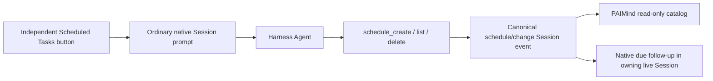

# FP13 Scheduled Tasks Checkpoint

> Historical Goal A checkpoint. Superseded for current product behavior by RQ-103 local-main activation; retained as evidence of the earlier native-facade acceptance.

## Result

FP13 is Technically Verified and Product E2E Verified on 2026-08-15. PAIMind adds an independent management button and read-only product catalog over the official Harness Schedule v1 fold. Harness remains the sole owner of Session, Schedule identity, timer execution, Tool results and due follow-up turns.

## Canonical chain

- Runtime truth owner: Harness Session and `schedule/change` fold.
- PAIMind-owned state: none for Schedule lifecycle.
- Product entry: independent sidebar-footer clock plus body-level responsive Overlay/Drawer.
- Explicit exclusions: Run Now, Cron, independent Scheduled Session, cold wake, independent run history and exactly-once claims.

## Real Product E2E

1. A real Agent called `schedule_create` for `schedule-1`. The PAIMind panel showed the same canonical id, kind, deadline and delivery mode without optimistic state.
2. After 30 seconds, Harness emitted an ordinary later turn in the same live Session, consumed the one-shot record and PAIMind Notifications projected one unread trusted Session message.
3. A 300-second recurring reminder survived browser refresh and a full Harness stop/start. Its exact native id was then removed through `schedule_delete`.
4. The model initially misrouted the recurring request to `after_seconds`; its own correction deleted that native record and created the requested `every_seconds` record. The native conversation and catalog preserved this truth instead of presenting deterministic client CRUD.
5. A real `every_seconds: 60` request returned `frequency_too_high`; no false catalog record appeared.
6. Chinese/Dark, English/Light and 560×800 Drawer checks passed.
7. Disabling only PAIMind Scheduler removed the clock and product catalog while the same Session still called native `schedule_list` successfully. Restoring the formal Bundle restored the button.

## Verification matrix

| Gate | Result |
|---|---|
| Focused contracts | Native correction suite and platform research suite both passed; formal package exposes one strict read Remote and native Prompt Actions only |
| Full check | 71 test files / 208 tests, Type Check, Production Build, 69-file document-link scan and framework scan passed |
| Framework | Exact seven-category Extension Center; Scheduled Tasks is `Automation`, managed as `Available`, entered through an independent button |
| Exact composition | Harness `0.1.0-rc.6` + Better Sidebar `0.12.1` + Office Viewer `0.1.0`; full install/boot/remove/restore and PAIMind-Scheduler-absent/native-Schedule-present profile passed with zero upstream delta and no shadow Scheduler package loaded |
| Browser | Existing real create/due/restart/delete/error evidence retained; post-correction form created and read canonical `schedule-2`, then deleted it; latest Scheduler console errors were zero |
| Error isolation | Model correction remained native and visible; invalid rule created no false record; Notification failure is outside Schedule dispatch; removing the PAIMind UI preserves native tools and conversation |

## Evidence

- `/Users/hansen/Documents/PAIMind-workspace/codex-output/qa/FP13-native-schedule-active.jpg`
- `/Users/hansen/Documents/PAIMind-workspace/codex-output/qa/FP13-native-schedule-delivered.jpg`
- `/Users/hansen/Documents/PAIMind-workspace/codex-output/qa/FP13-native-schedule-failure.jpg`
- `/Users/hansen/Documents/PAIMind-workspace/codex-output/qa/FP13-scheduler-light-en.jpg`
- `/Users/hansen/Documents/PAIMind-workspace/codex-output/qa/FP13-scheduler-narrow.jpg`
- `/Users/hansen/Documents/PAIMind-workspace/codex-output/qa/FP13-scheduler-disabled-native-list.jpg`
- `/Users/hansen/Documents/PAIMind-workspace/codex-output/qa/fp13-native-schedule-2026-08-15.png`

R5 is complete. Goal A advances automatically to R6 / FP14 Personal Center and Settings, where PAIMind must contribute to Harness Settings instead of creating a parallel settings runtime.
