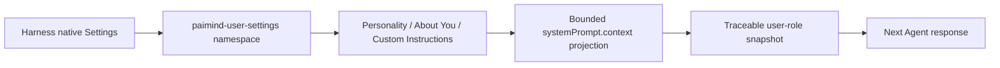

# FP14 Personalization Checkpoint

## Current result

The former broad `PAIMind Preferences` model has been superseded by a Codex-inspired Personalization contract. Product ownership is now limited to Personality, About You, Custom Instructions and an enable switch. Notification policy and PAIMind-owned reduced motion were removed from FP14.

Current acceptance state: `Technically Verified; Local Browser Pre-acceptance Passed; Product Model E2E Pending`.

## Architecture

- Canonical storage: Harness Settings document, official `installSettingsSection`, schema validation and native revision/CAS.
- Compatibility boundary: the rc.6 client uses the existing narrow PAIMind `describe`/`mutate` Remote because native Web Settings has a static namespace allowlist.
- Priority: current explicit user instructions override personalization; safety, permission, tool, model, active-Agent and Workspace/project boundaries cannot be changed.
- Empty/disabled behavior: no context is projected.
- Explicit exclusions: Notification receive policy, PAIMind motion policy, synthetic Memory, theme, locale, model, permission and Agent Preset.

## Verification completed in this change

- Full repository gate: 73 test files / 224 tests, Type Check, Production Build, 20-client framework verification and 80-document link check passed.
- Real `http://127.0.0.1:3080/` Browser pre-acceptance passed for the renamed `个性化` entry, Codex-inspired field set, native save feedback and exact context preview.
- A unique synthetic profile survived a full Harness stop/start. The one-time migration then removed raw `personalInstructions`, `motion` and `notifications` keys while preserving the new profile.
- Disable produced `当前不会注入任何个性化上下文。`; re-enable restored the saved profile without data loss.
- The `560×800` responsive layout kept the switch, all three Personality choices and form content visible and usable. No `paimind-user-settings` warning or error appeared in the browser log.
- Acceptance data was cleared after verification. The retained local state is `enabled: true`, `personality: none`, empty About You and empty Custom Instructions, so no personalization context is currently injected.
- One real model turn that records `paimind:personalization` in the conversation remains the Product E2E gate; this checkpoint does not reuse the prior System Prompt/motion/notification evidence for that claim.

## Historical evidence boundary

The 2026-08-15 FP14 evidence proved the previous prompt/motion/notification design. It remains historical evidence only and does not prove the new Personalization contract. New browser evidence must show the `个性化` surface and `paimind:personalization` user-context snapshot.
