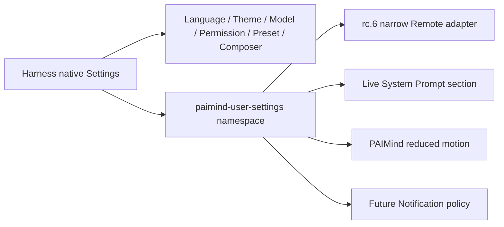

# FP14 User Settings Checkpoint

## Result

FP14 is Technically Verified and Product E2E Verified on 2026-08-15. PAIMind contributes one product-owned section to native Harness Settings. It does not create a Personal Center runtime, duplicate native controls, or persist browser-only prototype state.

## Ownership and compatibility

- Canonical storage: Harness `.dsh-home/settings.yaml`, official `installSettingsSection`, schema validation and native namespace revision/CAS.
- Compatibility boundary: Harness rc.6 Web Settings has a static namespace allowlist, so the client calls only PAIMind `describe`/`mutate` through Typert Remote. No parallel store and no upstream edit exists.
- Native reuse: Language, Appearance, Model, Permission, Agent Preset and Composer remain in Harness General/Models/Composer.
- Retired prototype state: synthetic Memory/history toggles, browser notification permission and local/session-storage preference fallback.

## Real Product E2E

1. Saved `Reply with exactly FP14-PREFERENCE-VERIFIED and nothing else.` through the UI. The canonical YAML changed, a real model turn consumed the live preference prompt and returned exactly the token.
2. Browser refresh and full Harness restart recovered the preference. Clearing it removed the behavior from a later real Bash turn.
3. `motion: reduce` projected `data-paimind-motion=reduce`; the active Think/Tool Orbs reported `paused=true` while native activity text and the Agent turn remained functional. Restoring `system` removed the attribute.
4. `notifications: off` suppressed only future PAIMind message publication. A real Agent-generated HTML still completed its Native Job, Artifact context, conversation link and sandboxed Viewer; unread stayed `1`, and the dialog had zero matching notification rows.
5. Restoring `all` and generating a second real HTML produced exactly one matching Notification row and advanced unread from `1` to `2`.
6. Chinese/Dark, English/Light and `560×800` passed. The final profile was restored to Chinese/Dark, empty instructions, `motion: system`, `notifications: all`.

## Verification matrix

| Gate | Result |
|---|---|
| Automated | 57 test files / 174 tests passed, including Host namespace read/mutate, native revision propagation, prompt, notification and Runtime Orb consumers |
| Type and build | Type Check, Production Build and 18-client framework scan passed |
| Exact composition | Harness `0.1.0-rc.6` + Better Sidebar `0.11.0`; full install/boot/remove/restore and PAIMind-User-Settings-absent profile passed |
| Browser | Real model instruction, clear, refresh, restart, active reduced motion, notification off/all branches, real Job/Artifact/Viewer and theme/narrow checks passed |
| Isolation | Removing only FP14 preserves native settings owners, conversation and other PAIMind packages; cleanup and zero upstream delta relative to the pre-run worktree passed |

## Evidence

- `/Users/hansen/Documents/PAIMind-workspace/codex-output/qa/FP14-native-settings-ownership.png`
- `/Users/hansen/Documents/PAIMind-workspace/codex-output/qa/FP14-personal-prompt-live.png`
- `/Users/hansen/Documents/PAIMind-workspace/codex-output/qa/FP14-reduced-motion-live.png`
- `/Users/hansen/Documents/PAIMind-workspace/codex-output/qa/FP14-notification-off-artifact-live.png`
- `/Users/hansen/Documents/PAIMind-workspace/codex-output/qa/FP14-notification-all-live.png`
- `/Users/hansen/Documents/PAIMind-workspace/codex-output/qa/FP14-settings-en-light-560.png`

R6 continues automatically to FP15 Permissions and Administration. FP15 must reuse native Harness Permission Presets for Sandbox/Approval while PAIMind adds only server-side product authorization and governance where a real service boundary exists.
