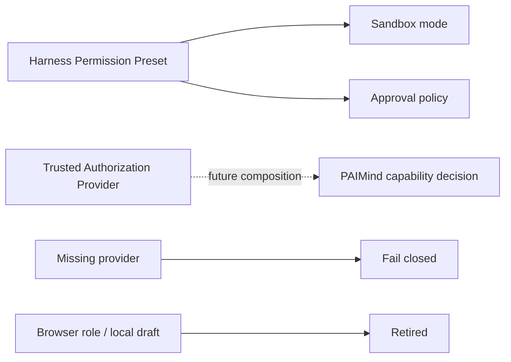

# FP15 Permissions and Administration Checkpoint

## Result

FP15 is Technically Verified with product classification `Native Reuse + Retired` on 2026-08-15. Harness Permission Presets remain the only Sandbox/Approval owner. The prototype's browser identity, role preview and local Configuration Studio publication are retired because they are not authenticated authorization.

## Product truth

- Native runtime permission: Reused.
- PAIMind business authorization: provider-neutral contract only; no provider is fabricated.
- Prototype RBAC/Admin publication: Retired.
- Extension Center Governance: exact category retained with an honest no-provider status and no available fake product.

## Real browser verification

1. Harness General remained the owner of the default Permission Preset; the native Composer remained the owner of the current Session preset.
2. The current real Session changed from `Workspace Write` to `Read Only`. A real Agent called `generate_html_artifact`; the Sandbox denied the write, Native Job ended `failed`, and no file or available Artifact was created.
3. The Session was restored to `Workspace Write` after the denial.
4. Governance showed no product card and explicitly explained why browser roles and Harness Full Access are not enterprise-administrator authority.
5. A repeated real failure verified the corrected Notification path: a bounded single-line error message was persisted without breaking the Tool, Job or Session.

## Verification matrix

| Gate | Result |
|---|---|
| Authorization contract | Allow, explicit deny, missing provider, missing principal, provider failure, malformed request and protected-operation error passed |
| Full automated | 57 test files / 178 tests passed |
| Type/build/framework | Type Check, Production Build and 18-client scan passed; caller roles, browser storage and fake Governance descriptors are forbidden |
| Exact composition | Harness `0.1.0-rc.6` + Better Sidebar `0.11.0`; full install/boot/remove/restore passed |
| Source integrity | Zero upstream delta relative to the pre-run Harness worktree |

## Evidence

- `/Users/hansen/Documents/PAIMind-workspace/codex-output/qa/FP15-native-permission-ownership.png`
- `/Users/hansen/Documents/PAIMind-workspace/codex-output/qa/FP15-native-read-only-denial.png`
- `/Users/hansen/Documents/PAIMind-workspace/codex-output/qa/FP15-governance-no-provider.png`
- `/Users/hansen/Documents/PAIMind-workspace/codex-output/qa/FP15-failure-notification-safe.png`

R6 advances automatically to FP16 Developer Resources. FP16 may expose product and technical diagnostics, but Harness Plugin Registry remains the only technical lifecycle authority and Extension Center remains the capability-management product surface.
