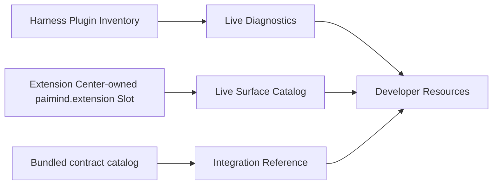

# FP16 Developer Resources Checkpoint

## Result

FP16 is Technically Verified and Product E2E Verified on 2026-08-15. `@hansen/developer-resources` contributes one read-only Settings section with three distinct truth surfaces:

- Live Diagnostics from native Harness Plugin Inventory.
- Surface Catalog from current `paimind.extension` contributions.
- Integration Reference from contracts bundled with the installed PAIMind package version.

It owns no Loader state, enable/disable control, version database, dependency graph, navigation launcher or synthetic component runtime.

## Product boundary

- Harness Settings → Plugins remains the sole technical Registry view.
- Extension Center remains the sole `paimind.extension` child-slot owner. FP16 only reads it.
- The frozen prototype Component Library's valid catalog intent was migrated; synthetic previews, simulated states and duplicate copy-prompt lab were retired.
- Versions, dependency graphs and failure details are not exposed by the selected native inventory contract, so FP16 makes no such claims.
- Bento is represented only through the stable `paimindSidebar` Preview/Side Card adapter boundary.

## Real browser Product E2E

1. The formal Harness profile reported 38 current `@hansen/*` Loader rows; all 38 were native `active`, with exact `moduleName`, `entryId`, effective enablement and `fiberPhase` displayed.
2. Native Settings → Plugins showed `developer-resources, mounted, enabled`, matching FP16's exact active row.
3. Surface Catalog showed current Runtime Orb, Task Monitor, Artifact/Viewer, Agent, Skill, Scheduler and Developer capabilities. Retired launcher and conversation-compatibility packages plus Configuration Studio did not appear.
4. Integration Reference showed exactly eight implemented boundaries, and every row was labeled `Bundled reference` rather than live discovery.
5. Native Refresh and a full Harness stop/start both recovered the same live 38-entry snapshot.
6. With Harness stopped, Refresh rejected the Remote, removed the previous success snapshot and rendered an explicit unavailable state with Retry. Restart plus Retry recovered the live snapshot.
7. Chinese/Dark, English/Light and a real `560×800` viewport passed. The formal profile was restored to Chinese/Dark.
8. The isolated Developer-Resources-absent composition booted with native Plugin Inventory, Extension Center, Runtime Orb, Task Monitor, User Settings and the remaining products present.

## Defect found and resolved

The first live browser mount exposed a duplicate child-slot declaration: FP16 attempted to declare `paimind.extension`, which is already owned by Extension Center. Harness isolated the failed package and kept native conversation running. FP16 now registers no child slot, treats Extension Center as the unique owner and safely returns an empty Surface Catalog if that slot is absent. A regression test asserts that no second owner is declared.

## Verification matrix

| Gate | Result |
|---|---|
| Automated | 59 test files / 186 tests passed; FP16 adds eight focused truth-boundary and client cases |
| Type and build | Type Check, Production Build and 19-client framework scan passed |
| Exact composition | Harness `0.1.0-rc.6` + Better Sidebar `0.11.0`; full install/boot/remove/restore, Extension-Center-absent operation and Developer-Resources-absent isolation passed |
| Browser | 38 native rows, native Plugins comparison, surface/reference tabs, refresh, restart, real Remote outage/retry, themes and narrow layout passed |
| Isolation | Removing only FP16 preserved native Registry and all other products; zero upstream worktree delta relative to the pre-run Harness sentinel passed |

## Evidence

- `/Users/hansen/Documents/PAIMind-workspace/codex-output/qa/FP16-live-diagnostics-zh-dark.png`
- `/Users/hansen/Documents/PAIMind-workspace/codex-output/qa/FP16-live-surface-catalog-zh-dark.png`
- `/Users/hansen/Documents/PAIMind-workspace/codex-output/qa/FP16-bundled-integration-reference-zh-dark.png`
- `/Users/hansen/Documents/PAIMind-workspace/codex-output/qa/FP16-developer-resources-en-light-560.png`
- `/Users/hansen/Documents/PAIMind-workspace/codex-output/qa/FP16-inventory-unavailable-en-light.png`

R6 is complete. Goal A proceeds to R7 final cross-plugin E2E, supported-Harness upgrade gate and frozen prototype runtime-entry retirement.
