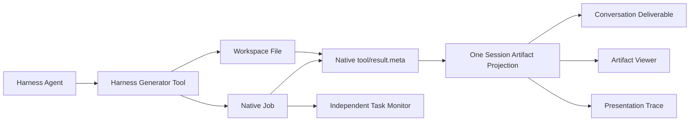

# R3 Real AI Generation Checkpoint

Date: 2026-08-15  
State: `Verified`

## Decision

R3 is verified as a Product E2E stage. A real Harness Agent started from an empty Workspace and Session, invoked PAIMind Generator Tools, created native Harness Jobs, published durable Artifact and Trace facts through the same native `tool/result.meta`, exposed native Conversation Deliverables, and opened real viewers without QA query parameters or pre-positioned target files.

This checkpoint restores FP06, FP07 and FP08 to `Product E2E Verified`. It does not complete Goal A. FP05's later isolated-removal plus Dark/narrow UI completion gate is recorded separately in [`FP05-product-ui-completion.md`](FP05-product-ui-completion.md).

## Canonical object chain

- `ArtifactProducedEnvelopeV1` and optional `ArtifactTraceEnvelopeV1` share one native Tool Result metadata wrapper and one `paimind.artifacts` Session Projection.
- The trace envelope must match the Artifact id, Session id, Workspace id, Job id, revision and explicit `traceId`; mismatched provenance is ignored.
- No consumer parses model prose, filename or document contents to infer kind, preview channel or traceability.
- Harness restart truthfully clears process-local Job history while the native Session log replays Artifact and Trace projections.

## No-fixture browser run

Workspace: `/Users/hansen/Documents/PAIMind-workspace/codex-output/qa/r3-five-format-e2e`  
Session: `生成R3 AI原生产物验证PPTX`  
Runtime: `http://127.0.0.1:3080/`

| Request | Native result | Real interaction |
|---|---|---|
| 3-page editable PPTX | `r3-validation-deck.pptx`, revision 3 | PPTX viewer shows 3 slides; revision 3 adds real structured provenance and Trace action |
| English PDF report | `r3-verification-report.pdf`, revision 2 | Local `@hansen/renderer-pdf` renders the actual A4 page with PDF.js and keeps Download |
| Formula XLSX | `r3-formula-workbook.xlsx`, revision 2 | Grid shows Alpha/Beta/Gamma; file contains `SUM(B2:C2)`, `SUM(B3:C3)`, `SUM(B4:C4)` |
| Self-contained HTML | `r3-verification-page.html`, revision 2 | Sandboxed HTML viewer shows Revision 2 and Refresh Recovery content; no external resources |
| 3-page Bento | `r3-bento-verification.html`, revision 2 | Independent isolated-origin Bento renderer shows 3 pages and updated content; no external resources |

The first five requests and their same-path updates produced ten completed native Jobs. A Read Only generation attempt produced one failed native Job and zero clickable `r3-denied-report.pdf` artifacts. The native conversation remained usable after failure.

## Real Trace verification

The revision-3 PPTX producer emits a generated trace document from the validated Tool input. Browser verification passed:

- the Artifact row exposes Trace only because its explicit Envelope carries a real `traceId`;
- Trace shows three slides, `generate_presentation_artifact input` as the registered source and `Generated` review status;
- Technical Trace shows Validate structured input → Render editable slide → Publish atomically lineage;
- calculation and code evidence identify `packages/generator-office/src/cli.ts`;
- page refresh and full Harness restart restore the same trace through Session Projection replay.

## PDF renderer correction

Better Sidebar `0.11.0`'s browser-native Blob iframe displayed only a Download control and a blank page in the in-app Chromium surface. The PDF file itself was valid. PAIMind therefore adds an independent `@hansen/renderer-pdf` package through a new stable `registerFileViewer` method on `@hansen/better-sidebar-adapter`:

- priority `paimind:pdf` overrides only the `.pdf` preview channel;
- PDF.js and its worker are bundled locally; there is no CDN or external network dependency;
- stable file-viewer registration is now explicitly versioned as adapter contract v3;
- renderer code imports only the PAIMind adapter, never Better Sidebar source or internal state;
- uninstalling the package falls back to the provider's original PDF viewer;
- the real revision-2 report visibly rendered one A4 page after refresh and Harness restart.

## Persistence and failure gates

| Gate | Result |
|---|---|
| Same-process refresh | Ten completed plus one failed Job remained; five Artifact revisions and Trace remained clickable |
| Harness restart | Task Monitor returned to zero; five files, latest revisions, Deliverables, viewers and Trace replayed |
| Permission failure | Read Only write failed closed; failed Job visible; no false Deliverable or Artifact entry |
| Structural validation | PPTX 3 slides; PDF 1 A4 page / PDF 1.7; XLSX three real formula cells; HTML/Bento no external URLs; Bento runtime event markers present |
| Error isolation | Generator failure and viewer/trace error boundaries leave native conversation available |

## Automated and composition evidence

- Full gate: 41 test files, 122 tests passed.
- Strict Type Check, Production Build and framework scan passed.
- Framework: 12 client plugins; exact seven-category Extension Center; Registry technical-only; Task Monitor independent; Bento/PDF use adapter-only provider boundaries.
- Exact composition: Harness `0.1.0-rc.6` + Better Sidebar `0.11.0`; install, boot 12 PAIMind clients, remove, restore, boot 11 independent clients without Extension Center, cleanup and zero Harness upstream delta passed.

## Browser evidence

- `/Users/hansen/Documents/PAIMind-workspace/codex-output/qa/R3-ten-native-jobs-revisions.png`
- `/Users/hansen/Documents/PAIMind-workspace/codex-output/qa/R3-real-generator-permission-failure.png`
- `/Users/hansen/Documents/PAIMind-workspace/codex-output/qa/R3-real-pptx-revision-2.png`
- `/Users/hansen/Documents/PAIMind-workspace/codex-output/qa/R3-real-xlsx-revision-2.png`
- `/Users/hansen/Documents/PAIMind-workspace/codex-output/qa/R3-real-html-revision-2.png`
- `/Users/hansen/Documents/PAIMind-workspace/codex-output/qa/R3-real-bento-revision-2.png`
- `/Users/hansen/Documents/PAIMind-workspace/codex-output/qa/R3-local-pdfjs-preview.png`
- `/Users/hansen/Documents/PAIMind-workspace/codex-output/qa/R3-real-presentation-trace.png`
- `/Users/hansen/Documents/PAIMind-workspace/codex-output/qa/R3-real-technical-lineage.png`
- `/Users/hansen/Documents/PAIMind-workspace/codex-output/qa/R3-trace-restart-recovery.png`

## Honest limitations

- The current PDF generator uses standard Helvetica and the real Product E2E prompt was English. Portable CJK font embedding remains unverified and is not claimed.
- The local PDF.js client bundle is approximately 2 MB before transfer compression. Later optimization may split it lazily, but this does not invalidate correctness or isolation.
- Native Harness Job history is process-local by design in the selected runtime; PAIMind does not create a shadow durable Job store.
