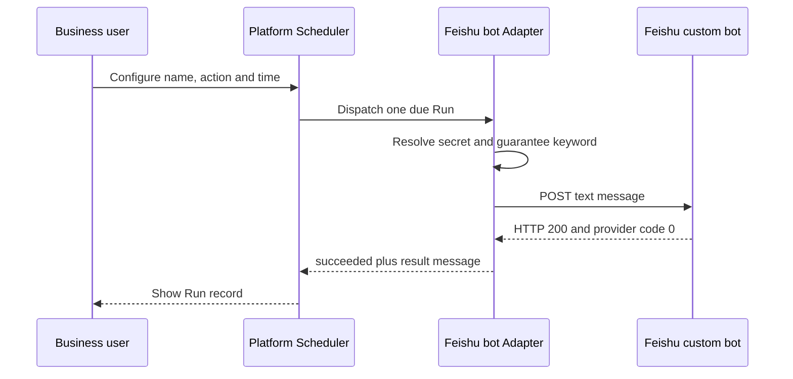

# Feishu Bot Scheduler E2E Guide

> This guide covers the Feishu action installed beside the active platform Scheduler. The Webhook remains deployment-only configuration and never enters the business form.

## Where to configure and verify

Business users configure a task directly through Harness **Settings → Platform Scheduler**:

1. Open **Task list** and choose **New task**.
2. Enter the task name.
3. Select the code-registered action **Feishu bot keyword test**.
4. Configure frequency, run time, time zone and enabled state.
5. Choose **Run now** to execute the action immediately without changing the next scheduled time.
6. Open **Run records** and distinguish **Manual run** from **Scheduled run** before verifying status and result message.

The sidebar does not expose a second Scheduler shortcut. The Settings route is the single product entry.

The business form never displays the Webhook, keyword enforcement, credential reference, HTTP request, retry or callback configuration. Those are Developer Configuration（开发者配置） owned by the Adapter.

## Developer configuration

For local acceptance, add the example action from
`packages/scheduler-adapter-feishu-bot/example/cordis.patch.yml`. Inject the
real Webhook through a Secret Manager or the Harness Home `.env`; never commit it
to source, Loader YAML, task definitions, logs or evidence.

```text
PAIMIND_FEISHU_BOT_WEBHOOKS_JSON={"credential:feishu-bot-rq103":"https://open.feishu.cn/open-apis/bot/v2/hook/<secret>"}
PAIMIND_FEISHU_BOT_KEYWORD=测试
PAIMIND_FEISHU_BOT_E2E=1
```

For the local `3080` profile, store only `PAIMIND_FEISHU_BOT_WEBHOOKS_JSON` in
`$DSH_HOME/.env` with file mode `0600`. DSH loads this user layer on every cold
start, so a normal restart does not lose the credential. The keyword and E2E
auto-create switches remain optional deployment settings.

Missing, malformed or unregistered credentials are Configuration Errors（配置错误）
and fail after one attempt. Only transient provider/network delivery failures
enter the Scheduler retry loop.

`PAIMIND_FEISHU_BOT_E2E=1` is only a local acceptance helper. It creates one
task eight seconds after startup. Normal business configuration should leave
it disabled and create tasks through the Scheduled Tasks page.

## Verified flow



The local acceptance run on 2026-08-15 completed as follows:

- Schedule: `schedule:82ff9208-4172-45b7-b4c0-ae53dee35de4`
- Run: `run:f67a84c4db7ebba7307af7cc55b56f14`
- Attempt: `1`
- Final status: `succeeded`
- Result: `Feishu bot accepted the scheduled message; keyword "测试" included`

The browser read-back also verified that the task form contains only business
fields and that Run records contain the durable final result.

The current local-main `3080` verification subsequently completed through the
single Settings entry:

- Schedule: `schedule:b0cd3717-3580-4eb9-a0b4-8c7299c314e2`
- Run: `run:9369c132c1fa0e8e65e776e176f3f271`
- Trigger: `schedule`
- Attempt: `1`
- Final status: `succeeded`
- Result: `Feishu bot accepted the scheduled message; keyword "测试" included`

The test definition remains available for inspection but is paused after the
successful Run to prevent an unintended repeated group message.

The persistence repair was re-verified after a cold restart on 2026-08-16:

- Run: `run:67e69adc-701f-4111-b857-46a757e1d97d`
- Trigger: `manual`
- Attempt: `1`
- Final status: `succeeded`
- Result: `Feishu bot accepted the scheduled message; keyword "测试" included`

## Delivery and retry boundary

Feishu custom-bot Webhooks do not expose the PAIMind callback and idempotency
contract. Scheduler transport failures may therefore be retried, and an
ambiguous network result can produce a duplicate group message. Use the
standard HTTP Adapter or a business-owned gateway when the action requires
strong idempotency for financial, approval or other non-repeatable side
effects.

The Adapter accepts only credential-free HTTPS URLs on the official
`open.feishu.cn` or `open.larksuite.com` custom-bot endpoint. It does not embed
external pages and never returns the Webhook in a Run result.
