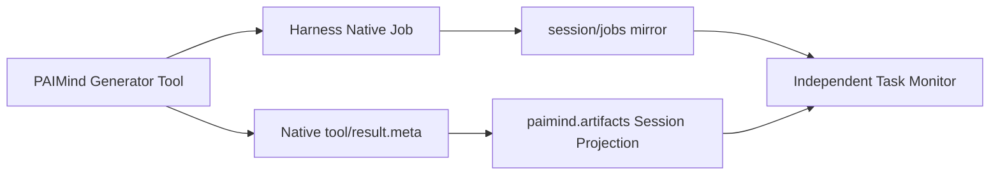

# FP05 Independent Task Monitor Plan

## Outcome

FP05 contributes one independent Task Monitor button to the native Harness Session header. It shows only real PAIMind producer Jobs from `jobsBySession` and correlates each row to the durable Artifact Session Projection by exact Native Job id.

Task Monitor is discoverable and classifiable in Extension Center under `Automation`, but Extension Center does not open it. Better Sidebar remains a separate viewer/Side Card provider and is neither a dependency nor an entry surface for FP05.

## Capability mapping

| Capability | Decision | Canonical owner |
|---|---|---|
| Job id, owner, running/stopping/completed/killed/failed, timestamps and cancellation | Reuse | Harness `ctx.jobs` / `session/jobs` |
| Session/Workspace identity | Reuse | Harness Session / Workspace |
| Artifact correlation | Read exact `taskId` | `paimind.artifacts` Session Projection |
| Independent button and responsive monitor surface | PAIMind contribution | `@paimind/task-monitor` |
| Capability classification/manageability | Product descriptor only | Extension Center |
| `queued`, `waiting`, fake progress or duplicate durable task store | Delete | None |
| Better Sidebar task tab and QA Preview Source | Delete | None |

## Public projection

`@paimind/task-monitor` is a client projection package. It owns no Host service, task registry or mutation API.

- Entry: `conversation.session.header.actions`.
- Data: current Session `jobsBySession[sessionId]`.
- Inclusion: exact `job.kind === 'paimind-artifact'`; labels and model prose are never parsed.
- Correlation: `artifact.taskId === job.id` from `useProjection('paimind.artifacts')`.
- Ordering: live Jobs first, then most recently settled.
- Surface: anchored Popover on desktop; fixed Drawer on narrow screens.
- Isolation: a component Error Boundary collapses only this button/surface.

The selected Harness runtime exposes no `queued` state. FP05 renders only the five native statuses and never invents an intermediate lifecycle.

## State and persistence truth

- Browser refresh keeps the current Harness process and must restore Job rows plus Artifact correlation.
- Harness process restart clears native Job history because the selected Registry is process-local.
- The Session log replays the Artifact Projection after restart; Task Monitor truthfully shows no historical Job row.
- PAIMind does not add a persistence store to manufacture a stronger Job guarantee than Harness provides.

## Failure and permission boundaries

- A generator failure ends the native Job as `failed` and correlates a structured failed Artifact envelope with no Deliverable location.
- A killed/stopping Job uses native status; FP05 does not retry or mutate it.
- Permission and Sandbox flows stay in the generator's native Tool chain; Task Monitor is read-only.
- Missing projection leaves the Native Job row visible without Artifact detail.
- Missing Task Monitor package removes only its Header action; native Jobs, conversation and artifacts continue.

## Verification

1. Pure tests for exact producer filtering, ordering, correlation and malformed Projection fail-closed behavior.
2. Client tests for independent slot registration, bilingual copy, empty/live/completed/failed states, responsive CSS and Error Boundary.
3. Generator execution tests for Native Job terminal state, nested native `write` Tool parent token, successful correlation and failed-without-location behavior.
4. Framework scan proves no Better Sidebar dependency/import, no task registry/Preview Source and exact `Automation` descriptor.
5. Full tests, Type Check, production build and exact Harness composition.
6. Real browser from an empty Workspace/Session: Agent invokes the HTML generator, live/terminal Job appears in the independent button, conversation Deliverable appears, preview opens, page refresh restores, process restart follows the documented native limitation.

FP05 is Product E2E Verified. R2 proved the first real HTML chain; R3 regressed ten successful plus one failed generation Jobs; the final product-UI checkpoint passed isolated package removal, Dark desktop and a real 560px narrow Drawer. Evidence: [`../checkpoints/FP05-product-ui-completion.md`](../checkpoints/FP05-product-ui-completion.md).
