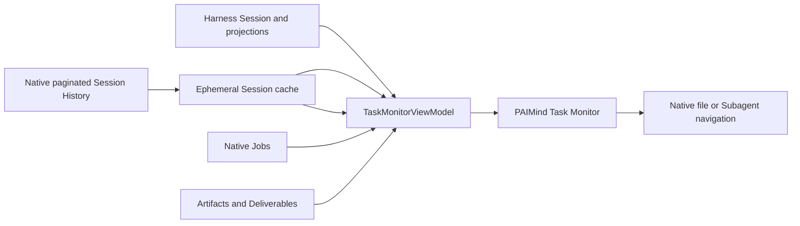

# FP05 Complete Task Monitor Plan

## Outcome

`@hansen/task-monitor` consolidates the native Harness `agent-preset`,
`subagent-catalog`, `job-list` and `session-log-download` Session-header seats. A compact icon trigger in the
right-side Session utility position opens a read-only desktop
Popover or narrow-screen Bottom Sheet that combines the current Session and
Project summary with deterministic runtime facts. Its lower slot priority wins
while installed; removing the package restores all three native contributions.

The monitor owns no task registry, persistence, lifecycle, permission or mutation
API. Better Sidebar is not its entry surface or state source.

## Capability mapping

| Capability | Decision | Canonical owner |
|---|---|---|
| Session title, running/waiting/completed, Agent Preset | Reuse | Harness Session list |
| Goal, Todo and Plan | Reuse | Harness Session projections |
| Multiple checklist records | Derive current/history groups from exact `todo/write` snapshots; never create parallel Todo identities | Harness paginated Session History |
| Workflow and Subagent stage/navigation | Reuse | Harness Chat nodes and child catalog |
| Tool Call and native Job status | Reuse | Harness conversation and `session/jobs` |
| Inputs | Exact `kind: 'read'` locations only | Harness Tool render intent |
| Outputs | Exact Deliverable and Artifact records only | Harness Turn and Artifact projection |
| Skill | Exact `skill-invocation` Context or successful native `skill` Tool pair | Harness Context, Tool and paginated Session History |
| MCP | Display exact `mcp__<server>__<tool>` calls only; request-catalog availability is not a used state | Tool and paginated Session History |
| Project association | Reuse | `Project = Workspace` projection |
| Session Log download | Delegate without copying | Harness `sessionLogDownload` controller |
| Read-only summary and navigation | PAIMind contribution | `@hansen/task-monitor` |
| Progress guesses, connection guesses and shadow state | Forbidden | None |

## Public projection

- Hidden while installed: `conversation.session.header.actions` IDs
  `agent-preset`, `subagent-catalog` and `job-list`. The real Subagent count,
  state and native navigation move into Task Monitor instead of being copied.
- Right-side renderer: `conversation.session.header.utilities`, exact native id
  `session-log-download`, order `0`; Task Monitor replaces that cell while
  delegating the download action to the untouched native controller.
- All four exact-ID replacements use the isolated shadow priority `-10`, lower
  than the shipped entries only inside those exact cells and fully reversible.
- Session Log is a soft dependency resolved through Cordis `ctx.get`; missing or
  malformed services hide only the download row and never block Task Monitor.
- The native Session Log controller remains the only export implementation; its
  current status and download action are surfaced in Current Summary.
- View Model: pure `TaskMonitorViewModel`; never persisted.
- Historical Skill/MCP and Todo evidence is prefetched from the native paginated
  `session.history` API after the Session becomes idle. A process-local cache
  keeps the click path instant; the plugin keeps no copied durable log, resource
  registry, checklist identity or projection.
- State priority: Agent/Goal error, pending interaction, running facts, paused
  Goal, complete Goal, then idle.
- Progress: `completed / total` only when a real Todo snapshot supplies the
  total. Sequential snapshots with at least 50% item overlap are treated as
  revisions of one checklist; distinct groups appear as current/latest and
  collapsed historical checklist records.
- Job list: all native Jobs, live first, then most recently finished. Historical
  failed Jobs remain rows but do not force the current Session into error.
- Navigation: files use `ctx.workspaces.openPath(path)`; registered Bento paths
  are intercepted by the Artifact router and open the hidden workbench; Subagent
  rows use native `openSubagent`.
- Unknown or malformed optional structures fail closed and contribute no facts.
- Sensitive Tool args, MCP URLs, headers and credentials never enter the View
  Model.

## Interaction and layout

- Icon-only 32px trigger in the former Session Log position with Tooltip, `aria-label`, `aria-expanded`,
  `aria-pressed` and keyboard focus treatment.
- The trigger is a state-agnostic summary entry: running, waiting, blocked,
  idle and complete Sessions all use the same icon without a Badge or status
  dot. Current state remains visible inside the opened summary panel and in the
  native conversation surface.
- Desktop width is 420px and clamped to the viewport while scrolling, resizing
  or changing container geometry.
- At 640px and below the surface becomes a full-width Bottom Sheet with internal
  scroll and no horizontal overflow.
- Repeated click, outside pointer and `Escape` close the surface; `Escape`
  restores trigger focus.
- A component Error Boundary contains failures inside this contribution and
  leaves the native conversation usable.
- Information order is Current Summary, active Task Progress when evidence
  exists, Agent/Skill/MCP, Outputs, Inputs and collapsed Technical Details.
  A section, resource row, subtitle or summary statistic with no deterministic
  fact is omitted instead of rendering zero, dash or explanatory empty-state
  copy. Inactive Plan is likewise absent.
- Dense collections follow one progressive-disclosure rule: show four primary
  rows, five current Todo items, three historical checklist summaries and four
  resource chips; keep remaining items behind a labelled disclosure. Running
  Subagents sort before inactive children without changing native identities.
- Every non-zero Current Summary statistic is a real icon button. Activation
  scrolls and focuses the corresponding Todo, Agent/Subagent or Output group; a
  statistic never looks interactive while remaining decorative.
- Every Subagent is a full-width button with hover, focus and trailing-arrow
  affordance. Activation uses native `openSubagent`, closes only after a
  successful navigation call, falls back to the exact child Session when that
  call throws, and otherwise keeps the panel open with a visible error.
- The main Agent and its Subagents share one Agent resource group. The main
  Agent uses one fixed role icon, while provider/model parameters stay hidden
  until hover or keyboard focus. Subagent avatars draw from a stable, extensible
  icon registry and display the exact child name on hover or keyboard focus.
  Variants distinguish siblings without inferring unsupported roles from their
  labels or task text.
- Skill and MCP rows render only exact used evidence. Their success color is the
  compact state signal; visible names omit a redundant `Used` suffix, and an MCP
  that only appeared in the latest request catalogue remains hidden.
- Opening the panel never starts a history scan. Agent and the current render
  window appear immediately; prefetched Skill/MCP/Todo history is reused and a
  truthful background-sync state replaces false empty claims on a cold start.

## State and persistence truth

- Page refresh keeps current process-local Job records.
- Harness restart clears Job history in the selected runtime; Session, Goal,
  Artifact and Deliverable recovery follows their native persistence boundaries.
- PAIMind does not add a durable Job store to hide this limitation.

## Verification

1. Pure tests cover state priority, Todo progress, all-Job ordering, exact
   Artifact correlation, inputs/outputs, Skill/MCP evidence and hostile data.
2. Client tests cover the icon trigger, Tooltip, open/close, `Escape`, focus,
   outside click, exact file/Subagent navigation and native slot priority.
3. Sidebar regressions prove there is no fixed `PAIMind Artifacts` entry and the
   Bento workbench is a hidden on-demand tab with an Artifact-specific title.
4. Full Type Check, tests, production build, API snapshot and exact Harness
   composition must pass.
5. Promotion from `technical-preview` to `available` requires a fresh real
   DeepSeek Agent run plus desktop, 560px, Light/Dark browser pre-acceptance.

Earlier PAIMind-only Job and Drawer evidence remains historical. This complete
monitor revision is reopened until the new real-AI and browser gates in item 5
pass; unit fixtures or prior screenshots do not satisfy that promotion.

## 2026-08-17 implementation read-back

- `pnpm run check:fast` passed: 32 package contracts, Type Check, 70 test files /
  240 tests, production build, API snapshot, package audit, Publint, NodeNext,
  framework verification and documentation links.
- Exact Harness composition passed against Harness `0.1.0-rc.6`, Better Sidebar
  `0.12.2` and Office Viewer `0.1.0`, including full install/boot/remove/restore,
  Task Monitor removal fallback and zero upstream worktree delta.
- Local browser pre-acceptance at `127.0.0.1:3080` passed the 420px desktop
  Popover, `560×800` Bottom Sheet, Light/Dark themes, Tooltip, `Escape` focus
  return, outside click, no horizontal overflow, stale fixed-tab retirement and
  one-click Artifact-to-Bento navigation with a dynamic title. Browser evidence
  is retained outside this repository under `codex-output/qa/task-monitor-2026-08-17/`.
- No new Console error appeared during the timed Task Monitor acceptance window.
  One pre-existing Better Sidebar `agent-terminals` reconnect error was visible
  from before that window and is not attributed to this plugin.
- The selected Session contains a prior real DeepSeek Skill/Tool/Artifact chain,
  which validates projection and navigation against real persisted facts. A new
  clean-Profile real-AI run and shared-environment repeat remain outstanding, so
  maturity intentionally stays `technical-preview`.

## 2026-08-17 multi-checklist and click-latency read-back

- A second real Session exposed four native `todo/write` checklist groups. The
  newest group renders as current (`2/6`) while three older groups remain behind
  compact disclosures; no parallel Todo store or list identity was added.
- The trigger now remains quiet for every Session state. Browser inspection
  confirmed zero numeric Badges and zero status dots; waiting and blocked state
  remain available inside the panel rather than being promoted as notifications.
- Full Session History moved out of the click path. Background prefetch, a
  bounded 32-Session memory cache and incremental merge after completion keep
  the panel open action independent from history scanning; the real panel opened
  in approximately 288ms with `ppt-master` already visible.
- Task Monitor Type Check and 11 focused tests passed. The repository suite
  passed 70 files / 244 tests plus package, pack, Publint, NodeNext, examples,
  framework and docs checks. The protected API snapshot remains blocked only by
  a separately modified Scheduler runtime export and was not silently accepted
  as part of this change.

## 2026-08-17 disclosure and Subagent-navigation read-back

- Empty optional facts now omit their entire summary statistic, subtitle,
  resource row or section. A sparse real Session showed no false Project, Todo,
  Subagent, Input or Output placeholders while preserving its evidenced Agent.
- Dense collections use bounded primary views: four normal rows, five current
  Todo items, three historical checklist summaries and four resource chips.
  Remaining facts are reachable through labelled disclosures.
- Subagent names are no longer small inline links. Browser read-back confirmed
  each real child is a full-width accessible button with hover/focus feedback
  and a trailing arrow. Activating one closed the panel, selected the exact
  child Session and exposed the native parent/child breadcrumb.
- Task Monitor Type Check, 3 focused files / 13 tests, production build,
  package/docs/framework checks and the real Harness install/boot/remove/restore
  composition passed. The full 70-file / 246-test suite also passed; `check`
  and `check:release` stop only at the pre-existing Scheduler API hash mismatch.

## 2026-08-17 summary-drill-down and Agent-icon read-back

- Browser DOM read-back proved the `2 子代理` summary value is a `<button>` and
  focuses the real Subagent group. The two full-width rows remained the exact
  native child-Session navigation targets.
- The main Agent row exposes a fixed role icon. The two real children rendered
  distinct `browse` and `think` icon variants from an eight-slot registry, each
  with two SVG affordances (avatar and trailing navigation arrow).
- Hovering the first child avatar exposed its exact name, `全量对账 outline 与数据源`,
  and clicking the second row navigated to `/bento-ppt 请使用 @white-space-analys /
  列出 wmt-qa-inputs 文件` in the native breadcrumb.
- The live desktop panel stayed within `1056×864`; the `560×800` Bottom Sheet
  measured `544px` wide with no document or panel horizontal overflow.
- Focused verification passed 3 files / 13 tests and a standalone browser
  bundle. The repository-wide Type Check is currently blocked by unrelated
  in-progress `@hansen/harness-compat/client-surface` source, so this revision
  does not claim a fresh full release gate.

## 2026-08-17 Agent-resource grouping read-back

- The two native child Sessions now live below the main Agent in the
  `Agent、Skill 与 MCP` resource section. Task Progress contains only real progress
  evidence; it no longer duplicates Subagent navigation.
- The top `2 子代理` icon button focuses the new child anchor. Each child
  remains a full-row native navigation target with an exact-name tooltip and a
  stable icon variant.
- Provider/model parameters are hover/focus-only. Browser keyboard read-back
  exposed `aliyun · deepseek-v4-flash-0731` without occupying persistent panel
  space.
- Four exact used Skills render with the success token and bare names. No MCP
  row is present because the selected Session has no exact
  `mcp__<server>__<tool>` call; request-catalog availability is not displayed.
- Focused verification passed 3 files / 13 tests, package TypeScript and the
  standalone browser bundle. Desktop and narrow Bottom Sheet interaction checks
  found no observed horizontal overflow. This is local product pre-acceptance,
  not a shared-environment formal acceptance claim.
