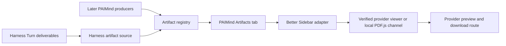

# FP06 Artifact Bridge and PDF/PPT Preview Plan

> `PRR-01`: Viewer implementation is retained; Product E2E is reopened and must use the canonical Agent → Tool/Skill → Native Job → native Tool Result metadata → Session Projection → Deliverable → Viewer chain.

## Outcome

FP06 makes PDF and PPTX artifacts associated with the current Harness Session and Workspace discoverable from one `PAIMind Artifacts` tab. PPTX preview, slide navigation and download reuse the selected Better Sidebar provider. Real browser validation proved that the provider's browser-native PDF Blob iframe was blank in the selected Chromium surface, so FP06 adds a removable local `@paimind/renderer-pdf` channel through the stable adapter; it does not patch or fork provider source and does not create a separate PPTX renderer.

This keeps the feature upgradeable while `dsh-better-sidebar` evolves independently: artifact product semantics depend only on `@paimind/better-sidebar-adapter`, and the adapter exposes a capability result instead of provider records or types.

## Capability mapping

| Capability | Decision | Owner |
|---|---|---|
| Turn-scoped produced-file facts | Reuse | Harness `deliverables` Turn data |
| Session and Workspace identity | Reuse | Harness Session plus `@paimind/workspace-project` |
| PDF preview and download | Migrate through stable adapter | `@paimind/renderer-pdf`, with Better Sidebar `pdf` fallback |
| PPTX preview, slide navigation and download | Reuse | Better Sidebar `pptx` viewer |
| Artifact association, scope filters and product states | Migrate | `@paimind/artifacts` |
| Safe path resolution and provider capability check | Migrate at boundary | `@paimind/artifacts` plus `@paimind/better-sidebar-adapter` |
| Separate PAIMind PPT renderer | Delete from scope | None |
| HTML, Bento and Spreadsheet artifacts | Later | FP07 |
| Presentation source trace | Later | FP08 |
| Cloud object storage and signed URLs | Later Goal B | Cloud Folder Provider |

## Package and contract boundaries

### `@paimind/better-sidebar-adapter`

- Extends its version-neutral contract v3 with `registerFileViewer(definition)`, `getFileCapability(path)` and `openFile(request)`.
- Mirrors only the provider methods needed to match an enabled viewer, verify the hidden editor tab, close a stale editor instance and open the refreshed path.
- Returns structured `opened`, `provider-unavailable`, `editor-unavailable`, `viewer-unavailable` or `failed` results.
- Maps the narrow viewer registration shape needed by independent PAIMind renderers without exposing provider descriptors, stores or reducers.

### `@paimind/renderer-pdf`

- Registers only the higher-priority `paimind:pdf` capability through `@paimind/better-sidebar-adapter` contract v3.
- Bundles PDF.js and its worker locally; it reads the provider-supplied media URL and owns no file transport or Artifact state.
- Contains its own render error boundary and Download action. Uninstalling it restores the provider's original `pdf` viewer.
- Does not import Better Sidebar modules, patch provider DOM or alter the native conversation.

### `@paimind/artifacts`

- Publishes `ctx.paimindArtifacts` as an observable projection registry; producers retain durable ownership.
- Registers exactly one `paimind:artifacts` Better Sidebar tab.
- Reads native Harness `deliverables` values from the public Turn timeline and caches only Sessions actually staged in the client. It does not parse assistant prose, tool names or DOM labels.
- Accepts later PAIMind artifact sources through a stack-safe `registerSource` contract.
- Associates every artifact explicitly with `sessionId` and `workspaceId`.
- Supports `available`, `updating`, `missing` and `failed` product states.
- Resolves relative paths against the active Workspace root, rejects URL schemes, control characters, traversal and paths outside that root, then delegates only `.pdf` or `.pptx` files to the matching verified viewer.
- Owns no file bytes, copy, upload, renderer cache or second filesystem index.

## Data and state flow

Native paths are keyed by Session, Workspace, normalized path and latest producing sequence. Reproducing the same path updates the revision without creating a duplicate. The next explicit Preview action closes the path-derived editor instance and reopens it, forcing the provider viewer to load current bytes.

## Failure and permission boundaries

- No current Session or unknown Workspace association: no native artifact row is invented.
- Unsafe or out-of-Workspace path: Preview is refused before calling the provider.
- Disabled/missing PDF or PPTX viewer: the tab reports a bounded capability error and native conversation continues.
- Missing/failed producer state: the row remains visible with its structured reason but cannot be opened.
- Provider or local PDF.js fetch/render failure stays in its viewer boundary and preserves Download where a media URL is available.
- `updating`: row stays visible and Preview remains disabled until the producer reports a settled state.
- Artifact discovery grants no new filesystem permission. The provider uses the current Harness Session scope and its existing file route authorization.

## Upstream update gate

The active matrix remains exact npm `@deepseek-ai/dsh@0.1.0-rc.6` plus `dsh-better-sidebar@0.11.0`. A provider candidate cannot replace it until these FP06-specific checks pass:

1. Built-in viewer inventory still matches `pdf` and `pptx`, and adapter contract v3 can register the local `paimind:pdf` channel.
2. The hidden `editor` tab still supports path-keyed open, close and refresh.
3. The local PDF.js channel loads current bytes and retains download on success/error; removing it restores the provider viewer.
4. PPTX loads current bytes, reports slide count, navigates and retains download on success/error.
5. Disabled viewer/editor and missing provider fail closed through the adapter.
6. Desktop, provider narrow-drawer rules, Light/Dark and Chinese/English browser gates pass.
7. Bundle install/boot/remove/restore and Harness zero-source-delta gates pass.

## Verification

- Pure tests for artifact validation, immutable projection, source stacking, diagnostics, ordering and explicit Session/Workspace scoping.
- Pure tests for path normalization, traversal/scheme/control-character rejection, supported extension checks and native Turn-data extraction/update dedupe.
- Adapter tests for file capability discovery, disabled/missing editor/viewer, refreshed open and throwing provider behavior.
- Client tests for empty, available, updating, missing, failed, localized, theme-token, provider-error and narrow-layout states.
- Better Sidebar provider tests for viewer inventory and editor load/error/download behavior.
- Full typecheck, production build, framework boundary scan and exact-version real composition.
- Browser pre-acceptance with fixtures remains a viewer-only check. Product completion requires a real Agent to create and revise PDF/PPTX through the canonical Native Job, Tool Result metadata, Session Projection and Deliverable chain without QA query parameters or pre-positioned targets.

## Later package ownership

- HTML/Bento/Spreadsheet viewers and artifact kinds: FP07.
- Stable trace relationship and trace tab deep links: FP08.
- Scheduled Session artifacts and result lifecycle: FP13.
- Role visibility and server authorization for enterprise artifacts: FP15.
