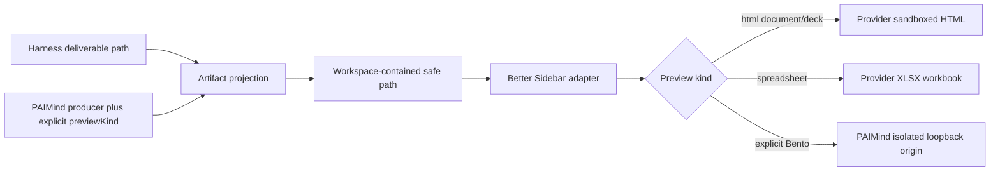

# FP07 HTML, Bento and Spreadsheet Preview Plan

> `PRR-01`: Viewer/renderer implementation is retained; Product E2E is reopened for real XLSX/HTML/Bento generation.

## Outcome

FP07 extends the existing `PAIMind Artifacts` plugin with HTML and XLSX artifact kinds. Normal HTML documents and HTML Decks open through Better Sidebar's existing sandboxed `html` viewer; spreadsheets open through its existing `xlsx` viewer. Self-contained Bento runtimes use a separate `@hansen/renderer-bento` plugin because the provider's CSP-sandboxed route intentionally lacks the storage-capable origin required by the existing Bento runtime. The exception remains an independent Side Card tab and does not patch Harness or Better Sidebar.

## Capability mapping

| Capability | Decision | Owner |
|---|---|---|
| HTML file read, preview/edit toggle and download path | Reuse | Better Sidebar `html` viewer |
| HTML sandbox and viewer enable/disable | Reuse | Better Sidebar Side Card settings |
| XLSX workbook parsing, sheet navigation and grid | Reuse | Better Sidebar `xlsx` viewer |
| Session/Workspace association and safe file delegation | Extend | `@hansen/artifacts` |
| HTML document / HTML Deck / Bento product label | Migrate as explicit metadata | `@hansen/artifacts` source contract |
| Independent HTML or spreadsheet renderer packages | Delete from scope | No `@hansen/renderer-html` or `@hansen/renderer-spreadsheet` copy |
| Storage-capable Bento runtime | Add only the missing capability | `@hansen/renderer-bento` isolated-origin plugin |
| Bento source trace | Later | FP08 |
| Bento editing, import and export workflow | Later | Dedicated product package after preview migration |

## Package and contract changes

### `@hansen/artifacts`

- Adds `html` and `xlsx` to the bounded artifact-kind union.
- Adds optional `previewKind: html-document | html-deck | bento-deck | spreadsheet` metadata.
- Validates that HTML preview kinds are used only with `.html`/`.htm`, and `spreadsheet` only with `.xlsx`.
- Native Harness deliverables remain path-derived and default to `html-document` or `spreadsheet`; no HTML body, filename convention, assistant prose or tool label is parsed to infer Bento semantics.
- PAIMind product sources may explicitly declare `html-deck` or `bento-deck`.
- The existing Artifact tab displays the explicit product label. `html-document` and `html-deck` delegate to the provider with `html -> html`; `spreadsheet` delegates with `xlsx -> xlsx`; only explicit `bento-deck` metadata calls the Bento service.

### `@hansen/renderer-bento`

- Declares the exact host services it consumes: `webServer` and `sessions`.
- Starts a random loopback-only origin and exposes only a token-bound, read-only HTML route for the current Session `cwd`.
- Realpath-confines the requested file to the Session root, rejects symlink escapes, non-HTML files and files above the bounded size.
- Registers one independently enabled `paimind:bento-preview` Side Card tab and exposes `paimindBentoPreview` to `@hansen/artifacts`.
- Uses a cross-origin iframe with `allow-scripts allow-same-origin`; this enables the Bento runtime's local storage without sharing the Harness GUI origin.
- Applies CSP `connect-src 'none'`, `form-action 'none'`, `object-src 'none'`, `base-uri 'none'`, `referrer-policy: no-referrer` and `nosniff`.
- Closes the loopback server and removes its routes/tab/service on plugin disposal.

### `@hansen/better-sidebar-adapter`

No contract expansion is required. FP07 uses the version-neutral `openFile` capability introduced by FP06. Provider viewer descriptors and rendering components remain private to the adapter boundary.

## Data and state flow

## Security, failure and permission boundaries

- Normal HTML remains in the provider sandbox without `allow-same-origin`. PAIMind never auto-disables that sandbox.
- Bento does not use the provider's unsafe toggle. It receives a distinct random origin whose CSP denies all network/form/object channels, so `allow-same-origin` applies only inside the isolated renderer origin and cannot expose Harness storage or APIs.
- URL schemes, traversal, control characters and paths outside the current Workspace are rejected before provider delegation.
- Disabled/missing HTML or XLSX viewers and unavailable Bento service return bounded capability errors inside the Artifact tab; the conversation continues.
- Malformed HTML/XLSX errors remain provider-owned and preserve its existing fallback behavior.
- `previewKind` changes labels and future product routing only; it grants no filesystem, script or network permission.

## Upstream update gate

The exact matrix remains npm `@deepseek-ai/dsh@0.1.0-rc.6` plus `dsh-better-sidebar@0.11.0`. A provider candidate must keep:

1. Registered and independently enabled `html`, `xlsx` and hidden `editor` capabilities.
2. Provider HTML sandbox on by default, with no `allow-same-origin` or top-navigation token.
3. XLSX lazy chunk, workbook/sheet navigation and download/error fallback.
4. File refresh through the existing path-keyed editor contract.
5. Side Card inventory integration, Bento isolated-tab disposal, install/remove/restore and zero Harness source delta.

## Verification

- Pure tests for new kinds, preview-kind compatibility, native deliverable defaults and safe path handling.
- Client tests for exact viewer allowlists, product labels, localized states and disabled provider behavior.
- Better Sidebar native HTML sandbox and XLSX viewer regression suites.
- Full typecheck, production build, framework boundary scan and exact-version composition.
- Browser pre-acceptance with one HTML document, one interactive HTML Deck, one existing 25-slide Bento runtime and one real formula-bearing XLSX workbook in a real Harness Workspace.

## Explicit later ownership

- Presentation Trace and stable slide/data association: FP08.
- Editable Bento authoring/import/export lifecycle: a later dedicated package; it is not inferred from preview HTML.
- Remote webpages continue to use Better Sidebar's separate sandboxed Browser tab, not the local Artifact file contract.
- Cloud object storage and signed URLs: Goal B.
