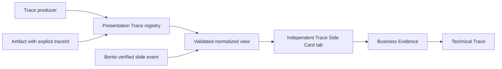

# FP08 Presentation Trace Plan

> `PRR-01`: implementation is preserved at Safe Checkpoint but not Verified. Final acceptance requires a real Generator/Trace Producer to publish the `traceId` and lineage on the canonical Tool Result Artifact envelope chain.

## Outcome

FP08 migrates PAIMind presentation provenance into an independent `@paimind/presentation-trace` Cordis package. A trace producer registers structured `paimind.presentation-trace/v1` or `/v2` records against an explicit Artifact `traceId`; the plugin projects Business Evidence and Technical Trace in one Better Sidebar tab. It never parses slide pixels, Bento HTML, model prose, filenames or renderer state to invent lineage.

## Capability mapping

| Capability | Decision | Owner |
|---|---|---|
| Artifact/Session/Workspace identity | Reuse read-only | `@paimind/artifacts` |
| Right rail, responsive drawer, tab enable/disable | Reuse | Better Sidebar through `@paimind/better-sidebar-adapter` |
| Bento preview and verified slide events | Extend through public event contract | `@paimind/renderer-bento` |
| `paimind.presentation-trace/v1` compatibility | Migrate and normalize | `@paimind/presentation-trace` |
| `paimind.presentation-trace/v2` sources, blocks, metrics, facts, dimensions/measures, visual bindings and technical fields | Migrate | `@paimind/presentation-trace` |
| Business Evidence → Technical Trace progressive disclosure | Migrate | `@paimind/presentation-trace/client` |
| Trace action beside a traceable artifact | Add through generic Artifact Action Slot | `@paimind/artifacts` public service |
| Renderer-owned trace store or conversation reducer | Delete from scope | No second state store and no upstream mutation |
| PPTX parsing/import and Bento authoring | Preserve as separate concern | Not part of the Trace viewer plugin |

## Package and public contracts

### `@paimind/artifacts`

- Adds optional, explicit `traceId` metadata to an Artifact; native deliverables do not receive one automatically.
- Adds a provider-neutral `registerAction()` extension point. An action supplies stable id, localized label, applicability predicate and callback; the Artifact UI renders it without importing the contributing package.
- Actions are stack-safe and disposable. A failed action produces only an Artifact-tab notice.

### `@paimind/renderer-bento`

- Extends `PaimindBentoPreviewService` with a read-only snapshot/subscription containing the current request and last verified runtime event.
- Accepts only allowlisted `paimind:bento-ready`, `paimind:bento-slide` and `paimind:bento-exit` messages whose `event.source` is the active iframe and whose `event.origin` equals the random sandbox origin.
- Events carry only explicit mode and positive slide number; arbitrary iframe payload never crosses the service.

### `@paimind/presentation-trace`

- Owns `PaimindPresentationTraceSource`, registry, normalized snapshots, diagnostics, artifact selection and drill-down state.
- Validates source ids, slide/block/metric/fact ids, dimensions, measures, visual encodings, source references, immutable `factValuesChanged:false`, visual bindings and optional technical fields.
- Normalizes v1 slide facts to v2 single-fact metric groups without inventing missing technical values.
- Registers one `paimind:presentation-trace` Side Card tab and one `Trace / 追溯` Artifact action.
- Filters by exact `traceId`, Artifact id, Session id and Workspace id. Switching files cannot leak a previous trace.

## Data and state flow

## Security, failure and permission boundaries

- Trace is metadata, not authority: source names/code paths are display facts and never become open-file, URL, shell or network operations.
- Unknown fields are omitted from the standard projection; missing lineage/calculation/code/runtime remains `Not registered / 未登记`.
- Invalid records stay in source diagnostics and do not partially render.
- Source failure, missing trace, disabled tab, stale Bento event or render error leaves Artifact preview and native conversation operational.
- The plugin consumes public PAIMind services only; it does not inspect Better Sidebar DOM, provider stores, iframe internals, Harness reducers or conversation prose.

## Verification

- Contract tests for valid v1/v2, normalization and every reject path.
- Registry tests for source shadowing/disposal, diagnostics, exact Artifact association and file/session switching.
- Artifact Action Slot tests for registration, action failure containment and removal.
- Bento event tests for exact source/origin allowlist, invalid messages and cleanup.
- Client tests for list → Business Evidence → Technical Trace, missing technical values, source list, slide sync, localization and error boundaries.
- Full typecheck, production build, framework boundary scan and exact-version Harness/Better Sidebar composition.
- Browser pre-acceptance from the real FP07 Bento Artifact: open Trace, navigate slide/metric/fact, inspect sources/lineage/calculation/code/runtime, switch locale/theme, disable/restore the tab, refresh and restart.

## Explicit later ownership

- Visual object/chart-point/table-cell selection requires a producer/runtime that emits stable binding ids. FP08 validates and renders bindings but never derives them from pixels or DOM.
- Enterprise visibility and source-file authorization policy: FP15.
- Scheduled generation of traced artifacts: FP13.
- Cloud source/object resolution: Goal B.
