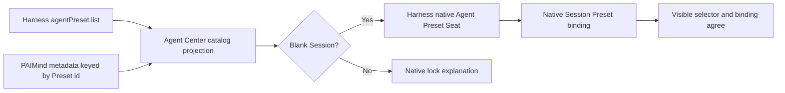

# FP09 Agent Center Plan

> Superseded（已替代）: 当前产品与验收规范为 [`../product/RQ-106-agent-center-prd.md`](../product/RQ-106-agent-center-prd.md)。本文件仅保留历史设计依据。

## Outcome

FP09 adds a PAIMind Agent Center as the catalog, market, classification and governance product layer over the one native Harness Agent Preset roster. It does not create an Agent runtime, duplicate Preset document or alternate execution id.

The surface is an independent Harness Settings section, not a Launcher destination and not an Extension Center navigation action. Extension Center only describes and technically manages the `@hansen/agent-market` capability under `Agents`.

## Native mapping

| Product capability | Decision | Canonical owner |
|---|---|---|
| Preset id, name, description, trust, default and broken state | Reuse exactly | Harness `agentPreset.list` |
| Blank-Session Preset selection | Reuse exactly | Harness native Agent Preset Seat plus Session binding |
| Preset execution, Tool/Skill composition and persistence | Reuse exactly | Harness Agent Preset runtime |
| Catalog search, product categories, featured rows and favorites | PAIMind product metadata keyed by Preset id | `@hansen/agent-market` |
| Copy, delete, default setting and file authoring | Native reuse / later Builder | Harness Agent Presets UI and FP10 |
| Second Agent object, second Preset document or mock market roster | Forbidden | None |

## Package and contract boundaries

### `@hansen/harness-compat`

- Exposes the version-isolated `agentPreset.list` wire shape, native Agent Preset Seat control and the minimal Session binding facts FP09 needs.
- Feature code imports no `@deepseek-ai/*` package.

### `@hansen/agent-market`

- Registers one `settings.section` named `Agent Center` and one Extension Center descriptor in `Agents`.
- Reads the native roster on mount and every explicit refresh; no cached roster is presented as current truth after an API failure.
- Preserves Host ordering as a stable tie-breaker while allowing search and product filters.
- Product metadata contains only category/featured/favorite state keyed by Preset id. It cannot change native trust, default, broken, Tool, Skill or runtime fields.
- Favorites use a replaceable browser-local metadata adapter in Goal A. This is explicitly not Agent configuration; cloud synchronization belongs to a later provider.
- Selecting a card reuses the current blank Session or creates a new one, then selects through the native Agent Preset Seat. Completion requires the Session binding and the visible selector state to remain synchronized. A started Session remains locked by the native rule.

## State and failure paths

- Empty roster: show a truthful deployment-empty state.
- List failure: show a bounded error and Retry; do not fall back to a synthetic catalog.
- Broken Preset: keep it visible for governance, but disable selection.
- Nonblank Session: keep browsing/favorites available; disable selection with the native lock explanation.
- Metadata parse/storage failure: fall back to no favorites without affecting the native roster or conversation.
- Component failure: collapse only Agent Center; native Agent Presets and conversation remain available.

## Verification

1. Pure projection tests prove native fields remain unchanged, metadata is keyed only by Preset id, search/filter ordering is deterministic and stale favorites cannot invent rows.
2. Client tests cover roster load/error/empty, category/search/favorite, system/user/broken/default governance badges, blank selection and nonblank lock.
3. Framework scan proves no direct Harness import, no second Agent runtime/config store and exact `Agents` Extension Center category.
4. Full Type Check, test suite, production build and exact Harness install/boot/remove/isolation gates.
5. Real browser: open the native roster and Agent Center, compare ids/trust/default/broken facts, search/filter/favorite, refresh, select a different Preset in a blank Session, then prove an already-started Session stays locked and native conversation remains available after Agent Center removal.

FP10 will reuse the native copy/read/openDocument/remove seams for Preset authoring. FP11 will bind native Skill ids; FP09 stores neither.
