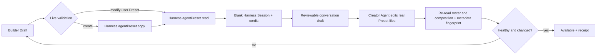

# FP10 Personal Agent Builder Plan

> Superseded（已替代）: 独立 Builder 页面已退役，当前能力并入 [`../product/RQ-106-agent-center-prd.md`](../product/RQ-106-agent-center-prd.md)。本文件仅保留历史设计依据。

## Outcome

FP10 adds a two-column natural-language Builder over Harness Agent Preset authoring. The Builder never writes a second Agent configuration: it creates a real local Preset through native `agentPreset.copy`, then hands a fixed, reviewable request to a real blank Session running the native `cordis` Creator Preset. The Creator Agent edits the Preset files under normal Harness tools, permissions and Session history.

Harness `0.1.0-rc.6` intentionally exposes no browser RPC that accepts arbitrary composition text. Therefore PAIMind must not simulate form-field persistence or invent a write endpoint. Existing Presets are modified only through Creator mode or the native `openDocument` directory handoff.

## Native mapping

| Product capability | Decision | Canonical owner |
|---|---|---|
| Preset roster, trust, broken/default facts | Reuse exactly | Harness `agentPreset.list` |
| Create a personal Preset | Native copy-only write | Harness `agentPreset.copy` |
| Read before/after state | Native privileged read | Harness `agentPreset.read` |
| Natural-language execution | Native blank Session using `cordis` | Harness Session + Agent Preset + conversation |
| Open files for direct authoring | Native id-only directory handoff | Harness `agentPreset.openDocument` |
| Undo a Builder-created Preset | Native delete, before it is bound to another Session | Harness `agentPreset.remove` |
| Restore arbitrary edited composition text | Not available in `rc.6`; no fake undo | None |
| Builder draft, composition-plus-metadata fingerprint receipt and lifecycle display | Product metadata only; never Agent configuration | `@paimind/agent-builder` |

## Whitelisted request contract

The browser may submit only:

- `mode`: `create | modify`;
- `sourcePresetId`: an id from the live roster, required for create;
- `targetPresetId`: a validated native id (`[a-z0-9][a-z0-9-_]*`);
- `displayName`: optional name used only by native copy;
- `requirement`: natural-language intent inserted into the Creator Session draft.

No Host path, raw Cordis YAML, plugin module, arbitrary JSON or composition text crosses the Builder write boundary. The Creator Agent must inspect the actual target and resolve Tool/Skill ids from Harness; FP10 does not store them.

## Package and compatibility seams

### `@paimind/harness-compat`

- Adds version-isolated `read`, `copy`, `openDocument` and `remove` Agent Preset methods.
- Exposes only the native Workspace new-Session action, Session binding and conversation draft setter needed for the Creator handoff.
- Keeps every `@deepseek-ai/*` import and `rc.6` shape outside feature packages.

### `@paimind/agent-builder`

- Registers one independent `settings.section` and one `Agents` Extension Center descriptor.
- Left column: create/modify mode, live source/target selection, optional display name and natural-language requirement.
- Right column: native target facts, Draft → Creator Session → Available lifecycle, before/after fingerprint over native composition/name/description, open-files action and bounded Undo.
- Serializes copy, handoff, refresh and removal operations. Duplicate submit is disabled while one native operation is active.
- Stores only the active Builder receipt in browser-local product metadata. Native roster and content are always re-read after refresh/restart.

## State and failure paths

- `authorable: false`: create is unavailable; browsing and modify/open actions remain truthful.
- System target: direct modify is refused. The user must create a local copy.
- Missing/broken source: copy is refused without creating a draft row.
- Creator Preset absent/broken: no Session handoff; a created copy remains visible as Draft and can be undone.
- Copy succeeds but handoff fails: receipt records the native copy and exposes Undo/Open files; no false Available state.
- Page refresh or Harness restart: product receipt reloads, then native roster/content are re-read before any lifecycle claim.
- Existing-preset modify: `rc.6` has no atomic content restore RPC; the UI must not advertise one-click Undo.
- Component removal/failure: native Agent Presets and conversation remain available.

## Verification

1. Pure tests: id whitelist, create/modify validation, fixed prompt construction, receipt parsing and hash comparison.
2. Client tests: authorable/read/copy/handoff/open/remove success and error, operation lock, refresh recovery, system refusal, bounded Undo and no false Available state.
3. Framework scan: exact `Agents` classification, authoring RPCs only behind compat, no Agent runtime/config store and no direct Harness import.
4. Full Type Check, tests, Production Build and exact Harness composition including isolated Agent Builder removal.
5. Product E2E from a clean id: create a real copy, launch a real `cordis` Session with the generated prompt, send it, observe actual Tool/Read/Edit execution, return to Builder, verify the native roster and changed content receipt, start a real Session with the created Preset, then remove the disposable test Preset only after the execution evidence is captured.

Product E2E hardened two runtime boundaries discovered during implementation:

- The native new-Session seat can finish loading its configured default after an optimistic Creator selection. Builder waits for that load and confirms `cordis` a second time before setting the draft.
- `agentPreset.read.content` covers the Cordis composition but metadata-only edits live in the same native read result as `name` and `description`. Availability therefore fingerprints all three fields; it never treats a metadata-only Creator edit as unchanged.

FP11 will supply governed Skill/Tool catalog ids. FP10 intentionally asks Creator mode to resolve them from Harness instead of storing an early duplicate registry.
