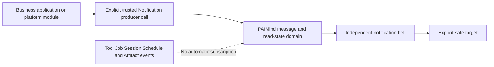

# FP12 Notification Center Plan

## Outcome

FP12 adds a durable PAIMind Notification Center for message and read-state only. DeepSeek Harness remains the sole owner of Workspace, Session, Job, Schedule and Artifact lifecycle. A notification stores a safe reference to one canonical object; it never copies that object's workflow state and never becomes an approval, retry, archive or task-processing system.

Harness `0.1.0-rc.6` has no Notification domain or public notification API. A minimal PAIMind message/read-state sidecar is therefore a legitimate new product domain rather than a duplicate Harness runtime object.

## Native mapping

| Product capability | Decision | Canonical owner |
|---|---|---|
| Workspace, Session and Artifact identity | Reuse exactly | Harness ids and native Session projection |
| Task, generation and schedule lifecycle | Reuse exactly | Harness Job / Schedule / Tool Result metadata |
| Notification title, body, level and read state | PAIMind-owned sidecar | `@hansen/notifications` storage domain |
| Producer trust | Host registration closure | PAIMind Host producer id; never client/model payload |
| Notification deep link | Safe canonical reference | Artifact, Session, registered PAIMind surface or credential-free HTTPS URL |
| Approval, retry, complete, blocked, archive and business workflow | Explicitly excluded | Canonical source domain |

## Package and seams

### `@hansen/contracts`

- Defines closed notification levels, trusted source snapshots and target union.
- Rejects unknown target kinds, non-HTTPS external links, embedded URL credentials and invalid ids.
- Keeps exactly one optional action target per message.

### `@hansen/harness-compat`

- Owns the version-sensitive Typert Remote and Storage Domain seams.
- Feature code sees structural `PaimindHostRemoteService`, Remote mount and storage-table contracts only.
- No notification feature imports Cordis, `dsh-storage-domain` or `dsh-typert-protocol` directly.

### `@hansen/notifications`

- Host service opens the versioned `paimind_notifications` Storage Domain under the active Harness profile.
- A registered producer captures its trusted source in Host code and publishes idempotently.
- The service is passive: it never listens to Tool, Job, Session, Schedule or Artifact lifecycle events. Business and platform producers must call `registerProducer(...).publish(...)` or the authenticated Platform API explicitly.
- Client mounts the package's strict Remote descriptors and contributes an independent sidebar-footer bell plus a shell Overlay/Drawer.
- Extension Center manages the capability under `Automation`; it is not the product entry point.
- Artifact actions open the exact Harness Session, focus the exact artifact id and open the stable Artifacts side card adapter.

## Canonical event flow

The notification does not persist Job status, Artifact availability, revision truth or Session content. If a linked object changes, its native projection remains authoritative.

## State and failure paths

- Publish is idempotent by trusted producer id plus idempotency key.
- Storage retains the latest 200 messages; expiry removes notification rows only.
- `markRead` uses a version compare-and-set contract. A conflict returns the current record rather than overwriting another client.
- `markAllRead` changes read timestamps only.
- Body is rendered as plain text; markup is never interpreted.
- Notification publication failure is returned only to the explicit caller and never changes the referenced business or Harness object lifecycle.
- Missing target or removed viewer leaves the message readable; native conversation remains usable.
- Removing only this package leaves Artifact, Task Monitor, Extension Center and native conversation running.

## Product E2E gate

1. Record the current Notification count, then generate a real Artifact and verify its Tool, Job, Deliverable and Artifact results remain available while the count does not change.
2. Publish one real message through a trusted registered producer or the authenticated Platform API.
3. Verify exactly one new unread message appears with the caller-bound source, explicit content, level and target.
4. Repeat the same `idempotencyKey` and verify no duplicate message is created.
5. Open the independent bell, filter All/Unread, inspect plain-text source/body/level and mark one/all read.
6. Follow the explicit target and verify the exact registered destination opens.
7. Refresh the browser and restart Harness; notification and read state must recover from Harness profile storage.
8. Verify Chinese/Dark, English/Light and 560 px narrow Drawer behavior.
9. Remove only `@hansen/notifications`; native conversation, Task Monitor, Artifact entry and viewer must remain usable.

## Automated and composition verification

- Contract tests: safe target, external URL and immutable record rules.
- Domain tests: trusted producer, deterministic idempotency, compare-and-set read mutation and mark-all.
- Remote tests: one shared strict schema set for Host and Client and rejection of unsafe wire values.
- Client tests: plain-text rendering, unread filter, exact Artifact deep link, mark-all, independent slot registration and Remote mounting.
- Full tests, Type Check, Production Build and framework scan.
- Exact Harness composition: full install/boot/remove/restore, operation without Extension Center, and an isolated composition with Notification Center absent and zero upstream source delta.

FP12 originally reached Product E2E Verified on 2026-08-15 with an automatic Artifact producer. The 2026-08-17 product correction retired that producer and replaced the gate with explicit-producer publication plus proof that ordinary Artifact generation does not change the Notification count.
