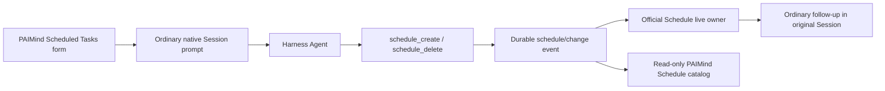

# FP13 Scheduled Tasks Plan

> Historical Goal A plan. Superseded for current product behavior by the later RQ-103 activation decision; retained as evidence of the previous native-facade scope.

## Outcome

FP13 enables the official Harness `@deepseek-ai/dsh-schedule` package and adds a PAIMind Scheduled Tasks product layer over its canonical Session-local reminders. PAIMind does not own a second Schedule, Job, Session or timer runtime.

Harness `0.1.0-rc.6` ships Schedule but does not enable it in the default Web Profile. Version 1 supports `after`, explicit `at`, and fixed-rate `every` rules through `schedule_create`, `schedule_list`, `schedule_delete` and the durable `schedule/change` Session event. Delivery returns to the original live Session as an ordinary later conversation turn.

## Native mapping and capability boundary

| Product capability | Decision | Canonical owner |
|---|---|---|
| Reminder id, rule, prompt, target and active state | Reuse exactly | Harness Schedule v1 and `schedule/change` |
| Persistence and replay | Reuse exactly | Harness Session event log and persistence barrier |
| Create, list and delete | Reuse exactly | Harness Agent-scoped Schedule Tools |
| Time-zone interpretation | Reuse official opt-in support | Harness Time Context plus explicit Tool selector |
| Due execution | Reuse exactly | Harness live root Agent `followup()` in the original Session |
| Product catalog and form | PAIMind product layer | Historical Session-local facade button and Overlay/Drawer |
| Due notification | Optional PAIMind projection | Trusted producer from canonical dispatch event; Session target only |
| Run now | Unsupported in Schedule v1 | No PAIMind substitute |
| Cron/calendar recurrence | Unsupported in Schedule v1 | No PAIMind substitute |
| Independent Scheduled Session / cold wake | Unsupported in Schedule v1 | No PAIMind substitute |
| Independent run receipt/history | Unsupported in Schedule v1 | Native conversation is the result surface |

The legacy prototype's platform/personal schedule stores, synthetic run ids, archive/backfill, integration types and fabricated independent Sessions are deleted from migration scope. They are not evidence of a Harness capability.

## Packages and seams

### Native Bundle composition

- Add `@deepseek-ai/dsh-time-context` and `@deepseek-ai/dsh-schedule` before PAIMind Scheduler.
- Keep both packages behind the exact Harness `rc.6` compatibility gate.
- Schedule remains a native Harness object even when its PAIMind management UI is removed.

### `@paimind/harness-compat`

- Own the only direct import of public `@deepseek-ai/dsh-schedule` fold/view helpers.
- Expose a structural Session-event reader and a safe active-view adapter.
- Extend the structural Client Session face only with the already-public `prompt()` verb used to request native Tool execution.

### Historical Session-local facade

- Host strict Remote lists active reminders by folding the exact live Session log through official Schedule functions.
- Client contributes an independent sidebar-footer clock and a body-level Overlay/Drawer.
- Create and delete actions send an ordinary, explicit user prompt into the current Session. The Agent must invoke the native Schedule Tool; browser code never appends Schedule events or mutates timer state.
- Extension Center manages the descriptor under `Automation`; it is not the entry point.

## Canonical flow

## State and failure paths

- No live current Session: panel is read-only and explains that the selected Session must be live.
- Native Tool absent, rejected or model does not call it: the conversation owns the error; the catalog cannot invent a record.
- Invalid rule/time zone/non-future target/frequency below five minutes: native Schedule error remains authoritative.
- Persistence barrier uncertainty: the UI refreshes the official fold and never assumes success.
- Cold Session: timers do not run. Reopening reconstructs the owner and makes past reminders overdue; this limitation is visible.
- One-shot dispatch removes the active record after admission; the actual assistant result stays in ordinary conversation.
- Notification unavailable or failing: the canonical schedule dispatch and conversation continue.
- Scheduler UI unavailable or removed: native `schedule_*` tools and conversation remain usable.

## Product E2E gate

1. Start exact Harness with native Schedule enabled and no schedule fixture.
2. From the independent Scheduled Tasks button, request one short one-shot reminder.
3. Verify the real Agent calls `schedule_create`, a durable `schedule/change` record appears, and the PAIMind catalog reads the same id/rule/target.
4. Wait while the original Session remains live; verify the native reminder framing creates an ordinary later conversation turn and the active one-shot disappears.
5. Create an `every` rule at the native five-minute minimum, refresh and restart Harness, then verify the record recovers from the Session log. Delete it through `schedule_delete` and verify it disappears.
6. Trigger a real invalid rule and verify no record is invented.
7. Verify Chinese/Dark, English/Light and 560×800 Drawer behavior.
8. Remove only the historical facade; native Schedule tools, conversation, Task Monitor, Notification Center and other plugins must remain usable.

## Automated and composition verification

- Compat tests compare adapter output with official Schedule v1 fold/view behavior, including fork seed and dispatch context.
- Host tests cover live/unavailable/corrupt catalog states without a shadow store.
- Client tests cover exact Agent prompt construction, native failure handling, delete, independent slots, portal layering, current-Session switching and capability disclosure.
- Full tests, Type Check, Production Build and framework scan.
- Exact Harness composition: full install/boot/remove/restore plus a PAIMind Scheduler-absent profile that retains native Schedule and zero upstream source delta.

FP13 can become Product E2E Verified only after the real native Schedule create/due/restart/delete/error/isolation browser loop passes. A simulated timer, client-owned record or prototype fixture is insufficient.
