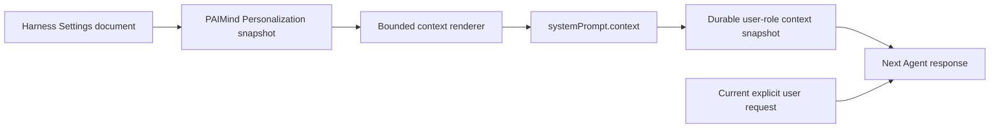

# FP14 Personalization Plan

## Product decision

FP14 contributes one PAIMind-owned `Personalization` section to the native Harness Settings shell. The product serves business users: Communication Style changes how assistants communicate, while Work Background and Response Requirements provide user-authored defaults. Project instructions and Memory remain separate concepts. Labels follow the [UI foundation writing rules](../standards/ui-foundation.md#面向业务用户的命名与文案), rather than inheriting wording from reference products.

Official references:

- [Personalize ChatGPT](https://learn.chatgpt.com/docs/personalize)
- [Codex customization](https://learn.chatgpt.com/docs/customization/overview)
- [Codex memories](https://learn.chatgpt.com/docs/customization/memories)

## Capability mapping

| Capability | Owner and result | Decision |
|---|---|---|
| Communication Style: Default / Friendly / Practical | PAIMind canonical Settings plus user-context projection; persisted `personality` values unchanged | Migrate |
| Work Background / Role and Responsibilities | PAIMind canonical Settings plus user-context projection; persisted `aboutMe` unchanged | Migrate |
| Response Requirements / Content and Format Requirements | PAIMind canonical Settings plus user-context projection; persisted `customInstructions` unchanged | Migrate |
| Collaboration enable switch | Stops context projection without deleting the saved profile; interface preferences remain independent | Add |
| Language, theme, model, Agent Preset, permission and composer | Native Harness owners | Native Reuse |
| Interface motion | Visual Experience owns system/on/off; FP14 hosts its optional native-slot contribution | Source-owned contribution; no FP14 motion storage |
| Notification receive policy | Notification domain | Remove from FP14; no current user receive switch |
| Memory and history inference | No approved PAIMind Memory domain | Retire; do not simulate |

## Product contract

```ts
interface PaimindPersonalization {
  enabled: boolean
  personality: 'none' | 'friendly' | 'pragmatic'
  aboutMe: string
  customInstructions: string
}
```

- Package name remains `@hansen/user-settings` for installation compatibility.
- Host namespace remains `paimind-user-settings` and uses the canonical Harness Settings document, schema validation and native revision/CAS.
- Client entry is named `Personalization` / `个性化`; there is no standalone Personal Center runtime.
- Empty defaults or `enabled: false` produce no model context.
- The saved preview shows Communication Style, Work Background and Response Requirements. Unsaved text is excluded. Raw context markup is not displayed in the business settings page; exact context generation remains covered by the Host contract and its tests.
- A one-time Host migration maps useful legacy response style/personal instruction values to the new fields, then removes every retired response, Notification and motion key from the raw user section.

## Injection model



The context identifies itself as user-authored long-term defaults. It explicitly states that the current request wins and that personalization cannot change safety, permission, tool, model, active-Agent or Workspace/project boundaries. User-entered angle brackets and ampersands are escaped before rendering so they cannot break the context envelope.

## Failure and ownership boundaries

- Settings unavailable or Remote mount failure: show an explicit unavailable state; never fall back to local/session storage.
- Stale revision or write failure: reread the canonical Host namespace, show committed values in the saved preview, and retain unsaved editor text for review/retry. Never claim a failed write was saved.
- The two text fields use one `saveText` request and one native revision-protected operation batch. The existing single-field `mutate` contract remains for the enable switch and personality, and for existing consumers.
- The plugin owns an in-memory editor per client scope. Navigating away from the settings section or closing/reopening the settings shell preserves drafts. Browser reload, plugin unload, and process lifecycle are not durable draft storage; the page registers the browser's native unload warning while dirty and releases it on disposal.
- Invalid or overlong fields: reject before persistence and context projection.
- Removing FP14 removes only the settings entry and future personalization context.
- Notifications remain publish/read-state behavior owned by `@hansen/notifications`.
- Runtime Orb motion consumes the shared UI foundation contract. Visual Experience owns the preference; when absent, consumers follow the operating-system reduced-motion preference. The FP14 collaboration switch does not control interface motion.
- Memory is not inferred from conversation history and is not presented as implemented.

## Verification gates

1. Schema, defaults, disable behavior, escaping, priority boundary and exact context rendering tests.
2. Narrow Remote read/write, native revision/CAS, atomic two-field save, retained drafts, rejected writes and unavailable-state recovery tests.
3. Notification code has no `paimindUserSettings` dependency; Runtime Orb consumes UI foundation motion helpers without its own preference resolution or FP14 state dependency.
4. Type Check, full automated tests, Production Build, framework verification and documentation checks pass.
5. In a real Harness profile, save a unique Work Background or Response Requirements value and verify `paimind:personalization` appears as a user-role context snapshot from the next turn.
6. Disable personalization and verify the next turn records the cleared context and no longer applies the value; re-enable and verify recovery.
7. Verify refresh/restart persistence, Chinese/Dark, English/Light and narrow layout.

Product E2E is complete only after the real settings → context snapshot → Agent response loop is verified. A form fixture or a rendered preview alone is not acceptance.

## UI foundation update — 2026-09-07

The [UI foundation contract](../standards/ui-foundation.md) supersedes the previous OS-only motion decision. FP14 declares the optional `paimind.personalization.appearance` child slot; Visual Experience provides the source-owned component and persistence. When FP14 is absent, the same contribution falls back to General settings. When Visual Experience is absent, collaboration settings continue independently. Interface fields never enter the collaboration context payload.

The [foundation v1 pre-acceptance](../acceptance/ui-foundation-v1-2026-09-07.md) records the minimum consumer integration. The subsequent [Personalization UI pre-acceptance](../acceptance/user-settings-ui-2026-09-07.md) covers this plugin's editing, recovery, accessibility and presentation changes. Model-context acceptance remains a separate gate.
