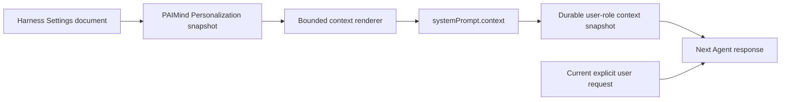

# FP14 Personalization Plan

## Product decision

FP14 contributes one PAIMind-owned `Personalization` section to the native Harness Settings shell. It follows the Codex customization model: Personality changes communication style rather than capability; About You and Custom Instructions provide user-authored defaults; project instructions and Memory remain separate concepts.

Official references:

- [Personalize ChatGPT](https://learn.chatgpt.com/docs/personalize)
- [Codex customization](https://learn.chatgpt.com/docs/customization/overview)
- [Codex memories](https://learn.chatgpt.com/docs/customization/memories)

## Capability mapping

| Capability | Owner and result | Decision |
|---|---|---|
| Personality: None / Friendly / Pragmatic | PAIMind canonical Settings plus user-context projection | Migrate |
| About You | PAIMind canonical Settings plus user-context projection | Migrate |
| Custom Instructions | PAIMind canonical Settings plus user-context projection | Migrate |
| Master enable switch | Stops context projection without deleting the saved profile | Add |
| Language, theme, model, Agent Preset, permission and composer | Native Harness owners | Native Reuse |
| Reduced motion | Operating-system `prefers-reduced-motion` plus native Harness behavior | Native Reuse; remove from FP14 |
| Notification receive policy | Notification domain | Remove from FP14; no current user receive switch |
| Memory and history inference | No approved PAIMind Memory domain | Retire; do not simulate |

## Product contract

```ts
interface PaimindPersonalization {
  enabled: boolean
  personality: 'none' | 'friendly' | 'pragmatic'
  aboutMe: string
  customInstructions: string
}
```

- Package name remains `@hansen/user-settings` for installation compatibility.
- Host namespace remains `paimind-user-settings` and uses the canonical Harness Settings document, schema validation and native revision/CAS.
- Client entry is named `Personalization` / `个性化`; there is no standalone Personal Center runtime.
- Empty defaults or `enabled: false` produce no model context.
- The preview renders the exact context payload that the Host projects.
- A one-time Host migration maps useful legacy response style/personal instruction values to the new fields, then removes every retired response, Notification and motion key from the raw user section.

## Injection model



The context identifies itself as user-authored long-term defaults. It explicitly states that the current request wins and that personalization cannot change safety, permission, tool, model, active-Agent or Workspace/project boundaries. User-entered angle brackets and ampersands are escaped before rendering so they cannot break the context envelope.

## Failure and ownership boundaries

- Settings unavailable or Remote mount failure: show an explicit unavailable state; never fall back to local/session storage.
- Stale revision or write failure: reread the canonical Host namespace and show only committed values.
- Invalid or overlong fields: reject before persistence and context projection.
- Removing FP14 removes only the settings entry and future personalization context.
- Notifications remain publish/read-state behavior owned by `@hansen/notifications`.
- Runtime Orb motion follows only the operating-system reduced-motion preference.
- Memory is not inferred from conversation history and is not presented as implemented.

## Verification gates

1. Schema, defaults, disable behavior, escaping, priority boundary and exact context rendering tests.
2. Narrow Remote read/write, native revision/CAS, two-field sequential save and unavailable-state tests.
3. Notification code has no `paimindUserSettings` dependency; Runtime Orb has no `data-paimind-motion` dependency.
4. Type Check, full automated tests, Production Build, framework verification and documentation checks pass.
5. In a real Harness profile, save a unique About You or Custom Instructions value and verify `paimind:personalization` appears as a user-role context snapshot from the next turn.
6. Disable personalization and verify the next turn records the cleared context and no longer applies the value; re-enable and verify recovery.
7. Verify refresh/restart persistence, Chinese/Dark, English/Light and narrow layout.

Product E2E is complete only after the real settings → context snapshot → Agent response loop is verified. A form fixture or a rendered preview alone is not acceptance.
