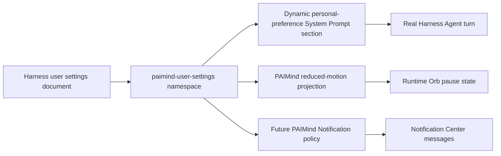

# FP14 Personal Center and Settings Plan

## Product decision

FP14 contributes one PAIMind-owned section to the native Harness Settings shell. It does not create a Personal Center route, duplicate General Settings, or persist browser-only prototype state. Harness remains the owner of locale, theme, model, Agent Preset, permission preset, composer behavior and the user settings document.

## Capability mapping

| Prototype capability | Harness / PAIMind result | Decision |
|---|---|---|
| Language | Harness General → Language | Native Reuse |
| Light/Dark/System | Harness General → Appearance | Native Reuse |
| Model/reasoning selection | Harness Model and native Composer | Native Reuse |
| Default permission mode | Harness General / Permission Preset | Native Reuse; FP15 governs enterprise authorization |
| Response style, length, structure, citations and personal instructions | PAIMind settings namespace plus a live Harness System Prompt section | Migrate |
| Reduced motion | System preference remains authoritative; PAIMind can additionally force reduced motion for PAIMind animations | Migrate without overriding an OS reduction |
| In-app notification policy | PAIMind preference filters future PAIMind Notification publications; stored messages and Harness objects are untouched | Migrate |
| Prototype memory and history-reference switches | No Harness Memory domain; prototype entries are synthetic | Retire, do not simulate |
| Browser notification permission | No production delivery provider | Do not expose |
| App confirmation policies | Harness Sandbox/Approval plus FP15 authorization | Defer to FP15 |
| Density and trace-detail defaults | No current cross-plugin consumer that can apply them honestly | Do not expose until a real consumer exists |

## Package and contracts

- New package: `@paimind/user-settings`.
- Host namespace: `paimind-user-settings`, registered through Harness `ctx.settings` with schema defaults and live application.
- Host service: `ctx.paimindUserSettings`, exposing an immutable current snapshot and policy predicates to optional PAIMind consumers.
- AI integration: one dynamic `systemPrompt.section` reads the current Harness settings snapshot for every assembly. Empty/default preferences add no misleading product capability.
- Client persistence: the Host registers the namespace in canonical Harness Settings. Harness `0.1.0-rc.6` exposes only a static Web Settings namespace allowlist, so the client uses a narrow PAIMind Typert Remote to call Host `describe`/`mutate`; the adapter still reads/writes the same Harness settings document and carries the native namespace revision/CAS fence. It never creates a second store.
- Client surface: one `settings.section` entry called `PAIMind Preferences`; no launcher and no standalone page.
- Extension Center descriptor: category `Experience`, surface `settings-section`.
- Runtime Orb integration: `system` follows `prefers-reduced-motion`; `reduce` also pauses PAIMind animation through a PAIMind-owned root attribute.
- Notification integration: optional Host service injection filters only future PAIMind publications with `all`, `attention` or `off`; canonical Schedule/Job/Artifact state and existing messages are never changed.

## State model

## Failure and permission boundaries

- Settings unavailable or Remote mount failure: section renders a disabled, explicit unavailable state; it does not fall back to local/session storage.
- Stale revision or write failure: the narrow client adapter rereads the canonical Host namespace and the UI shows the last committed value.
- Invalid or overlong personal instruction: schema rejects before persistence; no prompt section is published from invalid data.
- PAIMind settings package failure/removal: native Language, Theme, Model, Permission, Conversation, Agent Preset and Notification storage continue.
- Notification policy failure cannot fail the producer Tool or Schedule dispatch.
- Reduced-motion projection affects PAIMind animation only; native Harness CSS continues to honor the operating-system media preference.

## Automated and composition gates

- Schema/default/normalization and prompt rendering tests.
- Narrow Remote read/write, native revision/CAS propagation, unavailable, stale-write recovery and locale tests.
- Runtime Orb observes the PAIMind reduction attribute without forcing motion against the OS.
- Notification policy tests cover all/attention/off and optional-service absence.
- Production build, exact seven-category descriptor scan and no direct Harness imports outside `harness-compat`.
- Exact Harness install/boot/remove/restore plus a PAIMind-user-settings-absent profile that preserves native settings and every other PAIMind feature.

## Real Product E2E

1. Open native Settings and verify Language, Appearance, Model, permission and composer rows remain the only native owners of those capabilities.
2. Open `PAIMind Preferences`; save a unique personal instruction and response preference.
3. Run a real Agent turn and verify the new instruction affects the model response through native System Prompt injection.
4. Refresh and restart Harness; verify the canonical settings and the same Agent effect recover.
5. Clear the instruction and verify a subsequent real turn no longer follows it.
6. Select reduced motion and trigger a real active Runtime Orb; verify state remains visible while animation is paused. Restore System.
7. Set notification policy Off, perform a real artifact generation and verify no new PAIMind message while Job/Artifact/Deliverable still complete. Restore All and verify a later real generation produces a message.
8. Check Chinese/Dark, English/Light and 560×800.
9. Remove only `@paimind/user-settings`; verify the section and preference effects disappear while native Settings, conversation, Runtime Orb system media behavior, Notification Center and every existing message remain. Restore the formal Bundle.

FP14 is Product E2E Verified only after this real settings → model/motion/notification loop passes. A form fixture or localStorage write is insufficient.
