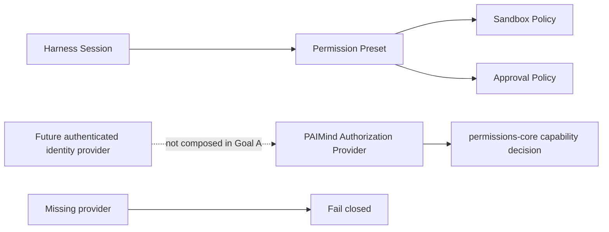

# FP15 Permissions and Administration Plan

## Product decision

FP15 does not fabricate an enterprise identity, role switcher or Configuration Studio on top of a single-user local Harness. Harness Permission Presets remain the sole owner of Sandbox and one-shot Approval policy. PAIMind retains only a provider-neutral server authorization contract that fails closed when no authenticated Authorization Provider is composed.

The frozen prototype is not a migration source for production RBAC: its sign-in identity is selected from browser `sessionStorage`; its release UI says `Role preview only · no real RBAC`; enterprise publication writes only a local draft and explicitly does not change visibility or send approval. Those surfaces are retired rather than relabeled as a working administration product.

## Capability mapping

| Prototype or planned capability | Harness / PAIMind result | Decision |
|---|---|---|
| Read Only / Workspace Write / Full Access | Harness Permission Preset and Sandbox Policy | Native Reuse |
| Ask / Never approval policy and one-shot approval | Harness User Approval and Permission Preset | Native Reuse |
| Default permission for new Sessions | Harness General settings | Native Reuse |
| Session-specific permission switch and audit events | Harness Session log and Permission Projection | Native Reuse |
| Browser-selected member/developer/admin role | No authenticated identity in Harness; prototype uses sessionStorage | Retire |
| Role preview and client-side visibility hiding | Not authorization | Retire |
| Configuration Studio local draft and simulated publication | No authenticated UserAiApplication service/provider | Retire |
| Product capability authorization contract | `@paimind/permissions-core`, provider-neutral and fail-closed | Harden as technical framework |
| Enterprise directory publication, SSO, MFA, organization membership and role assignment | Requires an authenticated cloud identity/control-plane provider | Out of Goal A implementation scope; do not simulate |

## Canonical ownership

- Harness owns every runtime permission event and enforcement mechanism.
- An Authorization Provider must resolve its own authenticated principal; a client or operation caller cannot submit a trusted role.
- `permissions-core` accepts a provider object from server composition, asks it for the current principal, and asks the same provider for authorization.
- Missing principal, missing provider, provider failure and explicit denial all produce structured denials. No default `member`, local role, environment role or browser fallback exists.
- Resource identity is optional, typed and opaque. It is context for the trusted provider, never proof of access.

## Package changes

1. Replace caller-supplied `decidePermission(role, capability)` with asynchronous provider-backed `authorizePermission(provider, request)`.
2. Add structured principals, resources, denial reasons and a `PaimindAuthorizationError` suitable for Host operation boundaries.
3. Keep capability vocabulary stable but remove the embedded role matrix and any default role.
4. Do not add a user-visible FP15 plugin or Extension Center descriptor while no real provider exists. The `Governance` category remains valid and can host a future provider-backed capability.
5. Do not add a PAIMind permission selector, admin navigation item, local Configuration Studio store or browser identity.

## Failure and security boundaries

- Provider absent → `provider-unavailable`, denied.
- Provider returns no authenticated principal → `unauthenticated`, denied.
- Provider explicitly denies → `forbidden`, denied.
- Provider throws → `provider-error`, denied without leaking the provider error to the client.
- Malformed request or unknown capability → schema/type boundary rejects before the provider call.
- Harness Permission Preset selection neither grants PAIMind business authorization nor changes an Authorization Provider decision.
- PAIMind authorization cannot weaken Sandbox or Approval; both decisions must pass independently where both apply.

## Verification gates

1. Unit tests cover allow, explicit deny, missing provider, missing principal, provider failure and resource forwarding.
2. Framework scan forbids embedded default roles, browser storage, a PAIMind permission selector and an Admin/Configuration Studio descriptor.
3. Native browser verification proves Harness General/Composer remains the only permission selector and a real Session permission change remains native.
4. Extension Center `Governance` contains no fake available administration product.
5. Production build and exact Harness composition pass with `permissions-core` as a headless library.
6. Removing all PAIMind packages leaves native Permission Presets fully functional and the upstream worktree unchanged relative to baseline.

## Exit classification

- Runtime permissions: `Native Reuse`.
- Prototype RBAC and Configuration Studio publication: `Retired`.
- Provider-neutral authorization contract: `Technically Verified`, not counted as a user product feature.
- No Product E2E authorization claim is made until a real authenticated provider and at least one protected PAIMind mutation are composed.
