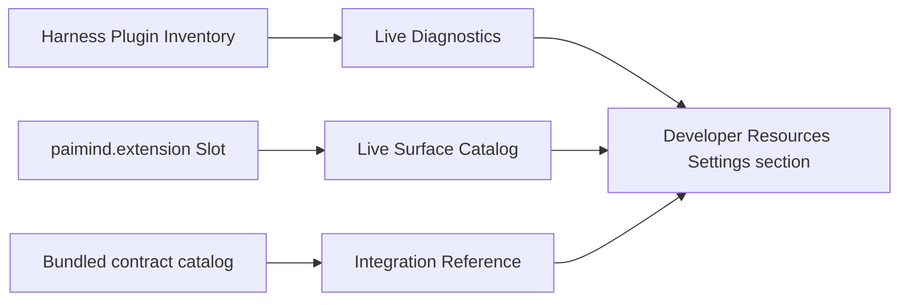

# FP16 Developer Resources Plan

## Product decision

FP16 is a read-only developer product surface over two deliberately separate sources:

1. **Live observation** comes only from the native Harness Plugin Inventory and from current `paimind.extension` slot contributions.
2. **Bundled reference** comes from immutable PAIMind integration contracts shipped with the installed package version.

It does not create a second Plugin Registry, enable/disable control, version database, dependency graph, synthetic health score, navigation launcher, or simulated component state. Harness remains the sole owner of technical loading, versions, dependencies and enablement. The PAIMind Extension Center remains the product capability manager.

## Capability mapping

| Prototype capability | Harness / PAIMind result | Decision |
|---|---|---|
| Component Library with prototype previews | Current `paimind.extension` contributions become a live Surface Catalog | Migrate the catalog value; retire synthetic previews and stale prototype components |
| Component runtime-state simulator | No production authority | Retire; use real browser/Product E2E evidence instead |
| Real-AI prompt recipes | Existing Feature Package acceptance documents and final E2E own executable scenarios | Retire duplicated copy-prompt lab |
| Plugin manifest | Harness Plugin Inventory provides exact Loader entries; Extension descriptors provide product metadata | Reuse both without joining guessed fields |
| Runtime diagnostics | Exact `entryId`, `moduleName`, `enabled`, `fiberPhase` for `@paimind/*` entries | Migrate as read-only live diagnostics |
| Versions, dependencies and failure stack | Not exposed by the current native inventory contract | Do not fabricate or scrape Loader internals |
| Integration reference | Static catalog of real PAIMind Slot, Service, Adapter, Event and Projection contracts | Migrate and label `Bundled reference` |
| Plugin enable/disable/install/uninstall | Harness Plugin Registry / native plugin tooling | Native Reuse; no PAIMind control |

## Package and surfaces

- New independent package: `@paimind/developer-resources`.
- Native shell entry: one `settings.section` named `Developer Resources`.
- Extension Center descriptor: category `Developer`, surface `settings`.
- Live sources:
  - `remote.pluginInventory.list()` for the native point-in-time Loader snapshot.
  - `paimind.extension` child-slot contributions for current product surface metadata.
- Slot ownership: Extension Center remains the only `paimind.extension` child-slot owner. Developer Resources is a read-only consumer and never redeclares the slot.
- Bundled sources:
  - `PAIMIND_INTEGRATION_REFERENCES`, compiled from actual stable contracts in this repository.
- The package is independently removable. Its absence removes only this read-only page and descriptor.

## Information architecture

### Live Diagnostics

- Shows PAIMind Loader entries only.
- Summary: total, active, loading, failed, disabled and enabled-but-unobserved.
- Each row preserves the exact native `moduleName` and `entryId`.
- A refresh performs a new native read; no cached technical state is shown after failure.
- The page explicitly states that versions, dependency graphs and failure details are not present in the current public contract.

### Surface Catalog

- Shows only current immutable `PaimindExtensionDescriptor` contributions.
- Displays category, actual surface, maturity, package id and a technical projection joined only by exact package module id.
- It does not render synthetic interactive component states and does not become a launcher.

### Integration Reference

- Shows real contract identifiers and ownership boundaries.
- Every entry is labeled `Bundled reference`, not `Live`.
- Initial contracts cover Extension contribution, Workspace adapter, independent Task action, Generator registry, Artifact Tool Result envelope, Artifact Session Projection, Preview/Side Card adapter and native Settings section.

## Failure and compatibility boundaries

- Inventory Remote unavailable: diagnostics and live technical projection show an explicit unavailable state with Retry; no stale success snapshot remains.
- One malformed extension contribution: ignored locally; other descriptors and native conversation remain usable.
- Developer Resources render failure: an Error Boundary removes only this section.
- Package removal or failure: Extension Center, native Plugin Inventory, conversation and all feature packages remain usable.
- No package outside `harness-compat` imports a version-sensitive Harness module.
- The package reads no filesystem, package-lock, Loader internals, browser storage or Better Sidebar internal API.
- Bento remains registered through the stable PAIMind Preview/Side Card adapter and is represented only by that public boundary.

## Automated and composition gates

1. Summary and exact-package projection tests cover active/loading/failed/disabled/unobserved and non-PAIMind exclusion.
2. Client tests cover the three tabs, exact native ids, immutable descriptor catalog, bundled-reference labels, unavailable/retry and locale.
3. Framework scan forbids Plugin Registry mutations, browser storage, direct Harness imports, guessed version/dependency/error fields and Better Sidebar imports.
4. Production build and Type Check pass.
5. Exact Harness install/boot/remove/restore passes with an isolated composition that omits only `@paimind/developer-resources` while retaining Extension Center, native Plugin Inventory and all other products.

## Browser Product E2E

1. Open native Settings → Developer Resources in the formal Bundle.
2. Confirm Live Diagnostics lists the currently installed `@paimind/*` Loader entries with exact module ids and real active phases.
3. Compare at least one row with native Settings → Plugins; the module and lifecycle fact must match.
4. Open Surface Catalog and confirm the current Runtime Orb, Task Monitor, Artifact, Agent, Skill, Automation and Developer descriptors are visible; no retired Launcher, empty Conversation marker or synthetic Admin surface appears.
5. Open Integration Reference and confirm all rows say `Bundled reference` and identify their owner/boundary.
6. Refresh the page and restart Harness; live diagnostics must be read again and remain truthful.
7. Check Chinese/Dark, English/Light and `560×800`.
8. Remove only Developer Resources; native Plugins, Extension Center, conversation and every product capability must remain. Restore the formal Bundle.

FP16 is Product E2E Verified only after the live native inventory and real registered surfaces pass in the running Harness. A fixture-only component preview is insufficient.
