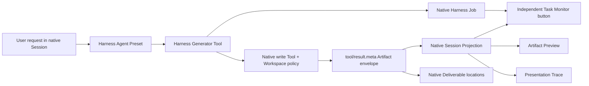

# R2 Product Truth Plane Plan

## Outcome

R2 establishes one production fact chain for generated PAIMind artifacts without creating a second Workspace, Session, Job, Deliverable or Plugin runtime. Its first concrete provider is a real HTML generator used to prove the entire chain before binary generators are added in R3.

## Locked product classification

| Concern | Canonical owner | PAIMind product role |
|---|---|---|
| Technical load, version, dependencies, enable/disable and Fiber state | Harness Plugin Registry | Extension Center joins status by package id; it never replaces the Registry |
| Capability categories and product metadata | PAIMind Extension Center | Exactly Experience, Content & Rendering, Agents, Skills & Tools, Automation, Governance and Developer |
| Product navigation | Each feature's native surface | Launcher remains retired; Extension Center is capability management, not navigation |
| Agent execution/configuration | Harness Agent Preset | Agent Center adds catalog/market/category/governance; Builder edits or creates the Preset |
| Task lifecycle | Harness Job Registry | Task Monitor is an independent button and read-only projection |
| Bento rendering | PAIMind Bento Renderer Plugin | Registers through stable Preview/Side Card Adapter; no Better Sidebar internal dependency |

## Native fact chain

## Contracts and packages

- `@paimind/contracts` owns `ArtifactProducedEnvelopeV1`, explicit format/preview enums and validators.
- `@paimind/harness-compat/host` is the only direct bridge to version-sensitive Harness Tool definitions and structural Host services.
- `@paimind/artifact-runtime` owns the capability registry, Native Job wrapper, bounded Workspace verification and pure Session Projection definition. It owns no artifact database.
- `@paimind/generator-web` registers `generate_html_artifact`. Format semantics are static provider facts; the model supplies only validated arguments.
- `@paimind/task-monitor` reads all native `jobsBySession` rows, orders active work first, and enriches only exact Artifact `taskId` matches. It also derives current Goal, Todo, Plan, Workflow/Subagent, Tool Call, Deliverable, invoked Skill and evidenced MCP summaries without a shadow store.
- `@paimind/artifacts` consumes both native Deliverables and the same Session Projection, deduplicating by Session/path in favor of the explicit product envelope.

## Durable carrier decision

The selected Harness runtime rejects unknown required Session event types and exposes no public custom-event registration API. R2 therefore does not emit a private `paimind/artifact-produced` event. It persists the versioned envelope in native `tool/result.meta`, which the Session log already records and replays, and folds it through the public Session Projection registry.

Native Job records are process-local. Browser refresh must retain them; Harness restart is expected to restore files, Deliverables and Artifact projection but not Job history. This limitation is visible in Task Monitor and cannot be hidden by a PAIMind shadow store.

## Failure and permission rules

1. Generation requires a live native Agent and Workspace membership.
2. File publication calls the native `write` Tool with the generator Tool token as parent, preserving Sandbox/Approval policy.
3. `ctx.fs.resolve`, Workspace containment and final `stat` must pass before state becomes `available`.
4. Failure metadata is durable, Native Job ends `failed`, and Tool presentation has no Deliverable location.
5. Provider or UI failure is isolated to that package; native conversation remains usable.
6. No consumer infers format, ownership or success from model prose, a filename or HTML body.

## R2 exit gate

1. Focused contract/execution tests, full test suite, Type Check and production build pass.
2. Framework verifier enforces Registry/Extension Center separation, seven categories, Task Monitor independence, Agent/Preset ownership and Bento adapter-only imports.
3. Exact Harness composition installs, boots, serves, removes and restores without upstream source changes.
4. From an empty Workspace/Session, a real Agent invokes `generate_html_artifact`.
5. The independent Task Monitor button shows the real Native Job and exact artifact correlation.
6. Native conversation shows a clickable Deliverable; clicking opens the HTML Viewer.
7. Page refresh replays Job and Artifact. Harness restart replays Artifact/Deliverable and truthfully drops process-local Job history.
8. A denied/invalid generation ends failed and creates no clickable Deliverable.

R2 completed on 2026-08-15. The truth plane and one real HTML loop passed; the evidence is recorded in [`../checkpoints/R2-product-truth-plane.md`](../checkpoints/R2-product-truth-plane.md). This does not restore FP06-FP08 to Product Verified; R3 still requires PPTX, PDF, formula-bearing XLSX, Bento and real Trace lineage in the complete five-format batch.
