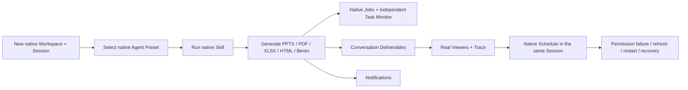

# R7 Final Product E2E and Prototype Retirement Plan

## Exit decision

R7 is the final Goal A stage. It does not add a seventeenth Feature Package. It proves that the already verified native objects and PAIMind plugins still form one coherent product after a supported external-provider upgrade, then operationally retires the frozen prototype runtime without editing or deleting its source.

Goal A may complete only when all R7 gates below pass and every valid prototype capability is mapped to Native Reuse, Product E2E Verified, Not Applicable infrastructure or explicit Retired status.

Execution status: complete on 2026-08-15. The evidence is recorded in
[`../acceptance/R7-final-e2e-retirement.md`](../acceptance/R7-final-e2e-retirement.md)
and [`../checkpoints/R7-final-e2e-retirement.md`](../checkpoints/R7-final-e2e-retirement.md).

## Current upgrade facts

- The official npm registry reports `@deepseek-ai/dsh@0.1.0-rc.6` as both `latest` and `next` on 2026-08-15. There is no newer published Harness candidate to test honestly.
- The historical selected baseline was exact Harness `0.1.0-rc.6` plus `dsh-better-sidebar@0.11.0`.
- `dsh-better-sidebar@0.12.1` targets Harness `^0.1.0-rc.6` and has passed the isolated R7 contract, composition and browser gates; it is now the selected provider.
- R7 therefore performs a clean reinstall of the latest official Harness `rc.6` and a real provider upgrade `0.11.0 → 0.12.1`. It records the absence of a newer Harness package rather than fabricating a version transition.

## Phase R7.1 — supported provider upgrade

1. Install exact Harness `0.1.0-rc.6` and Better Sidebar `0.12.1` in a separate clean runtime.
2. Compare the public `./client/service` contract required by adapter v3: `registerTab`, `openTab`, `closeTab`, `matchFileViewer` and file-viewer registration behavior.
3. Run the full Type Check, test, Production Build, framework scan and exact install/boot/remove/restore composition against the candidate.
4. Run desktop/narrow, Light/Dark browser checks for the Task button, Side Card, PDF/Bento channels and native conversation.
5. Promote the Bundle pin to `0.12.1` only after all gates pass. Completed: the exact pin moved only after the isolated contract, composition and browser gates passed.
6. Better Sidebar `0.12.1` externalizes PPTX/XLSX viewers. Add exact
   `@huanlin/dsh-plugin-better-sidebar-plugin-office@0.1.0` as a technical
   provider row after its real viewer gate passes; PAIMind does not create a
   duplicate Office renderer.

## Phase R7.2 — one clean cross-plugin Product E2E

Start with a newly created empty Workspace and blank Session in the selected upgraded runtime. Do not use QA query parameters, pre-positioned target files or fixture state.

Required journey:

1. Create an empty Workspace and blank Session.
2. Open Agent Center, select one real Harness Agent Preset before the first turn and confirm it locks after execution.
3. Open Skill Market, select one real Harness Skill id, send its native slash command and observe Harness Context Injection.
4. Trigger a real Think/Tool/streaming turn and confirm Runtime Orb transitions from real events only.
5. Ask the Agent to generate five new files: a 3-page PPTX with structured Trace, one PDF, one formula XLSX, one self-contained HTML document and one Bento deck.
6. During at least one generator execution, open the independent Task Monitor and capture a real running native Job; after completion confirm all five terminal Jobs.
7. For every output, use the conversation Deliverable/Artifact entry to open the matching Viewer. Confirm PPTX slide count, PDF page rendering, XLSX formula cells, HTML isolation and Bento page/runtime isolation.
8. Open the PPTX Trace action and confirm exact Artifact/Session/Workspace/Job/Trace correlation plus lineage.
9. Confirm trusted Artifact notifications point back to exact native Session/Artifact objects.
10. Create a one-shot native Schedule and wait for its same-Session follow-up plus Notification. Schedule v1 has no independent Scheduled Session; R7 must preserve this honest native limitation rather than add a shadow runtime.

## Phase R7.3 — failure and recovery

1. Switch the current native Session to Read Only and request one additional generated file. Confirm one failed native Job and no available Artifact, Deliverable or file. Restore Workspace Write.
2. Refresh the browser: current-process Jobs, Session Projection, Deliverables, Viewers, Trace, selected Preset/Skill and notifications recover according to their native owners.
3. Restart Harness: process-local Job history clears honestly while Session, files, Artifact Projection, Deliverables, Viewers, Trace, settings, Schedule fold and notifications recover.
4. Exercise a controlled plugin/remote failure and verify only its surface fails while native conversation remains usable; restore the formal composition.
5. Repeat the full automated, build, framework, exact-composition and zero-upstream-delta gates after browser testing.

## Phase R7.4 — prototype retirement

The frozen `paimind-agent-skill-prototype` source is not edited, deleted or repurposed. Retirement is operational and documentary:

1. Build `docs/migration/prototype-retirement-ledger.md` from actual prototype routes/components and classify each effective capability as Native Reuse, verified PAIMind plugin, headless infrastructure, retired synthetic surface or outside Goal B.
2. Confirm Bundle, package manifests, browser navigation and runtime configuration contain no dependency, import, route or data read from the prototype.
3. Confirm Launcher and empty Conversation marker remain absent from the Bundle.
4. Stop any listener serving the prototype runtime on port `4187` after resolving its exact process. A user-owned stale tab is not programmatically closed by the plugin API; it is acceptable only after the URL is proven unreachable.
5. Keep the prototype directory as a frozen specification archive and record its source commit. No source mutation is required or allowed.

## Final gates

- All current ledger rows are terminal and honest.
- Five-format clean-workspace E2E passes on the selected provider version.
- Agent Center/Builder use Harness Preset ids; Skill Market uses Harness Skill ids; Scheduler uses Harness Schedule/Session events; Task Monitor uses native Jobs.
- Permission failure, browser refresh, Harness restart and controlled failure isolation pass.
- Bundle install/remove, individual isolation, Production Build and full tests pass after the provider upgrade.
- Harness upstream source worktree has zero PAIMind delta relative to the pre-run sentinel.
- Prototype listener/runtime entry is retired and the frozen source remains byte-for-byte untouched. A stale user-owned tab carries no runtime authority.

Only then may Goal A be marked complete. Cloud Folder Provider remains a separate Goal B.
