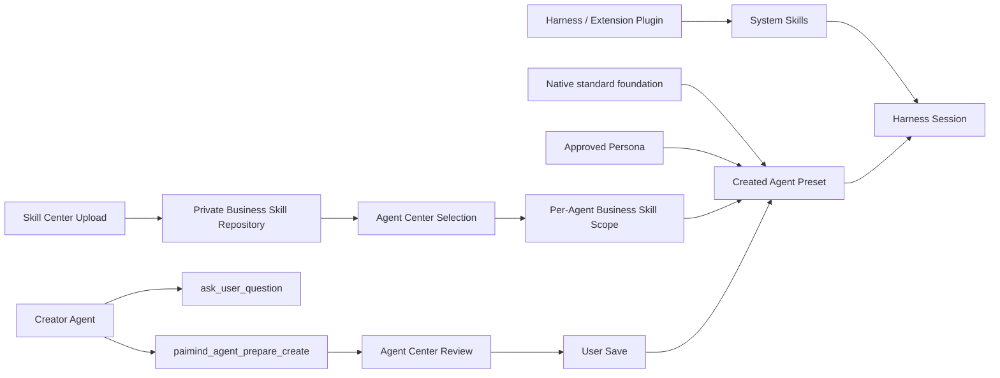

# Agent Runtime Internalization Plan

> Status（状态）：Implementation and Verification（实现与验证）  
> Branch（分支）：`codex/internalize-agent-standard-mode`  
> Scope（范围）：Mode（模式）内化、System Skill（系统技能）与 Business Skill（业务技能）隔离、Creator Agent（创建智能体）收敛及端到端验收

## 1. 本轮只有四个任务

| Task（任务） | 目标 | 当前状态 | Acceptance（验收） |
| --- | --- | --- | --- |
| T1 | 内化原生 Mode（模式） | Verified（已验证） | Agent Center（智能体中心）不展示 `minimal`、`standard`、`ptc`、`code`、`cordis`；新 Agent（智能体）固定以 `standard` 为基座 |
| T2 | 隔离两类 Skill（技能）并消除重复 | Verified（已验证） | Skill Center（技能中心）安装内容不会进入全局 Harness Skill Catalog（宿主技能目录）；只有 Agent（智能体）所选 Business Skill（业务技能）进入其私有范围；System Skill（系统技能）仍由 Harness（宿主框架）或系统插件提供 |
| T3 | 收敛 Creator Agent（创建智能体） | Verified（已验证） | 创建会话仅有 `ask_user_question` 与 PAIMind 草稿提交 Tool（工具）；Created Agent（被创建智能体）由 `standard` 基座、Persona（角色提示词）和已选 Business Skill（业务技能）组成 |
| T4 | 完整验证与交付 | Verified in Scope（范围内已验证） | 定向测试、完整测试、Type Check（类型检查）、Build（构建）、真实 Harness Composition（宿主组合）和 Browser E2E（浏览器端到端测试）均已有结果；仓库总门禁仍保留一项无关工作区修改造成的接口快照差异 |

原讨论中的 T3、T4、T5 已合并为这里的 T2。严格的 Repository Isolation（仓库隔离）与 Agent Scope（智能体范围）成立后，不再建设额外的“技能去重层”；只通过测试证明不会重复发现和注入。

以下内容本轮 Deferred（延期），不阻塞上述四项交付：

- 1,000 个 Skill（技能）的搜索、分页与 Token Budget（令牌预算）优化；
- PDCA、CRATE 等 Pipeline（流程管线）抽象；
- Folder（文件夹）、Workspace Prompt（工作空间提示词）、User Personalization（用户个性化）和 Effective Context Receipt（有效上下文回执）的完整上下文架构；
- `minimal`、`ptc`、`code`、`cordis` 的删除或上游改造。本仓库只隐藏并内化，不修改 Harness（宿主框架）源码。

## 2. 已确认的底层边界

### 2.1 Mode 内化

`standard` 是普通 Agent（智能体）的 Internal Foundation（内部基座），不是用户需要选择的 Product Concept（产品概念）。

```text
Created Agent
  = native standard foundation
  + Agent persona
  + Agent-selected Business Skills
```

- Agent Center（智能体中心）不再显示 Platform Modes（平台模式）页签和 Base Mode（基础模式）表单。
- 新建、复制和保存都固定 `basePresetId = standard`。
- 旧版非 `standard` Profile（配置）不会被静默覆盖，而是标记为需要重新创建。
- Harness（宿主框架）的原生模式仍可作为内部实现存在，但不进入 PAIMind 的普通用户入口。

### 2.2 Tool 与 Skill 分离

- Tool（工具）是可执行动作，包含 Schema（结构定义）、权限和副作用。
- Skill（技能）是知识、方法和工具使用指导，本身不是执行器。
- Web Search（网页搜索）的执行能力属于 Tool（工具）；对应的使用方法可以是 System Skill（系统技能）。
- Multimodal Understanding（多模态理解）的能力本体属于 Model Capability（模型能力）或 Tool（工具）；对应说明可以是 System Skill（系统技能）。
- Business Skill（业务技能）用于业务方法、规范和交付知识，由 Agent Center（智能体中心）选择。

### 2.3 两类 Skill 隔离

```text
System Skill source
  = Harness or enabled Extension Plugin
  -> system-wide discovery under Harness policy

Business Skill repository
  = $DSH_HOME/.paimind-skill-market/skills
  -> not scanned by the default Harness skill root

Agent Business Skill scope
  = $DSH_HOME/.agent-presets/<agent-id>/.paimind-skills
  -> links only the Business Skills selected for that Agent
```

因此：

```text
Effective Session Skill Catalog
  = enabled System Skills
  union current Agent-selected Business Skills
```

两者可以由 Harness Skill Runtime（宿主技能运行时）统一读取，但 Source（来源）、Owner（所有者）和 Scope（作用域）不同。

Skill Center（技能中心）只拥有 Business Skill Package Repository（业务技能包仓库）。“上传成功”表示已安装且可被 Agent Center（智能体中心）选择，不表示已经全局生效。

Agent Center（智能体中心）仍然负责 Agent Discovery（智能体发现）、Persona（角色提示词）、Business Skill Selection（业务技能选择）、版本、健康状态和 Session Binding（会话绑定）。它不创建第二套 Skill Runtime（技能运行时），也不把 Skill 名称再次写入 Persona（角色提示词）。

### 2.4 Creator Agent 与 Created Agent 分离

```text
Creator Agent
  = internal cordis authoring session
  + PAIMind authoring prompt
  + ask_user_question
  + paimind_agent_prepare_create

Creator Tool result
  -> structured proposal
  -> Agent Center review and edit
  -> user-owned Save

Created Agent
  = standard foundation
  + approved persona
  + selected Business Skill scope
```

`paimind_agent_prepare_create` 只把完整结构化 Proposal（提案）交给 Agent Center（智能体中心），不直接持久化，也不能绕过用户的 Save（保存）动作。真正的创建仍由现有 PAIMind 保存服务完成，因此不会把文件写入权限交给模型。

创建会话不继承普通 `standard` Agent（智能体）的完整 Tool Registry（工具注册表）。它的最小 Allowlist（允许列表）是有意设计的安全边界，不代表 Created Agent（被创建智能体）只有两个工具。

## 3. 数据流



## 4. Migration（迁移）与兼容策略

- Skill Center（技能中心）首次读取时，只迁移带 `.paimind-install.json` 的 PAIMind Managed Skill（受管业务技能）。
- Harness 全局 `skills` 中未受 PAIMind 管理的目录保持原位，视为 System Skill（系统技能）或其他来源，不移动、不删除。
- 如果新旧位置同时存在受管副本，旧副本进入可恢复 Backup（备份），避免覆盖新仓库内容。
- 旧版非 `standard` Agent Profile（智能体配置）继续可见但标为 Broken（不可用），要求用户基于标准模板重新创建，不做不可逆自动迁移。

## 5. 验收矩阵

| Case（用例） | 验收方式 |
| --- | --- |
| Agent Center（智能体中心）不显示原生四模式或底座选择 | 自动化 UI Test（界面测试）+ Browser E2E（浏览器端到端测试） |
| 新建 Agent（智能体）固定 `standard` | Unit Test（单元测试）+ 保存后文件检查 |
| 上传 Business Skill（业务技能）不进入 Harness 全局目录 | Installer Test（安装器测试）+ 真实目录检查 |
| 未受管 System Skill（系统技能）保持全局位置 | Migration Test（迁移测试）+ 真实目录检查 |
| Agent A 只挂载所选 Business Skill（业务技能），Agent B 不继承 | Agent Builder Test（智能体构建测试）+ Runtime（运行时）目录检查 |
| Persona（角色提示词）不重复写入 Skill 名称 | Composition Test（组合测试） |
| Creator Agent（创建智能体）只有两个允许工具 | Prompt Assembly Test（提示词组装测试）+ Tool Guard Test（工具守卫测试） |
| Creator Tool（创建工具）只产生完整合法 Proposal（提案） | Tool Contract Test（工具契约测试） |
| Tool Result（工具结果）可恢复到 Agent Center（智能体中心）草稿 | Client Projection Test（客户端投影测试） |
| Created Agent（被创建智能体）使用标准基座且可进入真实首轮 | Harness Composition（宿主组合）+ Browser E2E（浏览器端到端测试） |

## 6. 当前实施记录

- Targeted Tests（定向测试）：79 passed（通过）。
- Full Tests（完整测试）：94 个测试文件、452 项测试全部通过。
- Type Check（类型检查）与 Production Build（生产构建）：passed（通过）。
- Package、Pack、Publint、NodeNext、Example、Framework 与 Documentation Gate（文档门禁）：passed（通过）。
- Agent/Skill Center Composition（智能体/技能中心组合）：两者共同安装、分别缺席、原生恢复和上游零改动全部通过。
- Real Harness Composition（真实宿主组合）：Harness `0.1.1-rc.2` 全量安装、启动、卸载、恢复及所有缺席隔离场景通过；同时补齐发布脚本遗漏的 `@paimind/conversation-title` 安装依赖。
- Browser E2E（浏览器端到端测试）：真实 `3080` 页面不再显示 Mode（模式）入口或底座字段；Creator Agent（创建智能体）实际调用 `paimind_agent_prepare_create` 并回填 6 个草稿字段，未越过 Save（保存）；浏览器错误和警告日志为 0。
- Live Skill Migration（真实技能迁移）：8 个 PAIMind Managed Business Skill（受管业务技能）已进入 `.paimind-skill-market/skills`，Harness 全局 `skills` 中受管业务技能为 0；各 `.paimind-skills` 仅保留对应 Agent（智能体）所选链接。
- Token Observation（令牌观测）：本次 Creator Agent（创建智能体）真实首轮为约 5.3K Input Token（输入令牌）和 1.2K Output Token（输出令牌）。这是包含 Harness Context（宿主上下文）的整轮数值，不等于 PAIMind 创建流程的纯增量。
- Known Unrelated Gate（已知无关门禁）：本任务涉及的 5 个 Package（包）接口快照已更新；仓库 `check:api` 仍只报告原有未提交 `@paimind/visual-experience` 修改的 2 个哈希差异，本轮没有替它接受或覆盖快照。
