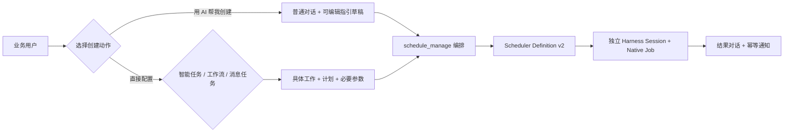

# RQ-107｜平台定时任务：工作类型与 AI 创建

## Product decision

产品名称统一为 Platform Scheduler（平台定时任务）。“用 AI 帮我创建”是 Create Action（创建操作），不是 Work Type（工作类型）；直接配置只保留业务含义明确的“智能任务 / 工作流 / 消息任务”。

| Product concept | Business-facing choice | Boundary |
|---|---|---|
| Create Action（创建操作） | 用 AI 帮我创建 | 页面级操作；进入普通对话并填入可编辑指引，不属于任务分类 |
| Work Type（工作类型） | 智能任务、工作流、消息任务 | 直接配置的一级选择；不显示 `actionId` 或 Adapter |
| Specific Work（具体工作） | 当前类型下已注册且可执行的业务能力 | 类型与具体能力分开选择；没有能力时明确显示空状态 |
| Runtime（运行方式） | 后台按计划执行、生成结果 | Scheduler、Job、Session、重试与通知由底层封装 |

## User experience

- 设置入口、页面标题和侧边入口统一使用“平台定时任务”。
- “新建任务”页右上角提供“用 AI 帮我创建”；它不是工作类型，不占用类型选择位置。
- 工作类型只展示“智能任务 / 工作流 / 消息任务”。“集成”和“监测”当前没有独立且稳定的业务定义，不作为业务用户入口。
- “用 AI 帮我创建”打开普通空白 Session，把默认指引写入 Composer Draft（输入框草稿）；不自动发送，用户可以补充、删改或完全改写后自行发送。
- 直接配置先选择工作类型及“具体工作”，再填写名称、周期、时区及必要参数。类型没有已注册能力时显示真实空状态，不展示不可执行表单，也不能保存。
- 页面只保留标题、工作类型、具体工作与配置字段；不再展示顶部产品说明、创建方式说明、说明卡片或重复的字段解释。
- 默认指引保持：
  > 我们一起来设置一个已安排任务吧。首先，说明已安排任务在 PAIMind 中的工作方式。然后询问我需要安排什么，以及应该在什么时候运行。
- 主列表提供搜索，以及“全部 / 已开启 / 已暂停 / 已归档”筛选。普通列表默认不混入已归档任务。
- 每行直接提供“立即运行 / 编辑 / 暂停或恢复 / 归档”；业务用户不必先进入详情页。点击任务名称仍可查看任务说明、计划、运行历史及配置或结果对话。
- 编辑采用独立编辑工作区；“工作类型”和“具体工作”分别只读展示，名称、周期、时间、时区、任务说明及启用状态可直接修改。
- “删除”映射为 Archive（归档），保留 Definition、Run 与 Audit。归档列表提供“恢复任务”；恢复后保持 Paused（暂停），避免意外立即调度。
- 首期仅接受单次、每日、工作日、每周和每月；其他频率明确拒绝，不静默转换为 Cron 或 RRULE。

## Encapsulated contract

- `schedule_manage`: `capabilities | create | update | list | run_now | pause | resume | archive | restore`。
- Action Descriptor 通过 `conversationEnabled=true` 显式开放，`usageHint` 用于匹配。没有具体匹配时使用 `paimind:agent-prompt`；多匹配时只展示业务名称。
- Action Category 新增 `workflow`。Platform API 与 SDK 允许 Dify 等真实工作流 Provider（提供方）以 `workflow` 注册；注册成功后自动进入“工作流”的“具体工作”列表。
- Registry（注册表）继续兼容 `integration` 与 `health-check` Category（类别），供旧任务、路由和审计使用；它们不进入当前业务用户的新建类型选择。未来只有形成清晰且不可被现有三类表达的业务模型后，才单独评估新增入口。
- Schema v2 Definition 包含 `actionInput` 和 `sourceSessionId`；`actionInput` 仅接受有限大小与深度的 JSON，并拒绝 credential、token、secret 等敏感键。
- 通用智能任务捕获配置 Session 的 Workspace 路径和 Agent Preset。显式可信 Action Registration 可固定 Provider/Model；否则每次运行通过 Harness `agentDefaultModel.currentSelection()` 解析当前默认 Model Route。
- 每次 Run 创建独立 Session 和 Native Job，使用任务名称作为 Session 标题，通过 Run 的 `action` 返回“打开对话”，并以 `runId` 发布幂等完成通知。

## Ownership and boundary

Harness 拥有 Session、Agent、Job 和执行事实；PAIMind 拥有 Schedule Definition、编排契约、Run Projection（运行投影）和产品展示。Harness 当前原生 Workflow Engine（工作流引擎）执行模型临时生成的前台脚本，不提供“已保存工作流目录”；PAIMind 不把它伪装成可选择的业务工作流。可定时工作流必须先通过 Action Registry（动作注册表）接入真实可执行 Provider（提供方）。不做原对话持续唤醒、事件触发、任意 RRULE、分布式调度或第二套 Session/Job 存储。

## Acceptance

实现与验收状态记录在 [`../acceptance/RQ-107-conversational-scheduled-tasks.md`](../acceptance/RQ-107-conversational-scheduled-tasks.md)。本地真实 Harness 与浏览器只构成 Pre-acceptance（预验收）；共享测试环境通过后才能形成最终 Acceptance（验收）。
