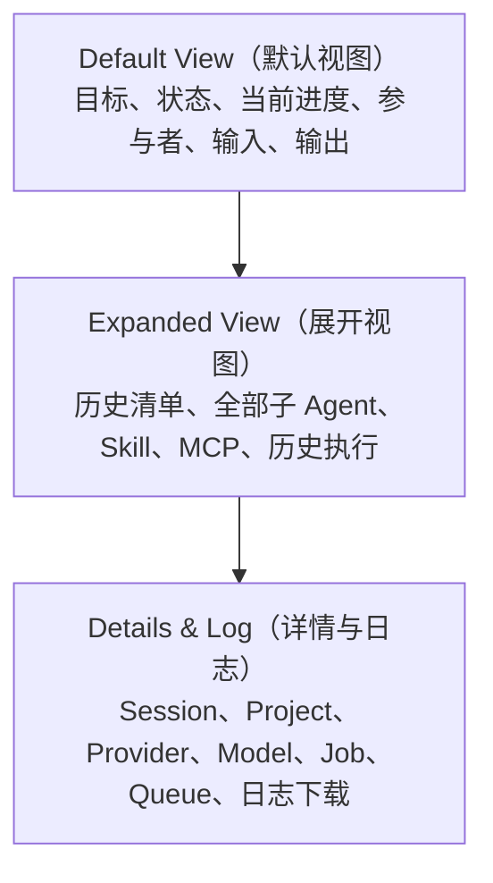
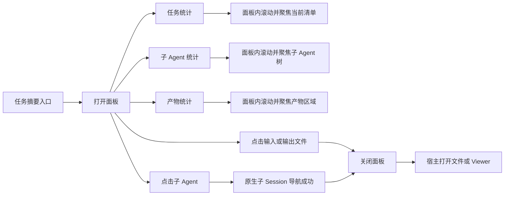

# RQ-108 任务摘要插件产品需求文档

## 1. 文档信息

| 项目 | 内容 |
|---|---|
| 产品能力 | `@paimind/task-monitor` 任务摘要 |
| 文档状态 | `Draft（草案）v0.1`，待产品评审 |
| 目标读者 | 产品、设计、前端、Harness（运行时）兼容层、测试 |
| 需求来源 | 现有任务摘要插件、冻结原型、真实 Harness（运行时）投影、2026-08-21 Full-State Baseline（全量状态基线）评审 |
| 关联文档 | [`../plans/FP-05-task-monitor.md`](../plans/FP-05-task-monitor.md)、[`../acceptance/FP-05-task-monitor.md`](../acceptance/FP-05-task-monitor.md) |

本文定义目标产品体验，不覆盖或改写已经验证的 Harness（运行时）事实边界。实施排期、人员分工、技术拆分和工时由研发计划维护，不在本 PRD（产品需求文档）中预设。

## 2. 产品结论

任务摘要应成为当前 Session（会话）的 Read-only Control Surface（只读控制界面），帮助用户在不阅读完整对话和技术日志的情况下回答五个问题：

1. 当前任务是什么、处于什么状态？
2. 当前做到哪一步，是否需要我处理？
3. 哪些 Agent（智能体）正在参与？
4. 本次任务使用了哪些输入？
5. 已产生哪些可以直接打开的结果？

任务摘要不以“展示全部字段”为目标。完整事实必须可追溯，但采用 Progressive Disclosure（渐进式披露）的三层信息结构：



产品默认展示用户决策所需的信息；运行时分类、路径、版本、内部编号和调试字段只在确有价值时进入详情层。平台缺少某类事实时，直接隐藏对应统计、区域或动作，不显示 `0`、`-`、空卡片或虚构占位。

## 3. 背景与问题

### 3.1 已验证事实

- Harness（运行时）拥有 Session（会话）、Goal（目标）、Todo（任务项）、Plan（计划）、Workflow（工作流）、Subagent（子智能体）、Tool Call（工具调用）、Job（任务记录）、Deliverable（交付文件）和 Session Log（会话日志）。
- PAIMind（产品层）任务摘要只读取这些原生事实并提供展示和导航，不拥有第二套任务状态、持久化、权限或运行历史。
- 现有插件已经支持非零统计、当前与历史清单、子 Agent（智能体）导航、输入与产物打开、Skill（技能）与 MCP（模型上下文协议服务）证据、详情与日志、空状态和窄屏布局。
- 2026-08-21 Full-State Baseline（全量状态基线）在一个假设 Session（会话）中同时展示了 5 个清单版本、7 个当前任务项、8 个子 Agent（智能体）、6 个 Skill（技能）、6 个 MCP（模型上下文协议服务）、6 个输入、6 个输出及多类运行状态。全部展开后面板高度约 3881px，证明“所有事实同时平铺”不具备良好的 Scanability（扫读效率）。

### 3.2 当前问题

| 问题 | 用户影响 | 产品判断 |
|---|---|---|
| Workflow（工作流）、Tool（工具）和 Job（任务记录）连续平铺 | 同一执行过程被多次表达，用户难以判断当前真正发生什么 | 默认层合并为“当前执行”；完整分类下沉 |
| 历史清单与已完成项展开后过长 | 当前进度被历史信息淹没 | 默认只展示未完成项；完成项和历史清单折叠 |
| 主 Agent（智能体）、子 Agent（智能体）、Skill（技能）和 MCP（模型上下文协议服务）视觉权重接近 | 负责人、参与者和运行能力缺乏主次 | Agent（智能体）优先；Skill（技能）与 MCP（模型上下文协议服务）合并为次级能力区 |
| 文件曾展示绝对路径、修订号、来源说明和正常状态 | 暴露无决策价值的技术信息，视觉噪声高 | 默认只显示文件名、异常状态和打开箭头 |
| 文件左侧使用方向指针 | 容易被理解为“产物类型”或“跳转方向”，但没有独立语义 | 删除左侧指针，整行作为点击目标 |
| Provider（供应商）和 Model（模型）曾以解释层出现 | 易遮挡内容，且不是默认任务判断所需信息 | 取消解释层，只在详情中展示 |
| `已使用`、`生成产物`、`输入文件`等逐行重复说明 | 标签重复占据空间，没有增加信息 | 使用分组标题表达语义，行内不重复 |
| Summary Statistic（摘要统计）点击后目标可能被固定头部遮挡 | 点击有反馈但用户看不到目标内容 | 面板内部定位，预留固定头部安全距离并聚焦目标 |
| 不同平台提供的事实不一致 | 某些平台出现无意义空区域或不可用动作 | 采用 Capability-aware Rendering（能力感知渲染） |

## 4. 产品目标

### 4.1 目标

- 用户打开面板后，先看到当前目标、状态和下一步，而不是技术流水账。
- 用户能够一键定位任务、子 Agent（智能体）和产物，并继续进入原生对象。
- 信息有来源时正确呈现，无来源时完整隐藏，不用推测补齐。
- 大量内容通过统一折叠规则保持可扫读，同时不丢失完整追溯能力。
- 主 Agent（智能体）、子 Agent（智能体）、Skill（技能）和 MCP（模型上下文协议服务）形成一致但有层级的视觉语言。
- 输入与输出的顺序符合任务认知：先输入，再输出与产物。
- Desktop（桌面端）、受限宽度和 Mobile（移动窄屏）均不遮挡关键内容、不横向溢出。
- 为未来平台或插件扩展保留受控的 Section Extension（区域扩展）能力，不把平台差异写死在页面中。

### 4.2 非目标

- 不在任务摘要中创建、编辑、取消或重试任务。
- 不建立 PAIMind（产品层）自己的 Todo（任务项）、Job（任务记录）、Agent（智能体）或日志存储。
- 不把任务摘要变成通知中心、调试控制台、文件管理器或 Agent Center（智能体中心）。
- 不伪造进度百分比、剩余时间、角色能力、连接状态或跨重启历史。
- 不在默认视图展示路径、内部 ID、修订号、配置哈希、Provider（供应商）、Model（模型）或请求参数。
- 不要求所有平台实现相同字段；产品要求的是一致的缺失处理规则。

## 5. 用户与核心场景

### 5.1 目标用户

- 正在等待复杂任务完成，希望快速了解进展的普通用户。
- 使用多 Agent（智能体）、Skill（技能）或 MCP（模型上下文协议服务）完成研究、数据、内容与交付任务的专业用户。
- 需要打开输入、产物、子 Session（会话）或日志进行复核的验收人员。

### 5.2 核心场景

1. **执行中查看**：用户打开摘要，看到当前任务、完成度、正在执行项和活跃子 Agent（智能体）。
2. **等待用户处理**：任务进入等待或阻塞状态，原因位于首屏，不需要展开技术详情。
3. **完成后取结果**：用户直接点击输出文件，在宿主 Viewer（查看器）或文件页面中打开。
4. **追溯过程**：用户展开历史清单、执行记录、Skill（技能）、MCP（模型上下文协议服务）或日志。
5. **能力不完整的平台**：平台没有 Goal（目标）、Skill（技能）历史或日志服务时，其余内容仍正常展示。
6. **空 Session（会话）**：尚未产生任务事实时展示单一空状态，不渲染多个空区域。

## 6. 信息架构与默认取舍

### 6.1 默认顺序

```text
任务摘要头部
└── 当前摘要
    ├── 当前目标或会话标题
    ├── 项目名称（有则显示）
    └── 任务 / 子 Agent / 产物统计（非零且可点击）
└── 当前进度
    ├── 需要处理的异常或等待信息
    ├── 当前清单与未完成项
    └── 当前执行
└── Agent 与能力
    ├── 主 Agent
    ├── 活跃子 Agent + 其他子 Agent 折叠
    └── 本会话能力摘要（Skill / MCP）
└── 输入文件
└── 输出与产物
└── 详情与日志（默认折叠）
```

### 6.2 信息分层决策

| 信息 | 默认层 | 展开层 | 详情层 | 无事实时 |
|---|---:|---:|---:|---|
| 当前状态 | 显示 | — | — | 显示 `空闲` |
| 当前目标 | 显示；优先于会话标题 | — | — | 回退到会话标题 |
| 项目名称 | 显示 | — | Project ID（项目标识） | 隐藏 |
| 当前任务进度 | 显示 | 已完成项 | — | 隐藏 |
| 历史清单 | 仅显示入口与数量 | 显示完整历史 | — | 隐藏 |
| 等待、阻塞和失败原因 | 首屏显示 | 相关记录 | 原始技术信息 | 隐藏 |
| Workflow（工作流） | 仅当前执行摘要 | 完整记录 | 类型与阶段 | 隐藏 |
| Tool Call（工具调用） | 仅当前执行摘要 | 完整记录 | 调用标识与时长 | 隐藏 |
| Job（任务记录） | 仅当前执行和异常 | 历史任务 | 类型、数量、时长 | 隐藏 |
| 主 Agent（智能体） | 显示 | — | — | 无模型且无 Agent 时隐藏 |
| 子 Agent（智能体） | 活跃优先，最多 4 行 | 其余全部 | — | 隐藏统计与子区 |
| Skill（技能） | 分组摘要与数量 | 统一行列表 | — | 隐藏 |
| MCP（模型上下文协议服务） | 分组摘要与数量 | 统一行列表 | — | 隐藏 |
| 输入文件 | 前 4 行 | 其余文件 | — | 隐藏整个区域 |
| 输出与产物 | 前 4 行 | 其余文件 | Artifact 数量（产物数量） | 隐藏整个区域 |
| Session（会话）日志 | — | — | 下载动作和状态 | 服务缺失时隐藏动作 |
| Provider（供应商）与 Model（模型） | — | — | 有值时显示 | 隐藏字段 |
| Queue（队列） | — | — | 非零时显示 | 隐藏字段 |

### 6.3 明确删除或下沉的信息

以下内容不得出现在 Default View（默认视图）：

- 文件绝对路径、Workspace（工作区）路径和本机地址。
- `r9251` 等修订号或内部版本号。
- 正常文件状态 `available`。
- `生成产物`、`交付文件`、`输入文件`等逐行来源说明。
- 文件左侧方向指针或没有独立含义的装饰图标。
- 主 Agent（智能体）的 Provider（供应商）/Model（模型）解释层。
- 主 Agent（智能体）右侧重复的“负责人”；“主 Agent”标签已经表达层级。
- 每一行 Skill（技能）和 MCP（模型上下文协议服务）重复出现的“已使用”。
- Workflow（工作流）、Tool（工具）和 Job（任务记录）的三套连续完整列表。
- Session ID（会话标识）、Project ID（项目标识）、Job ID（任务标识）、Call ID（调用标识）。

这些事实只要仍具备追溯价值，就进入 Expanded View（展开视图）或 Details & Log（详情与日志）；没有用户价值的纯装饰信息直接删除。

## 7. 功能需求

### 7.1 入口与容器

- 入口位于当前 Session（会话）头部的独立图标按钮，不进入 Better Sidebar（增强侧栏）或 Extension Center（扩展中心）的内容页面。
- 按钮保持状态无关，不在入口上叠加数量、运行点或告警 Badge（徽标）；状态在打开后的面板头部展示。
- Desktop（桌面端）使用宽度约 420px 的 Popover（浮层）；窄屏使用 Bottom Sheet（底部面板）。
- 打开时根据触发器、Viewport（视口）和宿主可用区域确定位置，至少保留 12px 安全边距。
- 面板内部滚动；固定头部不得遮挡通过统计卡定位的目标。
- 再次点击入口、点击外部或按 `Escape` 关闭；`Escape` 关闭后焦点返回入口。
- 面板打开不能触发重型历史扫描；历史信息必须预取、缓存或异步补充，不阻塞首屏。

### 7.2 当前摘要

- 主标题优先使用有效 Goal（目标）的 `objective`；没有 Goal（目标）时使用 Session（会话）标题。
- 项目名称作为次级文本，有真实关联时才显示。
- 统计卡最多包含：
  - `任务`：当前清单的任务项总数或 `已完成/总数`，不得使用“清单版本数”代替任务数量。
  - `子 Agent`：真实子 Session（会话）数量，不包含主 Agent（智能体）。
  - `产物`：当前可识别输出数量。
- 数值为零时隐藏对应统计卡；三项均为空时不保留统计容器。
- 每张统计卡都是 Button（按钮）：
  - `任务`定位当前清单；
  - `子 Agent`定位子 Agent（智能体）树；
  - `产物`定位输出区域。
- 定位后目标应位于固定头部下方至少 12px，并获得程序化焦点；不得只改变滚动而没有可感知焦点。

### 7.3 当前进度

#### 当前清单

- 显示 `已完成/总数`和真实比例进度条。
- 默认只展示未完成任务项，最多 5 行。
- 已完成项进入 `已完成 N 项`折叠区。
- 超过 5 个未完成项时显示 `其余 N 项`入口。
- 当前没有 Todo（任务项）事实时不展示进度条或 `0/0`。

#### 历史清单

- 历史清单默认只展示统一入口 `历史清单 N 个`，不得连续占据默认视图。
- 展开后按时间倒序显示每个清单的 `已完成/总数`，再按需展开清单内容。
- 清单来源仍是原生 `todo/write` 快照的只读分组，不产生新的清单 ID（标识）或编辑能力。

#### 当前执行

- Workflow（工作流）、Tool Call（工具调用）和 Job（任务记录）在默认层合并为“当前执行”。
- 默认最多显示 4 行，优先级为：
  1. 等待用户、阻塞或失败；
  2. 正在执行或停止中；
  3. 最近完成。
- 同一业务动作若能由确定关联识别为同一执行链，只显示一个用户可理解的主行；不得根据文案模糊猜测关联。
- 无法确定关联时允许分别展示，但必须进入折叠区，避免三套长列表连续平铺。
- 默认行显示用户可理解的标题和状态，不显示 `workflow`、`bash`、`paimind-artifact`、Call ID（调用标识）等技术类型。
- 展开后可以显示来源类别、阶段、真实状态和时长。
- 历史已完成、失败和取消记录进入 `历史执行 N 项`。

#### Goal（目标）与 Plan（计划）

- Goal（目标）已经作为当前摘要标题时，不在进度区重复展示完整目标行。
- Goal（目标）处于 `blocked` 或 `paused` 时，原因进入当前进度首行。
- Plan（计划）只在启用或切换待生效时展示；正常同步且不影响用户决策时进入详情层。

### 7.4 Agent（智能体）与能力

#### 主 Agent（智能体）

- 显示统一 Agent（智能体）图标、`主 Agent`标签和名称。
- 不显示重复的“负责人”、Provider（供应商）、Model（模型）或解释层。
- 主 Agent（智能体）没有导航行为时不得伪装为可点击行。

#### 子 Agent（智能体）

- 位于主 Agent（智能体）下方，使用父子层级线表达关系。
- 运行中的子 Agent（智能体）优先显示；默认最多 4 行，其余进入 `其余 N 个子 Agent`。
- 整行可点击，显示名称、Agent Preset（智能体预设）或可理解的次级描述、真实状态和右侧箭头。
- 点击优先调用原生 `openSubagent`；失败时回退到确定存在的子 Session（会话）。两者均不可用时保持面板打开并展示可理解错误。
- 图标允许来自稳定的可扩展视觉槽位，但不得根据任务名称推断未提供的真实能力。

#### Skill（技能）与 MCP（模型上下文协议服务）

- 默认显示一个紧凑的“本会话能力”摘要，例如 `6 个 Skill · 3 个 MCP`；只有一种资源时只显示该种资源。
- 展开后 Skill（技能）与 MCP（模型上下文协议服务）采用与 Agent（智能体）一致的图标、名称、分组和行高体系，但视觉权重低于 Agent（智能体）。
- 行内不重复“已使用”；分组标题已经表达其为本 Session（会话）真实使用记录。
- 2026-09-07 用户确认补充：同时展示当前智能体配置中的技能和连接引用，以及本会话确定的加载/调用证据。分别标注“已挂载”“已加载”“已使用”；已挂载不等于已经调用。未绑定且未调用的连接不显示。连接已停用时保留历史使用事实并明确标注停用。
- 主智能体使用公开配置或原生预设目录中的名称；连接名称由连接中心公开摘要提供，不直接把内部标识或运行时命名空间展示为名称。来源不可用时明确降级，不猜测名称或可用性。
- 资源超过 4 项时遵循统一 `其余 N 项`规则。

### 7.5 输入文件

- 顺序位于“输出与产物”之前。
- 只展示由确定 Read Intent（读取意图）产生的文件，不把模型文本中的路径识别为输入。
- 每行默认只显示完整文件名和右侧箭头；不显示路径、行号、来源类型或左侧指针。
- 整行可点击。点击后关闭摘要，并调用宿主打开文件。
- 最多显示 4 行，其余进入 `其余 N 项`。
- 宿主没有打开能力时保留文件名，但移除箭头和点击状态；不得展示无效按钮。

### 7.6 输出与产物

- 合并原生 Deliverable（交付文件）和 Artifact（产物）的用户入口，但保持底层真实来源可追溯。
- 每行默认显示文件名、异常状态和右侧箭头。
- `available`不展示文字；`updating`、`missing`、`failed`分别显示“更新中”“不可用”“失败”。
- 不显示路径、修订号、`生成产物`、`交付文件`或左侧方向图标。
- 整行可点击；点击后关闭摘要，再由宿主路由到对应 Viewer（查看器）或文件页面。
- `missing`和无法打开的失败产物不显示可点击箭头；点击能力必须与真实可用性一致。
- 最多显示 4 行，其余进入 `其余 N 项`。

### 7.7 详情与日志

- `详情与日志`位于面板底部，默认折叠。
- Session Log（会话日志）下载和技术详情放在同一个区域，不分散到摘要卡和底部两个位置。
- 日志按钮使用“下载会话日志”，旁边显示真实状态：准备中、已交给浏览器、下载失败或包含当前与子 Session（会话）。
- 技术详情按有无事实展示：Session ID（会话标识）、Project ID（项目标识）、Provider（供应商）、Model（模型）、Job（任务记录）数量、Artifact（产物）数量、Queue（队列）数量。
- 不显示 Tool（工具）参数、MCP（模型上下文协议服务）地址、请求头、凭证或敏感内容。

## 8. 状态设计

### 8.1 Session（会话）整体状态

| 状态 | 用户文案 | 默认视觉 | 首屏行为 |
|---|---|---|---|
| `idle` | 空闲 | 中性 | 不制造告警；有历史内容时仍可查看 |
| `running` | 进行中 | 业务主色 | 展示当前执行和活跃子 Agent（智能体） |
| `waiting` | 等待你 | 提醒色 | 等待原因进入当前进度首行 |
| `blocked` | 需处理 | 警示色 | 阻塞原因进入当前进度首行 |
| `paused` | 已暂停 | 中性提醒 | 展示暂停状态和已有结果 |
| `complete` | 已完成 | 成功色 | 当前进度折叠已完成项，产物保持显著 |

状态优先级保持：错误或阻塞 → 等待交互 → 运行事实 → 暂停目标 → 完成目标 → 空闲。

### 8.2 内容行状态

| 类型 | 状态 | 展示规则 |
|---|---|---|
| Todo（任务项） | 待处理、进行中、已完成 | 状态图标；已完成进入折叠区 |
| Workflow（工作流） | 进行中、已完成、失败、取消、中断 | 默认只显示当前和异常，历史进入展开层 |
| Job（任务记录） | 进行中、停止中、已完成、失败、取消 | 默认只显示当前和异常，技术类型下沉 |
| 文件 | 正常、更新中、不可用、失败 | 正常不显示状态；异常显示文字 |
| 子 Agent（智能体） | 进行中、空闲 | 进行中优先；空闲不使用警示色 |
| 日志 | 准备中、成功、失败 | 按钮禁用、结果提示和可重试行为匹配真实状态 |

### 8.3 加载、空状态与失败隔离

- 首屏先使用当前投影；历史资源异步加载时，不提前显示“没有 Skill（技能）”或“没有历史清单”。
- 某一可选数据源失败时只隐藏或标记对应区域，不阻塞整个面板。
- 所有业务区域均为空时显示一个统一空状态：`暂无任务内容`，并说明任务执行后会出现进度、Agent（智能体）与产物。
- 组件渲染失败时只替换任务摘要入口为不可用状态，不影响原生对话。

## 9. 点击联动与导航



交互要求：

- 统计卡不能仅有 Hover（悬停）视觉，必须是可键盘操作的真实 Button（按钮）。
- 面板内定位使用面板自身的 Scroll Container（滚动容器），不得调用页面级滚动导致宿主内容位移。
- 固定头部高度和 12px 安全间距必须计入目标位置。
- 文件和子 Agent（智能体）只有在宿主导航成功或已安全发起时才关闭面板；确定失败时保留面板并显示错误。
- 点击折叠入口只改变本次打开期间的视觉展开状态，不持久化为新的业务状态。

## 10. 视觉与响应式要求

- 视觉层级为：当前目标与状态 > 当前进度与异常 > Agent（智能体） > 输入/输出 > 能力与技术详情。
- 所有分组使用一致的间距、圆角、边框和折叠交互；避免每种资源自成一套卡片语言。
- 主 Agent（智能体）和子 Agent（智能体）共享同一父子容器；Skill（技能）和 MCP（模型上下文协议服务）使用同一行组件，但降低视觉强调。
- 文件行不使用彩色类型图标；异常通过文字和语义色表达，避免颜色成为唯一信息。
- Desktop（桌面端）目标宽度 420px；不得产生文档级或面板级横向滚动。
- 宿主可用宽度不足以安全放置 Popover（浮层）时切换到 Bottom Sheet（底部面板），不让解释层、Tooltip（提示层）或阴影遮挡主要文本。
- 长标题、Agent（智能体）名称和文件名允许单行截断，但完整内容必须通过原生可访问名称、浏览器标题或详情读取；不得只有不可访问的省略号。
- Light（浅色）、Dark（深色）和 System（跟随系统）主题均使用宿主 Token（设计变量），不写死只适合单一主题的背景与边框。

## 11. 平台差异与扩展性

### 11.1 能力感知渲染

| 平台能力 | 有能力 | 无能力 |
|---|---|---|
| Goal（目标）投影 | 目标作为摘要主标题 | 使用 Session（会话）标题 |
| Todo（任务项）投影 | 展示当前进度 | 隐藏任务统计和进度条 |
| Session History（会话历史） | 可展示历史清单、历史 Skill（技能）和 MCP（模型上下文协议服务） | 只展示当前可见证据，不显示伪空历史 |
| Subagent（子智能体）目录 | 展示数量和导航 | 隐藏统计和子区 |
| 文件打开能力 | 整行可点击并显示箭头 | 只读文件名，不显示箭头 |
| Artifact（产物）投影 | 合并并显示真实状态 | 仍可显示原生 Deliverable（交付文件） |
| Session Log（会话日志） | 详情中显示下载 | 隐藏下载动作，保留其他详情 |
| Provider（供应商）/Model（模型） | 详情中按值显示 | 隐藏对应字段 |
| Plan（计划） | 有效且影响用户时展示 | 隐藏 |

### 11.2 扩展原则

- 新平台或插件通过 Adapter（适配层）提供确定事实和动作，不直接向页面注入任意 HTML（超文本标记语言）。
- 可扩展区域必须声明：稳定标识、产品标题、显示层级、排序、是否可为空、摘要数量、目标锚点、行级动作和事实来源。
- 默认层只接受能够影响用户判断或下一步的内容；技术诊断类扩展只能进入详情层。
- 扩展区域必须遵循统一折叠上限、键盘操作、主题 Token（设计变量）、国际化和缺失隐藏规则。
- 新扩展不得创建第二套 Session（会话）、Job（任务记录）、Artifact（产物）、Agent（智能体）或权限模型。
- 平台专属内容不得在其他平台显示 Disabled Placeholder（禁用占位）；无能力即隐藏。

## 12. 数据真相与隐私边界

| 展示对象 | Canonical Owner（权威所有者） |
|---|---|
| Session（会话）标题、状态、Agent Preset（智能体预设） | Harness Session List（会话列表） |
| Goal（目标）、Todo（任务项）、Plan（计划） | Harness Session Projection（会话投影） |
| 历史清单、历史 Skill（技能）与 MCP（模型上下文协议服务） | Harness Session History（会话历史） |
| Workflow（工作流）、Tool Call（工具调用） | Harness Conversation（对话）节点 |
| 子 Agent（智能体） | Harness Child Session Catalog（子会话目录） |
| Job（任务记录） | Harness Native Job Registry（原生任务注册表） |
| 输入文件 | 确定的 Read Intent（读取意图）位置 |
| 输出文件 | Harness Deliverable（交付文件）与 PAIMind Artifact Projection（产物投影） |
| 日志下载 | Harness Session Log Controller（会话日志控制器） |

安全要求：

- 不从用户消息、模型回复、标签或命令文本推断 Job（任务记录）类型、文件或 Agent（智能体）能力。
- 默认视图不显示绝对路径、本机目录、请求参数、请求头、MCP（模型上下文协议服务）地址、凭证或环境变量。
- 历史缓存只用于当前进程内加速展示，不成为新的持久数据源。
- Harness（运行时）重启后不存在的进程内 Job（任务记录）不得由 PAIMind（产品层）伪造恢复。

## 13. 国际化与可访问性

- 中文和英文使用同一信息架构、折叠上限和交互，不允许一种语言缺少关键动作。
- 所有图标按钮必须拥有可理解的 `aria-label`；图标本身不得成为唯一名称。
- 统计卡、子 Agent（智能体）、文件行、折叠入口和日志下载均支持键盘操作与可见焦点。
- `Escape`关闭后恢复入口焦点；统计定位后目标获得焦点。
- 状态不能只依赖颜色，必须同时提供文案或图标语义。
- 屏幕阅读器读取顺序与视觉顺序一致：输入文件先于输出与产物。
- 折叠区域使用原生 `details/summary`或等价可访问控件，并暴露展开状态。

## 14. 范围与优先级

### P0（首要）

- 三层信息架构与默认信息减法。
- 当前目标、任务统计和异常优先级。
- Workflow（工作流）、Tool（工具）和 Job（任务记录）统一为当前执行入口。
- 主 Agent（智能体）/子 Agent（智能体）层级协调。
- Skill（技能）/MCP（模型上下文协议服务）合并为次级能力摘要。
- 输入先于输出；文件名直达、无路径、无正常状态、无左侧指针。
- 详情与日志合并，Provider（供应商）和 Model（模型）只在详情中出现。
- Summary Statistic（摘要统计）面板内滚动与焦点联动。
- 有无内容、平台能力缺失和异常状态的完整规则。

### P1（增强）

- 受控 Section Extension（区域扩展）契约。
- 当前执行链的确定性去重和关联展示。
- 长内容完整读取、冷启动历史同步状态和多平台 Adapter（适配层）验收。

### P2（后续评估）

- 用户可配置区域顺序或密度。
- 跨 Session（会话）的项目级摘要。
- 从摘要直接进入独立 Trace（追踪）页面。

P2（后续评估）不进入本次插件优化范围，除非另行立项。

## 15. 当前实现与目标差距

| 能力 | 当前隔离分支状态 | PRD（产品需求文档）目标 |
|---|---|---|
| 空区域隐藏 | 已实现 | 保留 |
| 单一空状态 | 已实现 | 保留并完成多平台验证 |
| 输入先于输出 | 已实现 | 保留 |
| 文件不显示路径、修订号和正常状态 | 已实现 | 保留 |
| 文件整行点击并关闭面板 | 已实现 | 增加不可打开状态规则 |
| Provider（供应商）/Model（模型）移入详情 | 已实现 | 保留 |
| 详情与日志合并 | 已实现 | 保留 |
| 摘要统计面板内定位 | 已实现 | 补足真实浏览器焦点与固定头部验收 |
| 主 Agent（智能体）与子 Agent（智能体）分组 | 已实现 | 删除重复“负责人”，继续降低噪声 |
| Skill（技能）和 MCP（模型上下文协议服务）与 Agent（智能体）协调 | 已改为统一行式 | 目标改为默认能力摘要、展开后统一行；删除逐行“已使用” |
| 当前与历史清单 | 已实现 | 默认进一步折叠全部历史清单 |
| Workflow（工作流）、Tool（工具）、Job（任务记录） | 仍分别展示 | 合并为“当前执行”，完整信息下沉 |
| 任务统计 | 当前统计清单版本数 | 改为当前任务项数量或完成度 |
| 目标重复 | 摘要标题和 Goal（目标）行可能重复 | Goal（目标）优先成为摘要主标题，正常状态不重复 |
| 平台缺失能力 | 已对部分可选服务失败关闭 | 建立统一能力感知渲染和动作降级规则 |

本表中的“已实现”只代表当前隔离开发分支和本地验证事实，不等于共享测试环境 Acceptance（验收）。

## 16. 验收标准

### 16.1 信息与取舍

- Full-State Session（全量状态会话）默认打开时，首屏可以看到目标、状态、当前进度、活跃执行和主要 Agent（智能体）；不得先出现历史清单或完整技术流水。
- 默认视图不连续平铺 Workflow（工作流）、Tool（工具）和 Job（任务记录）三套列表。
- Skill（技能）与 MCP（模型上下文协议服务）默认以能力摘要呈现，展开后行式视觉与 Agent（智能体）一致但权重更低。
- 输入文件位于输出与产物之前。
- 文件行不出现绝对路径、修订号、正常状态、来源说明或左侧方向指针。
- Provider（供应商）与 Model（模型）只在详情中出现，不存在 Hover（悬停）解释层。

### 16.2 状态覆盖

- 分别验证空闲、进行中、等待用户、阻塞、暂停和完成 Session（会话）。
- 验证当前任务项的待处理、进行中和已完成状态。
- 验证执行记录的进行中、停止中、完成、失败、取消和中断状态。
- 验证输出的正常、更新中、不可用和失败状态。
- 验证完全空 Session（会话）、只有 Agent（智能体）、只有输入、只有输出和只有详情的稀疏组合。

### 16.3 点击与可访问性

- 三张非零统计卡均为真实 Button（按钮），点击后目标不被固定头部遮挡，并获得焦点。
- 点击可用文件后面板关闭，宿主打开准确路径；界面中不显示该路径。
- 点击子 Agent（智能体）后打开准确子 Session（会话）；失败时不误关面板。
- `Escape`、外部点击、重复点击入口、键盘折叠与焦点恢复全部正确。
- 无鼠标情况下可以完成打开摘要、定位区域、展开内容、打开子 Agent（智能体）、打开文件和下载日志。

### 16.4 平台与响应式

- 对每项可选能力执行 Presence/Absence Pair（有无成对验证）：有能力时出现真实内容，无能力时区域或动作完整隐藏。
- Desktop（桌面端）、受限宽度和 Mobile（移动窄屏）均无文档级或面板级横向滚动。
- Light（浅色）、Dark（深色）和 System（跟随系统）主题下文本、边框、状态和焦点可辨认。
- 中文和英文顺序、功能和状态一致，无截断造成的不可理解信息。

### 16.5 真实性与回归

- Task Monitor（任务监控）继续只读取 Harness（运行时）原生事实和 PAIMind（产品层）现有 Artifact Projection（产物投影）。
- 不新增任务存储、清单 ID（标识）、Job（任务记录）恢复、权限或日志副本。
- 移除 `@paimind/task-monitor` 后，原生 Session（会话）、Job（任务记录）、文件、产物和对话仍可使用。
- 定向测试、类型检查、生产构建、兼容性门禁和真实 Harness（运行时）组合通过。
- 浏览器必须完成 Empty（空）、Sparse（稀疏）、Full（全量）、Error（异常）、Light（浅色）、Dark（深色）和 Narrow（窄屏）七类证据；组件 Fixture（夹具）只能作为设计验证，不能替代真实 Harness（运行时）产品验收。

## 17. 风险与产品决策

| 事项 | 风险 | 本 PRD（产品需求文档）建议 |
|---|---|---|
| 当前执行去重 | Harness（运行时）未必提供完整 Workflow（工作流）/Tool（工具）/Job（任务记录）关联 | 只做确定性关联；不确定时折叠而不猜测 |
| 任务统计语义 | 当前实现使用清单版本数，用户更关心任务项 | 改为当前任务项总数或 `已完成/总数` |
| 文件不可打开 | 有文件事实但平台没有打开动作 | 保留只读文件名，移除箭头和点击态 |
| 历史资源加载 | 冷启动时历史 Skill（技能）/MCP（模型上下文协议服务）可能稍后到达 | 使用加载中或异步补充，不显示伪空结论 |
| 扩展内容膨胀 | 新插件可能把所有字段申请进入默认层 | 默认层需产品审核；技术字段只允许进入详情层 |
| 共享环境验收 | 本地截图不能代表正式验收 | 合并后在共享测试环境串行执行七类浏览器证据 |

### 本版采用的产品决策

1. 摘要统计中的“任务”采用 `已完成/总数`，例如 `2/7 任务`，不再使用清单版本数。
2. “当前执行”默认只显示等待、阻塞、失败、进行中和停止中；没有这些状态时隐藏该区域，最近完成项进入历史执行。
3. Skill（技能）和 MCP（模型上下文协议服务）在默认层统一命名为“本会话能力”，展开后再按资源类型分组。
4. 不可打开文件仍保留只读名称和真实异常状态，但移除箭头、Hover（悬停）和点击行为。

以上决策作为本 PRD（产品需求文档）实施基线；产品评审若调整其中任一项，需要同步更新信息分层、交互和验收标准。
