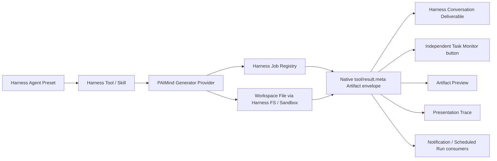

# AI-native Product Reality Review（AI 原生产品真实性复核）

Date（日期）: 2026-08-14  
Checkpoint（检查点）: `PRR-01`  
Decision（决策）: 暂停 FP09；先纠正产品事实层，再恢复编号功能包。

## 1. Executive decision（核心结论）

PAIMind 继续采用 Independent Plugin（独立插件）交付，但不再把“独立插件”解释为“独立领域模型”。DeepSeek Harness 是唯一 Runtime（运行基座）和 Domain Authority（领域事实权威）；PAIMind 只增加业务体验、生成器、投影、适配与治理，不复制 Harness 已拥有的 Workspace、Session、Agent Preset、Tool、Skill、Job、Schedule 或 Deliverable。

当前成果需要分为两类：

1. Technical Verification（技术验证）：插件可安装、可卸载、上游零侵入、兼容层、Viewer、安全隔离、构建和自动化测试。
2. Product E2E Verification（产品端到端验证）：用户从空白 Workspace/Session 向真实 Agent 提出生成要求，生成器通过 Harness Tool/Skill 执行，Native Job（原生任务）推进状态，Native Session（原生会话）记录 Tool Result metadata 并重放 Projection，Conversation Deliverable（对话产物）出现入口，点击进入真实 Viewer/Trace，并能刷新、重启和失败恢复。

只有第二类通过，功能包才可标记为 Product Verified（产品已验证）。Fixture（夹具）、Preview Query（预览参数）、手工预置文件和内存 Source（数据源）只能证明组件，不再作为产品闭环完成证据。

## 2. Evidence reviewed（已核验事实）

| Object（对象） | Current Harness fact（当前事实） | PAIMind decision（PAIMind 决策） |
|---|---|---|
| Plugin Registry / Inventory（插件注册与清单） | Settings → Plugins 提供配置页和只读 Loader 清单；当前页面实测显示 179 个 Loader 条目。Host `pluginInventory.list()` 只读，不提供安装、卸载、启停或产品导航。 | Harness 继续拥有技术加载、版本、依赖、启停与 Fiber 状态事实。PAIMind 不把产品能力塞入该技术清单，而是建立独立 Extension Center；两者以 package id 关联，不复制运行状态。 |
| Workspace / Session（工作区 / 会话） | Harness 已拥有创建、归属、持久化、恢复和 Session Event Log（会话事件日志）。 | `Project = Workspace`；只保留 Headless Adapter（无界面适配器），不建立第二套 Project Store（项目存储）。 |
| Agent Preset（智能体预设） | `ctx.agentPresets` 与 `agentPreset.list/select/read/copy/remove/openDocument` 已覆盖发现、选择、复制创作、只读查看、删除和空白会话切换锁。 | Agent Center 和 Builder 必须以 Preset id 为唯一运行标识。收藏、企业标签等 PAIMind Metadata（元数据）只能附着在 Preset id 上。 |
| Skill（技能） | Harness `ctx.skills` / `skill.list` 是会话与 Preset 作用域下的权威目录，调用仍走普通 prompt + `dsh-tool-skill`。 | Skill Market 只存 Harness Skill id，不复制 Skill 注册表或调用协议。 |
| Job（任务） | `ctx.jobs` 是可扩展 Job Registry；生产方拥有执行资源，Registry 拥有 id、owner、状态、取消、等待、通知与清理。客户端已有 `session/jobs` 和原生 Job button。当前实现为进程内状态，Harness 重启不恢复历史 Job。 | Artifact Generator（产物生成器）必须创建原生 Job；Task Monitor 只投影这些 Job，不再维护第二套任务状态机，也不伪造跨进程恢复。 |
| Schedule（定时） | Harness Schedule v1 是 durable、session-local reminder；只在原会话 live 时准时运行，dispatch 后在原 Session 发起 follow-up，没有独立 Scheduled Session UI。 | FP13 必须复用 Schedule/Job/Session；现有 v1 不能被误报为独立离线任务。独立 Scheduled Session 需先验证公开扩展 seam，否则作为明确阻塞，不私建第二套 Schedule。 |
| Deliverable（交付物） | 原生 UI 从成功 mutation tool 的 structured locations 折叠 Produced Files；不依赖模型正文。Native `tool/result.meta` 会随 Session 日志持久化并可由 Session Projection 重放。 | Conversation Artifact Entry（对话产物入口）复用原生行；PAIMind 生成器把结构化 Artifact Envelope 放入同一 Tool Result metadata，禁止靠正文或文件名猜测 kind。 |
| File System（文件系统） | `ctx.fs` 公开文本写入和有界字节读取，但没有通用 `writeBytes`。 | HTML/Bento 可走 `ctx.fs.writeText`；PPTX/PDF/XLSX 通过受 Harness Sandbox/Approval 管理的 Generator Runtime/Subprocess 写入，再由 `ctx.fs.resolve/stat` 校验，不绕过权限直接写宿主路径。 |
| Better Sidebar（增强侧栏） | 是独立、持续更新的外部 Provider；历史基线为 `0.11.0` 和 `0.12.1`，R8 已选择并验证 `0.12.2`。`0.12.x` 把 Office Viewer 外置为独立插件。 | 保持 exact pin（精确锁版）和 Adapter-only Dependency（仅适配层依赖）；不自动跟随上游。Office 扩展通过自己的技术 Bundle 在 Provider 之后加载。新版本先进入 Candidate Gate（候选门禁）。Task Monitor 不依赖该侧栏。 |

## 3. Reality gap（真实性差距）

| Package（功能包） | Technically true（技术上已成立） | Product gap（产品差距） | Revised state（修订状态） |
|---|---|---|---|
| F0 | 安装/卸载、错误隔离、兼容层、构建、真实组合、上游零侵入成立。 | 尚未包含真实生成事件链。 | `Framework Verified` |
| FP01 | Runtime Orb 使用真实 Harness 事件；并行行只让 active batch 动画，完成后恢复原生图标。 | 无新增核心差距。 | `Product E2E Verified` |
| FP02 | Launcher Overlay、焦点、响应式和卸载成立。 | Launcher 占位目的地没有独立产品价值；同时 PAIMind 仍缺少按产品类别管理扩展能力的页面。 | `Reopened → Retire Launcher + Build Extension Center` |
| FP03 | 原生 Question、Todo、Deliverable 和 Failure 已复用；PAIMind 包基本是 composition marker。 | 空插件不能计为用户功能。 | `Harness Native Reuse` |
| FP04 | Workspace/Session 只读映射和兼容层成立。 | 可见 Header Action 的独立价值不足。 | `Headless Adapter Verified; Visible Surface Reopened` |
| FP05 | Task Registry/面板的组件、过滤、错误隔离成立。 | 只接 PAIMind Fixture Source，且主动拒绝 Harness Job；位置也不符合独立按钮要求。 | `Reopened` |
| FP06 | Artifact 列表、路径约束、PDF/PPTX Viewer 复用、安全失败态成立。 | 没有真实 Generator、Native Job、Tool Result Artifact Envelope、Session Projection 和 Conversation Entry 闭环。 | `Viewer Technically Verified; Product E2E Pending` |
| FP07 | HTML/XLSX Viewer 复用和 Bento 隔离渲染成立。 | 同上；目前完成证据来自预置文件和 QA Query。 | `Viewer Technically Verified; Product E2E Pending` |
| FP08 | Trace v1/v2 contract、Artifact action、业务/技术追溯和 Bento runtime event bridge 已实现；侧栏禁用回执已复验。 | Trace 来源仍是 QA source；未由真实生成器产出 `traceId` 和结构化 lineage。完整回归尚未在检查点后运行。 | `Implemented at Safe Checkpoint; Product E2E Pending` |

## 4. Canonical Artifact chain（统一产物事件链）

### 4.1 Ownership（所有权）



- Job status、startedAt、finishedAt、cancel/kill 来自 Harness Job，PAIMind 不复制。
- Workspace/Session identity 来自 Harness，PAIMind 不 mint（铸造）第二套 id。
- Artifact state 只表示文件生命周期，不表示任务运行状态。
- Preview、Trace、Notification 都是 Consumer（消费者），不得反向写自己的重复状态。

### 4.2 Durable Artifact envelope（持久产物信封）

源码核验确认当前 Harness 不开放自定义 Session Event 注册，并会拒绝未知的 required event type。因此不新增私有事件类型；生成器把以下版本化 Envelope 放入原生 `tool/result.meta`，再由公开 Session Projection 重放：

```ts
interface ArtifactProducedEnvelopeV1 {
  schema: 'paimind.artifact-produced/v1'
  artifactId: string
  sessionId: HarnessSessionId
  workspaceId: HarnessWorkspaceId
  path: string
  title: string
  kind: 'pptx' | 'pdf' | 'xlsx' | 'html' | 'bento'
  previewKind: 'presentation' | 'pdf' | 'spreadsheet' | 'html-document' | 'html-deck' | 'bento-deck'
  revision: number
  producerId: string
  taskId: HarnessJobId
  traceId?: string
  state: 'available' | 'failed' | 'superseded'
  producedAt: number
  error?: { code: string; message: string }
}
```

Constraints（约束）:

1. `taskId` 是 Harness `JobId`，不是 PAIMind 自建任务 id。
2. `sessionId/workspaceId` 必须由当前 Agent/Workspace context 注入，模型不能任意提交。
3. `path` 必须经 `ctx.fs.resolve`、Workspace containment 和最终 `stat` 校验。
4. `kind/previewKind` 来自被调用 Generator Provider 的静态 capability，不从扩展名、正文或 HTML 推断。
5. `available` 只在文件原子发布并校验成功后写入；失败只写 `failed`，不产生可点击伪产物。
6. 更新同一 `artifactId` 必须递增 `revision`；旧 Tool Result 不被覆盖，Projection 使用最新 revision。
7. `traceId` 仅由真实 Trace Producer 注册成功后携带。

### 4.3 Generator Provider（生成器提供方）

新增 Host-side Registry（宿主侧注册表），但不新增 Workspace、Session 或 Job 模型：

- `@hansen/artifact-runtime`: Generator Registry、`tool/result.meta` Envelope、Session Projection、Native Job correlation、权限与失败收敛。
- `@hansen/generator-presentation`: PPTX 生成；需要时复用同一源 spec 派生 PDF。
- `@hansen/generator-spreadsheet`: XLSX 生成和公式校验。
- `@hansen/generator-web`: HTML document 生成，文本写入走嵌套的 Harness native `write` Tool；Bento 保持后续独立 Provider/Renderer。
- 每个 Provider 通过 Harness Tool Registry 暴露明确 schema，并由 Agent Preset 组合决定是否可见。
- Binary Generator 通过 Harness Subprocess/Sandbox 或未来公开 Binary FS Provider 产出；不得用浏览器、DOM 或宿主绝对路径旁路权限。

## 5. Extension Center（扩展中心）

Extension Center 是 Capability Management Surface（能力管理页），不是 Launcher（启动器）、Route Hub（导航中心）或第二套 Plugin Runtime（插件运行时）。它通过 Harness Settings 的独立 product contribution 展示 PAIMind 能力，并按以下固定类别分组：

1. `Experience`
2. `Content & Rendering`
3. `Agents`
4. `Skills & Tools`
5. `Automation`
6. `Governance`
7. `Developer`

Data ownership（数据所有权）:

- Harness Plugin Registry：package load、version、dependency、enablement、Fiber phase 与错误事实。
- PAIMind Extension Registry：name、description、category、product owner、entry surface、settings contribution、permission declaration 与 capability id。
- 每个 PAIMind package 在加载时自注册自己的 immutable descriptor，并在卸载时只移除自己的 descriptor。
- Extension Center 以 package id join 两类数据；它不缓存或重放 Harness technical state。
- 当前 Harness Remote 只有只读 Inventory，因此 v1 只提供真实状态、分类、详情和配置入口；在公开 mutation API 出现前，不伪造安装/卸载/启停按钮。
- Extension Center 不打开 Agent、Task、Viewer 等产品页面；真实入口仍位于各功能自己的 Header、Conversation、Settings 或 Preview surface。

Agent Center 与 Extension Center 也保持职责分离：Extension Center 管理 `@hansen/agent-market` 这个扩展能力；Agent Center 展示和治理 Harness Agent Preset Catalog。Preset 是执行对象，PAIMind 的分类、市场、收藏与企业治理只是 keyed-by-preset-id 的产品元数据，不是第二套 Agent 配置。

## 6. Package reclassification（功能包重分类）

| FP | Revised product mapping（修订产品映射） | Canonical Harness object（权威对象） |
|---|---|---|
| FP01 | Runtime Orb 保留 | Session/Turn/Step/Tool events |
| FP02 | 退役 Launcher；建立独立 Extension Center，按七类管理 PAIMind 能力；技术状态 join Harness Registry | Plugin Inventory + PAIMind Extension descriptors + Settings Slot |
| FP03 | 删除空 marker，不作为功能插件计数 | Native Conversation Questions/Todo/Deliverables/Failure |
| FP04 | 仅保留 Headless Workspace Context Adapter；删除无价值可见入口 | Workspace / Session |
| FP05 | 独立 Header Button + Overlay/Drawer；只显示 PAIMind producer kind 的 Native Job | Job / `session/jobs` |
| FP06 | Artifact Runtime + PPTX/PDF Provider + Viewer | Job + native Tool Result metadata + Session Projection + Workspace File + Deliverable |
| FP07 | XLSX/HTML/Bento Provider + Viewer | 同一 Artifact chain |
| FP08 | Trace Producer/Viewer 绑定真实 `traceId` | Tool Result Artifact Envelope + Session Projection + Trace contract |
| FP09 | Agent Center 是 Harness Agent Preset Catalog 的产品目录、市场、分类与治理层；PAIMind 只加 keyed metadata | Agent Preset id |
| FP10 | Builder 创建或修改 Harness Preset；运行锁沿用 Native rule；不保存第二份 Agent 配置 | Agent Preset copy/read/openDocument/select |
| FP11 | Skill Market 挂载 Harness Skill id | `ctx.skills` / `skill.list` |
| FP12 | Notification 是同一 Job/Artifact/Schedule 事件链的轻量已读投影 | Job/Schedule/Artifact references |
| FP13 | Scheduler UI 为独立插件，但 rule/run/session 全部复用 Harness | ScheduleId + JobId + SessionId |
| FP14 | 只扩展 PAIMind 自有偏好；模型、语言、主题、会话模式复用 Harness Settings | Settings namespaces |
| FP15 | 企业 RBAC 仅约束 PAIMind 业务能力；Sandbox/Approval 复用 Native Permission Preset | PAIMind authorization + Harness permission preset |
| FP16 | 在 Extension Center 的 Developer 类别补充兼容矩阵、集成参考与诊断；技术事实仍来自 Plugin Inventory/Invariants | Extension Registry + Plugin Inventory / Invariants |

## 7. Revised staged execution（修订后的分阶段执行）

### Phase R0 — Rebaseline（重新定基线）

Exit Criteria（退出条件）:

- 本 Review、Checkpoint、Goal Plan 和 Ledger 使用双层验证状态。
- FP02/FP04/FP05/FP06/FP07 重开；FP03 标为 Native Reuse；FP08 不进入 Verified。
- FP09 保持 Not Started。

### Phase R1 — Native surface rationalization（原生表面收敛）

1. 从 Bundle 与 UI 移除 PAIMind Launcher；保留代码到可回滚删除完成后再退役包。
2. 建立 `@hansen/extension-center` 与 Extension Registry；按七个产品类别展示 PAIMind descriptor，并 join Harness Plugin Registry 的技术状态。
3. 从 Bundle 移除 FP03 空 marker，并把其测试改为 Native Reuse regression（原生复用回归）。
4. FP04 改为 Headless Adapter，删除可见 Header action；验证下游仍可取 Workspace/Session context。
5. Extension Center 与 Harness Settings → Plugins 并存：前者是产品能力管理，后者是技术清单；安装/卸载仍走 Harness Profile/CLI，直到公开管理 API 可用。

### Phase R2 — Product truth plane（产品事实平面）

1. 落地 versioned Artifact Envelope，以 native `tool/result.meta` 作为持久载体并通过 Session Projection 重放。
2. 建立 Generator Registry 与 Provider capability contract。
3. FP05 改为独立按钮，读取 Native Job；删除独立任务状态机和 Better Sidebar 依赖。
4. Conversation、Artifacts、Task Monitor、Trace 读取同一 Session/Job chain。
5. 完成 refresh/restart/replay、revision、failed-without-artifact 与 plugin failure isolation 测试。

### Phase R3 — Real AI generation loop（真实 AI 生成闭环）

从空白 Workspace/Session 依次让 Agent 真实生成：3 页 PPTX、PDF、带公式 XLSX、HTML、Bento。每种格式都必须通过下文 Product E2E Gate。通过后 FP06、FP07 才能恢复为 Product Verified；真实 `traceId` 与 lineage 通过后 FP08 才能 Product Verified。

### Phase R4 — Native catalog extensions（原生目录扩展）

按 FP09 → FP11 推进 Agent Center、Builder 与 Skill Market；Preset/Skill id 是唯一运行引用。禁止把 Prototype mock agent/skill 直接迁移成第二套运行对象。

### Phase R5 — Event consumers and scheduling（事件消费者与调度）

按 FP12 → FP13 推进 Notification 与 Scheduler。先验证 Harness Schedule v1 的公开扩展能力：

- 若产品接受 session-local reminder，则直接复用原生 Schedule，并明确局限。
- 若仍要求独立 Scheduled Session，则必须证明 native Schedule dispatch 可被 out-of-tree 插件安全扩展为 `ScheduleId → JobId → new SessionId`，且不会同时在原会话重复执行；无法证明时保持 Blocking Decision（阻塞决策），不得私建第二套 Schedule。

### Phase R6 — Governance and developer surfaces（治理与开发者表面）

按 FP14 → FP16 推进设置、权限、管理和开发者诊断；优先注册 Harness Settings/Plugin Inventory contribution。

### Phase R7 — Final Product E2E and prototype retirement（最终产品闭环与原型退役）

完成跨插件真实生成、计划运行、通知、权限、重启、Provider 升级和上游零侵入检查后，才能退役旧原型运行入口并完成 Goal A。

Execution result：已于 2026-08-15 完成，证据见
[`../checkpoints/R7-final-e2e-retirement.md`](../checkpoints/R7-final-e2e-retirement.md)。

## 8. Product E2E Gate（产品端到端门禁）

禁止使用 `paimindArtifactPreview`、`paimindTaskPreview`、预置目标文件或 QA Fixture 作为完成证据。每种格式必须证明：

1. 从空白 Workspace/Session 发起真实用户请求。
2. 当前 Agent Preset 确实加载目标 Generator Tool/Skill。
3. Native Job 出现 `running → completed|failed`，独立 Task button 实时更新。
4. 成功时同一 Session 的 native Tool Result 记录 `ArtifactProducedEnvelopeV1`，Projection 中 Workspace/Session/Job id 正确。
5. Harness 对话出现真实可点击 Deliverable/Artifact entry。
6. 点击进入与显式 `previewKind` 匹配的 Viewer；不做文件名/正文猜测。
7. 更新文件产生更高 revision，已打开 Viewer 刷新到新版本。
8. 刷新浏览器后 Job、Artifact entry 和 Viewer 可恢复；重启 Harness 后文件、Deliverable、Artifact Projection 和 Viewer 恢复，进程内 Job 历史按原生事实清空。
9. 失败 Job 不产生 `available` 产物；错误可追踪，原生对话仍可继续。
10. 移除单个 Generator/Viewer 后，只有对应能力降级，其他插件和原生会话不受影响。
11. PPTX/PDF/XLSX 需额外打开并验证文件结构；XLSX 公式必须是真实公式而非静态值。
12. Bento/HTML 必须通过 CSP、隔离 origin 和无外部网络门禁。

## 9. Main Goal and completion（主目标与完成定义）

> 以 DeepSeek Harness 为唯一运行与领域基座，将 PAIMind 交付为可独立安装、可独立失败、可独立升级的 Out-of-tree Plugin Suite（树外插件套件）和按产品类别组织的 Extension Center；所有功能复用 Harness 原生 Workspace、Session、Agent Preset、Tool、Skill、Job、Schedule 与 Deliverable，在不修改上游源码、不复制领域状态的前提下，完成真实 AI 生成与业务闭环，最终退役旧原型运行入口。

Goal A 只有在以下条件全部成立时完成：

- F0、FP01–FP16 均为 `Native Reuse`、`Retired` 或 `Product E2E Verified`，不能以空插件补齐数量。
- 真实 AI 生成五类产物的跨插件 E2E 全部通过。
- Agent/Skill/Scheduler 均证明使用 Harness canonical id 和 lifecycle。
- Harness 与 Better Sidebar 没有 PAIMind 源码修改；Provider 升级门禁通过。
- 旧原型的每项有效能力都有原生复用、插件闭环或明确退役结论。

Completion result：以上条件已于 R7 全部通过；Goal A 完成。

## 10. R1 execution result（R1 执行结果）

R1 已于 2026-08-14 通过全部门禁，详细证据见 [`../checkpoints/R1-native-surface-rationalization.md`](../checkpoints/R1-native-surface-rationalization.md)。

- Launcher 和 FP03 marker 已退出 Bundle 与客户端发现。
- Extension Center 已作为独立 Harness Settings section 运行，展示固定七类和六个当前真实能力；Harness technical state 与 PAIMind product maturity 分层展示。
- Descriptor 使用 Harness 原生 Slot ledger，而非 PAIMind 第二套 Plugin Runtime。
- FP04 已收敛为 Headless Workspace Adapter。
- Extension Center 缺席的真实 Loader composition 中，其余七个插件仍可启动。
- R2 已进入并完成独立 Product Truth Plane（产品事实平面）验证；FP05/FP06/FP07/FP08 没有因 Viewer/Fixture 技术验证被错误恢复。

## 11. R2 execution result（R2 执行结果）

R2 已于 2026-08-15 通过 Product Truth Plane（产品事实平面）门禁，详细证据见 [`../checkpoints/R2-product-truth-plane.md`](../checkpoints/R2-product-truth-plane.md)。

- `ArtifactProducedEnvelopeV1` 持久化在原生 `tool/result.meta`，由公共 Session Projection（会话投影）重放；未注册私有 Session Event（会话事件）。
- Generator Provider（生成器提供方）通过 Harness Tool（工具）执行，写文件继续经过原生 Workspace Policy（工作区策略）和 Sandbox（沙箱）。
- Task Monitor（任务监控）是独立 Header Button（头部按钮），只消费 exact `paimind-artifact` Native Job（原生任务）和同一 Artifact Projection（产物投影），不依赖 Better Sidebar 内部接口。
- 从空白 Workspace/Session 由真实 Agent 生成并更新 HTML，完成 Native Job、Deliverable（交付物入口）、Viewer（查看器）、Revision（修订版）、失败无产物、刷新和 Harness 重启恢复闭环。
- Harness 重启后进程内 Job History（任务历史）诚实归零，Artifact Projection、Deliverable、文件和 Revision 2 Viewer 恢复；PAIMind 未建立影子任务存储。
- R3 已完成，详细证据见 [`../checkpoints/R3-real-ai-generation.md`](../checkpoints/R3-real-ai-generation.md)。FP06-FP08 已在真实五格式生成、Native Job、Deliverable、Viewer、Trace、Revision、失败、刷新与重启门禁后恢复为 Product E2E Verified。

## 12. R3 execution result（R3 执行结果）

- 真实 Agent 从空白 Workspace/Session 生成并同路径更新 PPTX、PDF、公式 XLSX、HTML 与 Bento；QA Fixture 和 Preview Query 未参与完成证据。
- 十个成功 Native Job 和一个 Read Only 失败 Job 证明 Task Monitor、Conversation Deliverable 与 Artifact Projection 消费同一事实链；失败没有伪产物。
- Better Sidebar 的 browser-native PDF iframe 在选定 Chromium 中为空白，因此新增独立 `@hansen/renderer-pdf`，只通过稳定 Adapter 注册 `.pdf` 通道；没有修改或直接依赖 provider 内部代码。
- PPTX revision 3 通过同一 `tool/result.meta` 和 `paimind.artifacts` Session Projection 携带 `ArtifactTraceEnvelopeV1`；真实 Trace 展示来源、三页、计算、代码和 Validate/Render/Publish lineage。
- 页面刷新保留当前进程 Job；Harness 重启诚实清空 Job History，但恢复五种最新 Artifact、Deliverable、Viewer 与 Trace。
- 当时阶段门禁为 41 个测试文件 / 122 项测试、Type Check、Production Build、12-client framework gate，以及 Harness rc.6 + Better Sidebar 0.11.0 的安装/启动/卸载/恢复/Extension Center 缺席/上游零差异；R7 的最终选择与更高门禁见第 16 节。
- FP05 的 isolated removal 与独立 Dark/narrow 产品 UI 证据已经通过，见 [`../checkpoints/FP05-product-ui-completion.md`](../checkpoints/FP05-product-ui-completion.md)。R4 现已解除阻塞并从 FP09 开始。

## 13. R4 execution update（R4 执行更新）

- FP09 Agent Center 已验证为 Harness Agent Preset Catalog 的产品目录、分类与治理层；PAIMind 只保存 keyed-by-preset-id metadata。
- FP10 Personal Agent Builder 已完成真实 native copy → `cordis` Creator Session → Harness approval → Preset file edit → native reread → Available → real Preset execution 闭环。
- Builder 没有写入 Cordis YAML 的浏览器 RPC；实际编辑继续由 Harness Creator Agent、Tool、Sandbox 和 Approval 管理。
- Availability 使用 native composition/name/description 的组合指纹；不会把元数据编辑误判为无变化。
- R4 自动进入 FP11；Skill Market 必须复用 Harness `ctx.skills` 和 Skill id，不建立第二套 Skill Runtime。
- FP11 已完成真实 native `skill.list` → PAIMind catalog → `/skill-name` 预填 → 用户发送 → Harness Skill Context Injection → 真实回复闭环；用户专用策略、刷新/重启、独立卸载、主题和窄屏均通过。
- Harness `rc.6` 未向浏览器公开 Skill 版本、来源、正文或文件树；FP11 明确展示能力不可用，不读取 Host 路径或建立影子详情库。
- R4 完成，自动进入 R5 / FP12 Notification Center；通知只关联 canonical Job/Artifact/Session，不复制任务处理状态。

## 14. R5 execution update（R5 执行更新）

- Harness `0.1.0-rc.6` 不存在 Notification 领域对象或公开 Notification API；FP12 因此只新增最小的 message/read-state sidecar，而不复制 Workspace、Session、Job、Schedule 或 Artifact 状态机。
- `@hansen/notifications` 已实现 Host-trusted producer、bounded Harness-profile Storage Domain、idempotent publish、compare-and-set read mutation、strict Typert Remote、plain-text rendering 和 closed safe target union。
- 第一个生产 Consumer 只读取真实 Generator Tool Result 中的版本化 Artifact metadata；不解析模型正文、文件名、路径或 HTML。通知写入异常在原生 Tool Result 之后隔离，不能把成功会话变成失败。
- Notification Center 归类到 Extension Center 的 `Automation`，但真实入口是独立 sidebar-footer bell 与 responsive Overlay/Drawer；Extension Center 不承担 Launcher 职责。
- 53 个测试文件 / 156 项测试、Type Check、Production Build、16-client framework gate、完整 exact Harness composition、Extension Center 缺席和 Notification Center 单独缺席启动、卸载清理及上游零差异均通过。
- FP12 已通过真实 Agent Tool → Native Job → Tool Result Artifact → unread Notification → exact Session/Artifact deep link → refresh/restart/failure/isolation/reinstall 浏览器链，恢复为 `Technically Verified; Product E2E Verified`。
- 真机 Browser 验收发现 Overlay 受 Better Sidebar stacking context 约束，通知操作实际命中了下层 Task Manager。现在 Overlay 通过 `document.body` Portal 挂载并使用独立高层级，点击命中与回归测试均通过。
- R5 自动进入 FP13。Scheduler 必须复用 Harness Schedule/Job/Session；若 `rc.6` 未公开安全的 Schedule v1 写入口，必须保留真实能力边界，不建立 PAIMind 影子 Schedule Runtime。
- FP13 Grounding 确认 exact `rc.6` 已发布 `@deepseek-ai/dsh-schedule`，但默认 Web Profile 未启用。官方 opt-in 组合只插入 `dsh-time-context` 与 `dsh-schedule`。
- Schedule v1 的唯一事实是 Session-local `schedule/change`；创建、读取、删除只能通过 Agent-scoped `schedule_create / schedule_list / schedule_delete`，到期结果只回到原 live Session 的普通对话。
- FP13 因此迁移为 Session-local Scheduled Tasks 产品层。旧原型的 Run Now、Cron、archive/backfill、独立 Scheduled Session、冷会话唤醒与独立运行结果均不迁移为假能力。
- FP13 已通过真实 Product E2E：Agent 原生 `schedule_create` → canonical `schedule/change` → PAIMind read-only catalog → 到期同 Session follow-up → trusted Notification；周期记录通过刷新与 Harness 重启恢复，删除与 `frequency_too_high` 失败均来自原生 Tool。
- 浏览器还暴露并保留了 AI-native 真实偏差：模型首次把 `every_seconds: 300` 误调用为 `after_seconds: 300`，随后以原生 `schedule_delete` + `schedule_create` 纠正。PAIMind UI 只显示 canonical fold，不伪装成确定性 CRUD，也不隐藏纠偏过程。
- 单独禁用 PAIMind Scheduler 后，独立按钮消失但原生 `schedule_list` 仍可调用；这验证了 Product Layer（产品层）与 Runtime（运行时）的独立安装边界。R5 完成，自动进入 R6 / FP14。

## 15. R6 execution result（R6 执行结果）

- FP14 只向 Harness 原生 Settings 增加 PAIMind 偏好；主题、语言、模型、权限、Composer 和 Agent Preset 仍由 Harness 所有。
- FP15 复用 Harness Permission Preset，浏览器角色预览、假 RBAC 与本地 Configuration Studio 发布被明确退役；缺少真实 Authorization Provider 时 Governance 失败关闭。
- FP16 使用原生 Plugin Inventory 构建 live Surface Catalog 与诊断，不复制技术 Registry；独立卸载后其他能力正常。
- R6 完成后，所有 FP01–FP16 已进入 `Product E2E Verified`、`Native Reuse`、`Retired` 或基础设施 `Not Applicable` 的终态。

## 16. R7 execution result（R7 执行结果）

- 在新 Workspace/Session 中选择原生 Preset `paimind`、调用原生 Skill，并通过真实 Agent Tool/Native Job 生成 PPTX、PDF、公式 XLSX、HTML 和 Bento。
- 同一事件链驱动独立 Task Monitor、对话 Artifact 入口、真实 Viewer、Presentation Trace 与 Notification；PPTX 同路径更新到 revision 2，刷新和 Harness 重启恢复持久对象。
- 原生 Schedule `schedule-1` 在同 Session 投递；Read Only 生成失败且没有假 Artifact；Developer Resources 缺席时原生对话返回 `ISOLATION-OK`。
- Provider 从 `dsh-better-sidebar@0.11.0` 升级到 exact `0.12.1`。外置 `@huanlin/dsh-plugin-better-sidebar-plugin-office@0.1.0` 通过自己的 Bundle 在 Provider 之后加载，真实 PPTX/XLSX Browser gate 通过；其旧 `^0.6.0` peer metadata 保留为已知风险。
- 最终 59 个测试文件 / 186 项测试、Type Check、Production Build、19-client framework gate、完整安装/启动/卸载/恢复和逐插件缺席组合通过；Harness 源码工作树前后零新增差异。
- 原型 commit `baa8a0f3bdf5b0787491c4c4fac627f2a8a30321` 保持干净，4187 监听已停止；3080 Harness 是唯一运行入口。完整能力映射见 [`../migration/prototype-retirement-ledger.md`](../migration/prototype-retirement-ledger.md)。
